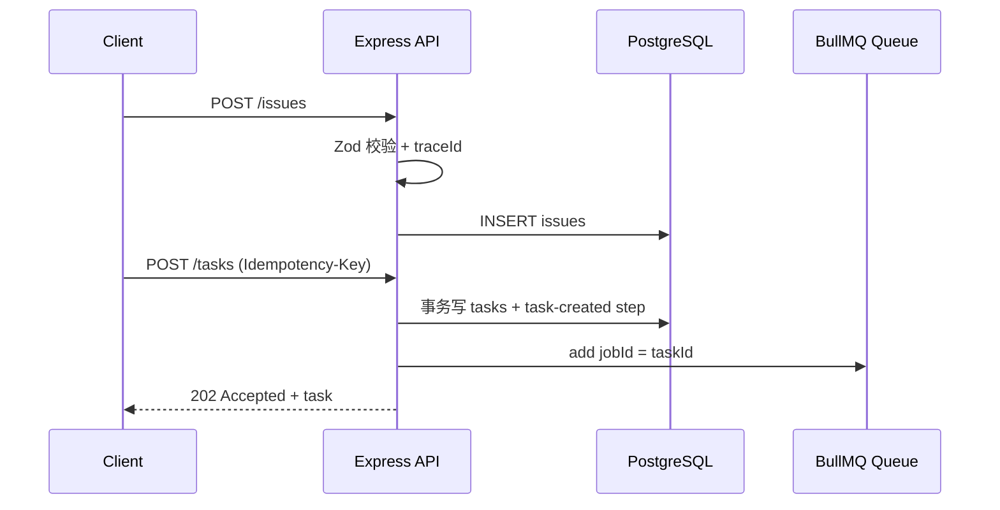

# Day 4：Express、Zod 与可追踪 API

## 今日目标

把浏览器、脚本或未来前端控制台发来的 HTTP 请求，变成可校验、可追踪、可持久化的 `Issue -> Task` 请求。今天不执行 Agent；API 只负责接收、验证、创建任务和返回查询结果。

## 先认识术语

- **HTTP**：客户端和服务端通信的协议。`POST` 通常创建资源，`GET` 通常查询资源。
- **REST API**：把数据看成资源并使用 URL 表达资源关系的约定。本项目的资源是 `/issues` 和 `/tasks`。
- **Express**：Node.js Web 框架，负责把 URL 和处理函数对应起来。
- **中间件（middleware）**：路由处理之前或之后都会经过的函数。这里依次解析 JSON、生成 `traceId`、记录 Pino 日志。
- **Zod**：运行时 schema 校验库。TypeScript 类型在编译后会消失，来自 HTTP 的 JSON 仍然可能是任意内容，因此边界必须在运行时校验。
- **Pino 结构化日志**：日志是 JSON 对象而不是拼接字符串，便于按 `traceId`、状态码或耗时检索。
- **traceId**：一次请求的追踪编号。客户端可通过 `x-trace-id` 传入，未传则 API 生成 UUID，并在响应头和响应体返回。
- **幂等（idempotency）**：相同请求重复提交，最终只产生一次业务效果。本项目把 `idempotency-key` 映射到 `tasks.idempotency_key` 的唯一约束。

## 请求链路



`202 Accepted` 的意思是 API 已接受任务，但任务由 Worker 异步执行，尚未保证最终成功。重复使用同一个幂等键时，API 返回已有 Task 与 `200`，不会再次入队。

## 实现位置

- [API 应用](../../apps/api/src/app.ts)：路由、Zod schema、统一错误结构、traceId 和 Pino。
- [API 入口](../../apps/api/src/index.ts)：端口监听及 SIGINT/SIGTERM 下关闭 HTTP server、队列和 DB pool。
- [仓储层](../../packages/db/src/repository.ts)：参数化 SQL 与 Task/Step 事务。
- [HTTP 集成测试](../../apps/api/test/api.integration.test.ts)：真实 PostgreSQL 验证。

## 为什么不只用 TypeScript interface？

```ts
// 编译期类型不会阻止真实 HTTP 请求传入错误数据。
type CreateIssue = { title: string; description: string };

// Zod 在运行时真正检查数据。
const input = issueSchema.parse(request.body);
```

错误 JSON 会获得 `400`、`VALIDATION_ERROR` 和 traceId；它不会进入数据库。

## 手动演示

先启动基础设施和数据库迁移：

```bash
cd StuProject
docker compose up -d --wait
npm run db:migrate
npm run dev:api
```

另开终端：

```bash
curl -i http://127.0.0.1:4000/health
curl -i -X POST http://127.0.0.1:4000/issues \
  -H 'content-type: application/json' \
  -H 'x-trace-id: demo-issue-001' \
  -d '{"title":"订单页白屏","description":"打开订单列表后无内容","labels":["bug"]}'
```

复制上个响应中的 Issue ID 后创建 Task：

```bash
curl -i -X POST http://127.0.0.1:4000/tasks \
  -H 'content-type: application/json' \
  -H 'idempotency-key: demo-task-001' \
  -d '{"issueId":"替换为真实 Issue UUID"}'
```

## 今天真实验证了什么

```bash
npm run test --workspace @stu/api
```

测试已验证：非法 Issue 返回 `400` 和 traceId；同一幂等键第二次创建 Task 返回原任务且不再次调用 dispatcher；查询 Task 能看到初始 `task-created` 审计步骤。

## 常见误区

- 把 HTTP `202` 说成“任务成功”：它只说明已接受，最终要查 `GET /tasks/:taskId`。
- 认为随机 UUID 就能去重：UUID 只负责唯一标识；业务请求去重需要稳定的幂等键。
- 在 route 中拼 SQL：所有用户值都应该通过仓储层的参数化查询传递。
- 只在日志里打印错误：调用方也需要稳定的错误响应契约和 traceId。
