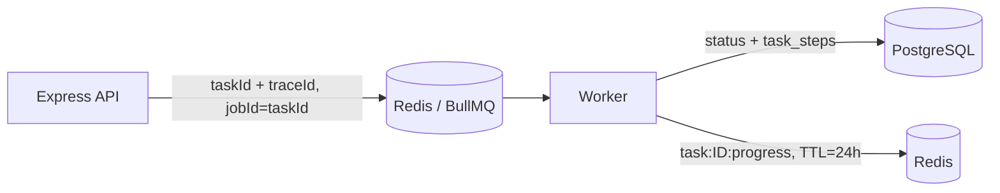

# Day 5：Redis、BullMQ 与异步 Worker

## 今日目标

让 API 快速返回，耗时任务交给后台 Worker。真实链路是：API 在 PostgreSQL 创建 Task 后，把 job 放入 Redis 支撑的 BullMQ 队列；Worker 取 job，更新 PostgreSQL 的状态与审计步骤，并把短期进度写入 Redis。

## 先认识术语

- **Redis**：内存型键值数据库。本项目只存队列和短期进度，不承担永久审计。
- **BullMQ**：Node.js 队列库，使用 Redis 保存 waiting、active、completed、failed 等 job 状态。
- **Queue / Job / Worker**：Queue 是任务排队的通道；Job 是一条待处理消息；Worker 是实际领取并执行 Job 的进程。
- **TTL（time to live）**：键的过期时间。任务进度 key 设为 86,400 秒，即 24 小时后自动删除。
- **至少一次投递（at-least-once）**：网络和进程故障下同一 Job 可能再次被执行，因此业务处理必须可重试、可去重。
- **backoff**：失败后等待一段时间再试。本项目使用指数退避，首个等待为 1 秒。

## 数据职责

| 数据 | 位置 | 为什么 |
| --- | --- | --- |
| Issue、Task、步骤、错误码 | PostgreSQL | 需要长期审计、查询与恢复 |
| BullMQ job、等待/执行状态 | Redis | 需要快速入队和消费 |
| `task:{taskId}:progress` | Redis，TTL 24h | 只用于短期 UI 进度，不值得永久保存 |

一句话：**PostgreSQL 是事实源，Redis 是可丢失的派生状态。**

## 队列契约



共享包中的 [queue.ts](../../packages/shared/src/queue.ts) 定义了队列名、连接配置和默认行为：`attempts: 3`、指数退避、完成 job 保留 100 条、失败 job 保留 500 条。API 与 Worker 共享配置，避免一个服务写到 A 队列、另一个服务监听 B 队列。

## `jobId = taskId` 为什么重要

每个数据库 Task 已有 UUID。入队时复用该 UUID：

```ts
await queue.add("execute-task", { taskId, traceId }, { jobId: taskId });
```

同一个 Task 的重复入队不会产生第二个不同 ID 的 job。它不能单独保证“所有外部副作用只执行一次”，所以未来真实调用 LLM、发评论或应用补丁时仍需要在 Task Step/业务表中记录检查点。

## Worker 做了什么

[worker.ts](../../apps/worker/src/worker.ts) 中的确定性 Day 5 处理器依次：

1. 写 Redis 进度 `planning`。
2. 把 PostgreSQL Task 更新为 `planning`。
3. 追加 `worker-started` 审计步骤。
4. 执行当前的占位任务，写 `succeeded` 与摘要。
5. 追加 `placeholder-execution` 步骤，写 Redis 进度 `succeeded`。

现在还没有 LLM 和浏览器操作。这是刻意的分层：先验证队列、状态机和审计，再接入不可预测且可能付费的模型调用。

## 验证

```bash
npm run test --workspace @stu/worker
```

真实 Redis + PostgreSQL 集成测试已经验证：Worker 能消费 Job、Task 最终变为 `succeeded`、审计步骤顺序为 `task-created -> worker-started -> placeholder-execution`，并且 Redis 进度存在。

## 面试陷阱

- “Redis 开启 AOF，所以能替代 PostgreSQL”：不对。AOF 只改善 Redis 自身的持久化，不提供本项目所需的关系约束、审计查询和恢复事实。
- “队列保证 exactly-once”：不对。常见队列语义是至少一次；用 `jobId`、幂等键、检查点和可重放步骤降低重复副作用。
- “TTL 到期代表任务数据可以删”：不对。只有 Redis 的短期进度会过期，PostgreSQL 的 Task 与审计仍保留。
