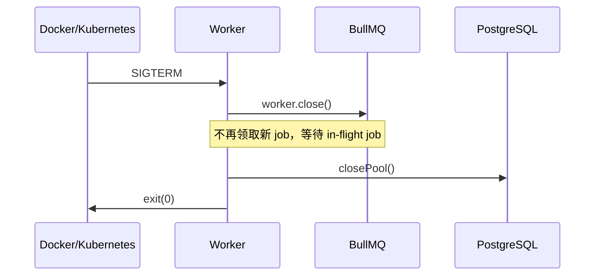

# Day 6：重试、优雅退出与恢复

## 今日目标

承认 Worker 会失败：进程会被停止、Redis 可能重启、代码可能抛错。设计目标不是“永不失败”，而是让失败后仍能知道任务在哪一步、有限重试、并能从 PostgreSQL 恢复队列。

## 先认识术语

- **SIGINT / SIGTERM**：操作系统发给进程的停止信号。终端 Ctrl+C 通常发 SIGINT；Docker/Kubernetes 通常先发 SIGTERM。
- **优雅退出（graceful shutdown）**：停止接收新工作，等待正在执行的工作结束，再关闭连接。
- **in-flight job**：Worker 已领取、尚未完成的 job。
- **重试（retry）**：失败后再次运行同一个 job。本项目上限是 3 次。
- **指数退避（exponential backoff）**：每次重试等待更久，防止依赖故障时持续打满 Redis、数据库或外部 API。
- **stalled job**：Worker 突然死掉，队列检测到 job 长时间没有心跳后的状态；BullMQ 会按自己的机制处理重试。
- **恢复协调（reconciliation）**：把“事实源记录的应有状态”和“派生系统的实际状态”进行比较，再补齐缺失工作。

## 优雅退出顺序



[Worker 入口](../../apps/worker/src/index.ts) 的 `shutdown()` 调用 `taskWorker.close()`。BullMQ 的 `worker.close()` 会暂停拉取新 job 并等待当前 job；随后关闭 PostgreSQL pool，最后退出。API 也会先关闭 HTTP server，再关闭队列和数据库连接。

优雅退出不是数据一致性的唯一保障。进程可能收到 SIGKILL、机器可能断电，因此每一步还必须能重放。

## 有界重试与最终失败

共享队列配置为：

```ts
attempts: 3
backoff: { type: "exponential", delay: 1_000 }
```

处理器连续失败三次后，Worker 将 Task 标成 `failed`，写 `WORKER_EXECUTION_FAILED`，并追加 `worker-failed` 审计步骤。重试次数必须有上限，否则永久错误会无限占用资源。真正的 Agent 后续可把需人工判断的异常转为 `needs_review`，而不是机械重试。

## Redis 丢失后的恢复

[recovery.ts](../../apps/worker/src/recovery.ts) 启动时执行：

1. 查询 PostgreSQL 内所有非终态 Task：`queued`、`planning`、`reproducing`、`searching`、`proposing`、`applying`、`validating`。
2. 用稳定 `taskId` 查询对应 BullMQ job。
3. Redis 中没有 job 时新建 job；job 为 `failed` 时调用 `retry()`；其余状态不重复入队。

这就是为什么 PostgreSQL 不能被 Redis 取代。即使 Redis 被清空，数据库仍告诉我们哪些任务没有最终完成。

## 已做的自动化故障实验

```bash
npm run test --workspace @stu/worker
```

该命令使用真实 Docker Redis、BullMQ、PostgreSQL，串行执行以避免共享队列竞争，验证：

- 数据库中存在 queued Task、Redis 无 job 时，恢复协调器会创建一个 job；再次执行协调器会发现已有 job，不会重复创建。
- 注入一个每次都抛错的处理器，BullMQ 实际执行 3 次；最终 PostgreSQL Task 为 `failed`，并包含 `WORKER_EXECUTION_FAILED` 与失败审计步骤。
- 正常任务能完成并写入短期 Redis 进度。

## 现实场景回答框架

“线上 Redis 故障时，你怎么避免任务直接消失？”

先说明边界：队列中的临时 job 可能丢失或延迟，不能假装 Redis 永远可靠。然后说明措施：业务 Task 和步骤先落 PostgreSQL；Worker 重启时扫描非终态 Task，用 `taskId` 做稳定 jobId 进行 reconciliation；业务步骤本身保持幂等，避免恢复后的重复执行产生重复外部副作用。最后补充监控：应告警 queued 任务积压、failed 数、恢复数量和最长任务等待时间。
