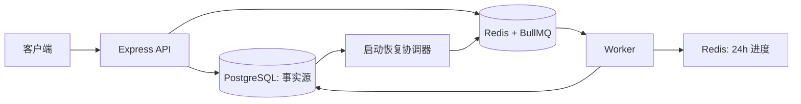

# Day 7：Week 1 复盘与白板表达

## 本周完成了什么

Week 1 没有接 LLM，完成的是一个可恢复、可审计的 Agent 后端底座：

- API 通过 Zod 校验输入，使用 `traceId` 关联日志和任务。
- PostgreSQL 保存 Issue、Task 与追加式 Task Step；事务确保同一次 Task 创建不会只写一半。
- Redis/BullMQ 负责异步调度，不承担永久业务事实。
- Worker 使用固定 `jobId = taskId`、有界重试与优雅退出。
- Redis job 缺失时，恢复协调器扫描 PostgreSQL 非终态任务后补齐投递。

## 两分钟白板讲法

“这个项目的目标是把前端缺陷诊断 Agent 做成能审计、能恢复的异步系统。用户先通过 HTTP API 创建 Issue 和 Task，Task 先落 PostgreSQL，再放进 BullMQ。Worker 消费任务，把每一步追加到 `task_steps`，前端短期进度放 Redis 并带 TTL。这里最关键的取舍是 PostgreSQL 是事实源，Redis 只是队列和热状态；因此 Redis 被清空或 Worker 重启后，可以从非终态 Task 重建 job。Week 1 到此为止还没有调用 LLM，Week 2 才把确定性占位处理器替换为受审计的规划 Agent。”

## 可以证明的成果

| 能力 | 证据 | 验证 |
| --- | --- | --- |
| HTTP 边界校验、追踪、幂等 | [API 测试](../../apps/api/test/api.integration.test.ts) | `npm run test --workspace @stu/api` |
| 事务、参数化与数据模型 | [数据库测试](../../packages/db/test/database.integration.test.ts) | `npm run test --workspace @stu/db` |
| 队列执行、失败重试、恢复 | [Worker 测试](../../apps/worker/test/recovery.integration.test.ts) | `npm run test --workspace @stu/worker` |
| 恢复实验结果 | [实验记录](../labs/week1-recovery.md) | 同上 |

## 刻意未做的事情

- 没有接入真实 LLM、Tool Calling 或浏览器控制。
- 没有自动应用代码补丁；未来所有高风险动作都必须由人工批准。
- 没有虚构吞吐量、成功率或线上用户数据。

这不是缺陷，而是工程边界：先把“失败后还能解释和恢复”做对，再增加模型和工具的非确定性。

## Week 2 入口

Week 2 从规划 Agent 开始。它只生成结构化诊断计划并写入 Task Step，状态停在 `awaiting_approval`。这让模型输出先成为可审计候选，而非直接执行命令或修改代码。
