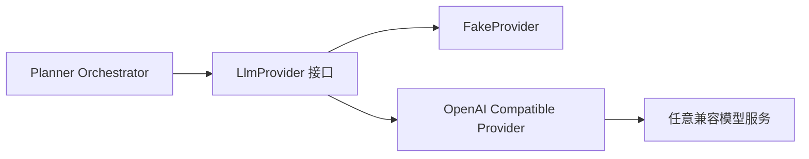

# Day 8：LLM Provider 抽象与 FakeProvider

## 今日目标

让业务代码只依赖“能完成一次对话”的接口，而不是直接依赖某家模型厂商的 SDK。这样本地开发、单元测试和未来更换模型供应商都不会改动 Agent 编排逻辑。

## 核心术语

- **Provider**：模型服务的适配器。本项目的 `LlmProvider` 只有一个核心方法：`complete(request)`。
- **Adapter（适配器）**：把第三方接口格式转换为项目内部稳定契约的组件。
- **OpenAI 兼容 API**：许多模型服务提供与 `/v1/chat/completions` 类似的 HTTP 协议；兼容不代表完全相同，因此仍要验证响应和错误。
- **FakeProvider**：不访问网络、返回确定性结果的模型替身。它让测试不消耗费用，也不会因网络、配额或随机性失败。
- **超时**：LLM 服务可能慢或卡住。Provider 使用 `AbortSignal.timeout` 限制单次请求时间。
- **可重试错误**：429 限流、5xx 服务端错误和网络错误可能短暂恢复；非法响应格式通常不可重试。

## 为什么不在 Worker 中直接 fetch 模型



如果 Worker 直接写 `fetch("某家 URL")`，模型名、密钥、超时和响应字段会渗入业务逻辑。替换供应商时不仅难测，也很容易把密钥或原始响应写进日志。现在由 [@stu/agent](../../packages/agent/src/index.ts) 统一完成边界转换，Orchestrator 只接收 `content`、`model`、`durationMs` 和可选 token 用量。

## 默认安全行为

`LLM_API_KEY` 为空时，`createDefaultProvider()` 返回 `FakeProvider`。这表示：

- 本地执行和 CI 不会意外访问付费 API。
- 输出可重复，适合作为后续 Planner 的回归测试输入。
- 真实模型只能在显式配置 Key 后启用。

Provider 错误信息不包含 Authorization header 或 API Key；429 与 5xx 标记 `retryable: true`，无效 JSON 和缺少内容标记为不可重试。

## 当前实现与验证

```bash
npm run typecheck
npm run test --workspace @stu/agent
```

四个测试已覆盖：

1. FakeProvider 的规划 JSON 可重复解析。
2. 未配置 Key 默认选择 FakeProvider。
3. OpenAI 兼容 Provider 发送 Bearer 请求并映射 token 用量。
4. 429 限流被分类为可重试，且错误信息不包含 Key。

## 边界

Day 8 只建立 Provider 适配层，尚未让 Worker 调用模型。Day 9 会将其接入 Planner，并让输出先落到 PostgreSQL 审计步骤、状态停在 `awaiting_approval`；模型不会直接调用 shell、写文件或应用补丁。
