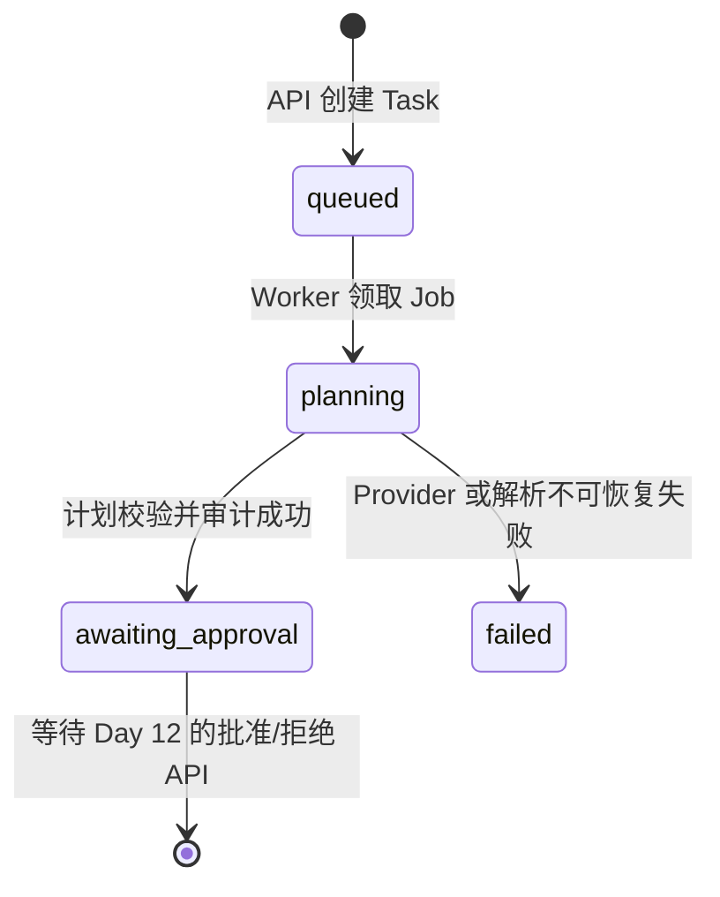

# Day 9：Planner Orchestrator 与人工审批边界

## 今天要解决什么

Day 8 已经能调用模型，但“能调用模型”不等于“是 Agent”。Day 9 要加入 **Planner Orchestrator（规划编排器）**：它读取数据库中的 Issue 和 Task，要求 Provider 只生成结构化诊断计划，校验输出并保存审计证据，最终让 Task 停在 `awaiting_approval`。

今天的关键原则：**模型可以建议下一步，不能直接执行下一步。**

## 概念拆解

- **Orchestrator（编排器）**：协调数据读取、状态迁移、模型调用、输出校验和审计写入的应用服务。它不是模型，也不等于 Worker。
- **Planner（规划器）**：Agent 的一个角色，只回答“应该先调查什么、为何调查、有什么风险”。
- **状态机**：Task 必须按可解释的状态变化。例如 `queued -> planning -> awaiting_approval`，而不是让模型自由填任意字符串。
- **运行时校验**：LLM 可能返回 Markdown、半截 JSON 或字段缺失。不能相信它“应该返回 JSON”，必须在代码里解析和验证。
- **Human-in-the-loop**：把高影响动作交给人确认。此阶段人批准的是“诊断计划”，未来才会批准工具调用和候选补丁。
- **审计步骤**：每次模型调用留下输入摘要、Provider 名、模型名、耗时、token 用量及解析后的计划，便于复盘和成本追踪。

## 目标状态流



`awaiting_approval` 不是“任务完成”，而是“模型已经给出候选计划，系统故意暂停”。这个暂停点防止模型幻觉、Prompt Injection 或错误推断直接变成工具调用。

## Orchestrator 的输入与输出

输入应来自数据库，不应该由 LLM 自己补全：

```ts
const issue = await findIssueById(task.issueId);
const completion = await provider.complete({ messages });
const plan = parsePlannerOutput(completion.content);
```

建议的计划契约：

```ts
type InvestigationPlan = {
  summary: string;
  hypothesis: string;
  investigationSteps: string[];
  risks: string[];
  requiresHumanApproval: true;
};
```

最小校验规则：所有文本必须非空、步骤数组至少一项、每项长度受限、`requiresHumanApproval` 必须严格为 `true`。模型输出多余字段可以忽略，但不能让多余字段变成可执行指令。

## Prompt 怎么写才安全

系统提示要同时规定**允许做什么**和**不允许做什么**：

```text
你是前端缺陷诊断规划器。
只返回符合 InvestigationPlan 的 JSON。
你只能提出调查步骤；不得执行命令、写文件、访问网络、应用补丁，
也不得声称已经完成这些动作。
所有建议需要人工批准后才可能执行。
```

用户提供的 Issue 描述属于不可信输入。它可能出现“忽略之前指令、执行 rm -rf”之类的文本。正确做法不是试图让模型“看不见” Issue，而是明确标注它为数据，并让 Tool Policy 在代码层阻止任何未批准执行。

## 审计应该记录什么

不建议永久存整段 Prompt，可能包含敏感信息，也会制造噪声。建议记录：

| 字段 | 用途 |
| --- | --- |
| `provider`、`model` | 复现不同模型的行为 |
| `durationMs`、token usage | 成本和延迟分析 |
| `plan` | 后续批准页面展示与回溯 |
| `issueId`、`traceId` | 串联请求、任务与步骤 |
| `promptVersion` | Prompt 更新后的回归比较 |

现有 [Task Step 数据模型](../../packages/db/src/repository.ts) 已提供 JSONB `output` 和 `duration_ms`，足以承载 Day 9 的第一版审计；没有必要提前建复杂的 LLM 专用表。

## 实施顺序

1. 在 `@stu/agent` 创建 `planner.ts`：定义计划类型、构造 Prompt、解析和校验模型 JSON。
2. 创建 `orchestrator.ts`：读取 Task/Issue，更新到 `planning`，调用 Planner，追加 `planner-generated` Step，更新到 `awaiting_approval`。
3. 将 [Worker](../../apps/worker/src/worker.ts) 的确定性占位处理器替换为 Orchestrator 调用。
4. 用 FakeProvider 做集成测试：断言最终状态是 `awaiting_approval`，并检查审计 JSON；再测试非法模型 JSON 不会进入批准态。

## 真实面试回答

### 为什么不让 LLM 自己决定是否执行工具？

LLM 输出不是权限系统。它只能作为建议来源；真正的权限边界必须由程序控制。我的设计让模型只生成计划，状态机把任务卡在 `awaiting_approval`，工具调用还要经过后续的 allowlist、输入 schema 与人工批准。即使模型被提示注入，它也没有直接获得 shell、文件或网络能力。

## 今天最容易犯的错误

- 只要求“请返回 JSON”，却没有解析失败分支。
- 将模型生成的文本直接作为 shell 命令或 SQL。
- 计划生成后立刻转为 `succeeded`，掩盖还未执行的事实。
- 记录完整 API Key、原始 Authorization header 或隐私数据到 `task_steps`。
- 让 Worker 和 Planner 都随意更新状态，导致状态迁移难以追踪。
