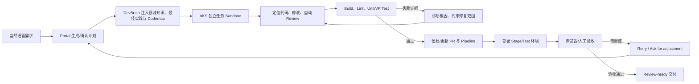

# AI Agent / AI 应用开发求职学习手册（TypeScript 版）

> 基于 WorkPilot 0.32.1 源码，并结合 Digital Employee 企业 Coding Agent 实践，将生产级 Agent 设计迁移到 TypeScript/Node.js 的工程化学习笔记
>
> 面向人群：熟悉前端与 TypeScript，准备转向 AI Agent、AI 全栈、LLM 应用或 Node.js AI 平台开发的应届生
>
> 源码与公开资料核验日期：2026-08-04

## 阅读地图

- **第一阶段（0–5）**：前端转型地图、WorkPilot 总架构、LLM/Prompt 和 Agent 状态机；
- **第二阶段（6–15）**：Tool、Context、Memory、RAG、MCP、Multi-Agent、安全、可靠性和 Evals；
- **第三阶段（16–21）**：故障排查、缩小复现、公开面经、35 道通用高频题、系统设计和 Node.js 后端基础；
- **第四阶段（22–29）**：简历三种真实性等级、逐条追问、项目介绍、模型基础、60 天计划、自测、来源，以及 Digital Employee 企业 Coding Agent 专题与 12 道追问。

第一次学习按顺序阅读；面试前重点复习第 19、20、23、24、27、29 章；做项目时把第 16、17、29.7–29.9 节当检查表。

## 0. 先说清楚：这份手册能做什么

这份手册不能保证“背完必拿 Offer”。招聘取决于基础、项目真实性、表达、算法题、岗位匹配和市场环境。它能帮你做到三件更可靠的事：

1. 建立一套从 LLM 到生产级 Agent 的完整知识框架；
2. 用 WorkPilot 的真实实现解释并发、安全、记忆、工具、MCP 和失败恢复，再用 TypeScript 复现；
3. 把“我会前端、调用过模型 API”升级为“我能用 TypeScript 设计、实现、测试和排查一个 Agent 系统”。

不要把 WorkPilot 或 Digital Employee 团队已有成果写成自己的开发成果。只有你亲自复现、测试并能回答追问的内容，才可以写入简历。第 22 章提供阅读分析版、使用实践版、缩小复现版和完整实现版的诚实表述。

### 推荐学习方法

每章按下面的顺序学习：

1. 先看“通俗理解”，建立直觉；
2. 再看“专业机制”，补齐术语和因果链；
3. 打开“WorkPilot 源码对应”走读；
4. 自己实现一个缩小版；
5. 用“面试回答模板”录音复述；
6. 不看答案完成自测题。

面试回答统一使用这个骨架：

> **结论 → 原理 → 工程方案 → 权衡 → 项目例子**

只背名词会在第二次追问时暴露；能讲出失败路径、监控指标和取舍，才像做过工程。

### 专业名词速查：先听懂，再深入

后文第一次看到名词时，先回到这张表建立直觉。面试回答不能只复述英文缩写，还要说清它解决的问题、失败方式和工程代价。

| 名词 | 白话解释 | 工程上解决什么问题 |
|---|---|---|
| LLM（Large Language Model） | 根据上下文预测后续 Token 的概率模型 | 理解和生成文本、代码、计划，但不天然保证正确 |
| Token | 模型读写文本时的计量单位，不等于一个字 | 决定上下文容量、延迟和费用 |
| Context Window | 一次模型调用最多能看到的 Token 范围 | 限制历史、工具和知识能放多少 |
| Prompt | 发送给模型的指令、数据和输出约束 | 定义本次任务接口，而不是保存秘密 |
| JSON Schema | 用 JSON 描述字段类型、必填项、枚举和嵌套结构 | 让模型和服务端共享结构契约 |
| Zod / Ajv | TypeScript 常用运行时 Schema 库 / JSON Schema 校验器 | 检查真实外部输入，而不只依赖编译期类型 |
| Structured Output | 要求模型按 JSON Schema 等结构输出 | 降低解析失败；仍需运行时和业务校验 |
| Agent | 模型能依据环境反馈动态选择下一步的系统 | 处理步骤难以预先完全写死的任务 |
| Workflow | 路径主要由程序预定义的流程 | 提供确定性、低成本、易审计的业务执行 |
| ReAct | Reason + Act：思考下一步、执行动作、读取观察 | 描述基本 Agent 循环；生产中需加预算和终止条件 |
| Tool / Function Calling | 模型提出结构化工具调用，由应用执行 | 让模型受控地读写外部世界 |
| State Machine | 有限状态、事件和合法转移组成的执行模型 | 防止 Agent 变成不可控的无限 `while` |
| Checkpoint | 可持久化、可恢复的任务状态快照 | 让长任务在崩溃或重启后继续 |
| JSONL | 每一行都是独立 JSON 对象的文本格式 | 适合追加式 Session 和审计事件 |
| Idempotency（幂等） | 同一操作重复执行，最终效果与一次相同 | 防止重试造成重复 PR、扣款或部署 |
| Idempotency Key | 标识一次业务操作的稳定唯一键 | 让服务端识别网络重试是不是同一操作 |
| Context Engineering | 选择、排序、压缩当前要给模型的信息 | 提高相关事实密度，减少冲突和过期信息 |
| RAG | 先检索外部知识，再让模型基于证据生成 | 处理私有、实时或可引用知识 |
| Embedding | 把语义映射成向量 | 支持“意思相近”的稠密检索 |
| BM25 | 基于词频和逆文档频率的稀疏检索算法 | 擅长错误码、ID、专有名词等精确匹配 |
| Rerank | 对初步召回候选重新精排 | 用额外延迟换更准确的 Top-K |
| RRF | Reciprocal Rank Fusion，用排名倒数融合多路结果 | 无需先统一 BM25 和向量分数的量纲 |
| ACL | Access Control List，谁能读哪些资源 | 在检索阶段阻止越权片段进入上下文 |
| RBAC | Role-Based Access Control，按角色授权 | 集中管理用户能调用哪些工具和数据 |
| MCP | Model Context Protocol，连接外部工具/资源的协议 | 标准化能力发现与调用，不自动提供安全 |
| Skill | 按任务加载的知识、步骤和引用材料 | 避免所有操作手册常驻 Prompt |
| Multi-Agent | 多个有独立上下文或角色的 Agent 协作 | 并行或专业分工，但会增加成本和协调失败 |
| HITL | Human-in-the-loop，人参与审批或纠偏 | 给高风险、模糊或不可逆动作设置责任边界 |
| TOCTOU | 检查时与使用时之间状态被替换 | 说明审批必须绑定规范化参数、身份和有效期 |
| SSRF | 服务端被诱导访问不应访问的地址 | 要求出站协议、域名、IP、端口和重定向控制 |
| Fail Closed | 安全检查异常时默认拒绝，而非放行 | 避免策略服务故障变成越权通道 |
| E-stop | 紧急停止开关 | 在失控、泄漏或成本异常时快速中断 Agent |
| Backpressure（背压） | 下游消费慢时，上游必须减速 | 避免流式事件和队列无限占用内存 |
| SSE | 基于 HTTP 的服务端单向事件流 | 适合模型文本和状态持续下发 |
| WebSocket | 浏览器和服务端的全双工长连接 | 适合取消、中途注入和二进制双向通信 |
| AbortSignal | JavaScript 的协作式取消信号 | 把用户取消/超时传到模型、网络和工具最底层 |
| AsyncIterable | 可以逐项异步产生数据的接口 | 统一模型流、Agent 事件流和网络适配 |
| Trace / Span | Trace 表示一次完整请求；Span 表示其中一个步骤 | 定位模型、检索、工具和审批的耗时与错误 |
| Eval / Grader | Eval 是评测任务集；Grader 是判分器 | 用可重复证据判断 Agent 是否真的变好 |
| P95 | 95% 请求延迟不超过该值 | 比平均延迟更能暴露尾部慢请求 |
| TTFT | Time To First Token，从请求到首个 Token 的时间 | 衡量用户感知到的首次响应速度 |
| SLO | Service Level Objective，服务质量目标 | 约束可用性、延迟或成功率的目标范围 |
| Circuit Breaker（熔断） | 下游持续失败时暂时停止请求 | 防止故障扩散并给依赖恢复时间 |
| Groundedness / Faithfulness | 回答是否有证据支撑 / 是否忠于给定证据 | 评估 RAG 是否“引用了但仍乱说” |
| Top-K / Recall@K | 取前 K 个结果 / 正确结果是否出现在前 K 个 | 评估检索候选覆盖率 |
| Sandbox | 隔离文件、进程、网络和凭据的执行环境 | 限制代码 Agent 的影响范围 |
| Pipeline / CI | 自动执行构建、检查和测试的流水线 | 把“代码看起来对”变成可验证证据 |
| Artifact | 构建产生的可部署包、镜像或静态资源 | 确认 Stage/生产环境运行的是哪次代码 |
| Monorepo | 多个应用和包放在同一大型仓库 | 统一依赖和工具，但增加定位与构建复杂度 |
| Feature Flag | 无需重新发布即可控制功能开关的配置 | 支持实验、灰度和快速回滚 |
| PR（Pull Request） | 请求团队审阅并合并代码变更 | 承载 Diff、讨论、测试和审批证据 |
| Review-ready | 已具备有效代码审阅所需的 Diff 与验证信息 | 不代表已经获得所有合并/发布授权 |
| Codemap | 文件、符号、调用、依赖、测试、配置等关系图 | 在大型仓库中从需求定位到关联代码 |
| AKS | Azure Kubernetes Service，Azure 托管的 Kubernetes | 调度和隔离云端任务容器 |
| DevBrain | DE 官方描述的知识层，组合领域知识、实践和 Codemap | 在编码前为任务补充仓库专有上下文 |
| VP Test | DE 工作流中的项目专用验证测试，录屏展示了 manifest/baseline 流程 | 检查变更是否符合预期；具体全称和规则应以项目文档为准 |
| Baseline | 测试用来对比的已批准期望结果 | 更新错误会把真实回归误标成通过 |
| Stage Link | 指向本次构建产物测试环境的链接 | 让产品、设计、QA 和 Reviewer 做人工验收 |

### TypeScript 代码阅读约定

本手册示例遵守以下约定：

- 默认开启 `strict` 与 `noUncheckedIndexedAccess`；
- 模型、HTTP、数据库 JSON、MCP 等外部输入一律先视为 `unknown`；
- 使用可辨识联合表达状态和事件，用 `never` 做穷尽检查；
- 所有长耗时操作都接收 `AbortSignal`；
- 示例优先展示核心不变量，省略真实项目中的鉴权、日志、持久化和供应商 SDK 适配时会明确说明；
- `Zod` 示例需要安装 `zod`，其余示例尽量只依赖 Node.js 标准库。

常见 TypeScript/Node.js 术语也统一如下：

| 名词 | 解释 | 在 Agent 代码中的用途 |
|---|---|---|
| `unknown` | “类型暂时未知，使用前必须收窄” | 承接模型、HTTP、MCP 和数据库 JSON |
| `any` | 关闭此值的多数类型检查 | 边界代码中尽量避免，否则错误会向下游扩散 |
| 可辨识联合 | 每个联合成员都有 `type` 等共同字面量字段 | 表达 Agent State、Event、Result 并安全分支 |
| `never` | 理论上不可能出现的值 | 在 `switch` 中检查是否漏处理新事件 |
| Type Guard | 返回 `value is T` 的运行时判断函数 | 从联合类型或 `unknown` 收窄到可用类型 |
| Generic（泛型） | 用类型参数复用一套类型安全逻辑 | 实现 `Tool<TArgs, TResult>`、队列和缓存 |
| Type Erasure | TypeScript 类型编译后不会留在 JavaScript 中 | 解释为什么外部数据必须再经 Zod/Ajv |
| Event Loop | Node.js 调度 I/O 回调和异步任务的循环 | 适合模型/网络 I/O，但会被同步 CPU 任务阻塞 |
| Microtask | Promise 回调等高优先级异步队列 | 连续大量微任务也可能让定时器和 I/O 饥饿 |
| `worker_threads` | Node.js 的多线程 CPU 工作单元 | 隔离 Tokenizer、解析和计算密集任务 |
| ESM / CJS | JavaScript 的两套模块系统 | 配置错误会导致 SDK 在开发可用、生产导入失败 |
| BFF | Backend for Frontend，面向前端的服务端层 | 保存密钥、做鉴权、聚合 Agent 事件并保护浏览器 |

### TypeScript 代码实验索引

建议不要只复制代码：先隐藏实现，根据“输入—输出—失败条件”自己写一遍，再对照本手册。

| 章节 | 代码实验 | 你应能解释的核心点 |
|---|---|---|
| 3.6 | 供应商无关的模型事件流 | 为什么 Runtime 不直接依赖某家 SDK |
| 4.6 | `unknown → Zod → 业务校验` | 为什么 `as` 不是安全边界 |
| 5.7 | 可辨识联合 Agent 状态机 | 状态、事件、终止条件如何建模 |
| 6.5 | Tool Registry 与三阶段执行 | 模型提议和应用执行为什么必须分离 |
| 7.6 | Token 预算内选择 Context | required、priority、trust、工具原子性 |
| 8.4 | Session Event Reducer 与 Memory Fact | Session、Snapshot、Memory 的边界 |
| 9.6 | ACL 前置的 BM25/向量 RRF | 检索质量与权限如何同时保证 |
| 10.6 | MCP 不可信结果适配 | Schema 合法为什么仍不等于可信 |
| 11.4 | 子 Agent 任务契约 | 隔离、预算、取消和结构化失败 |
| 12.2/12.7 | 有限并发与分类重试 | Promise 不负责限流、取消和幂等 |
| 13.6 | 参数摘要审批 | 如何防 TOCTOU 和旧授权复用 |
| 14.6 | 可重放流式 Reducer | 去重、顺序、缺口恢复和终态 |
| 15.7 | 轨迹 Grader | 为什么最终答案正确仍可能不合格 |
| 16.1 | 循环检测器 | nudge、hard stop 和 no-progress |
| 29.7 | Codemap 图遍历与交付反馈环 | 知识定位、验证失败和人工接管 |

---

## 1. 前端 TypeScript 开发者的岗位画像与能力地图

### 1.1 AI Agent 开发到底是什么岗位

通俗地说，模型像一个聪明但不稳定的“大脑”，AI Agent 工程师负责给它装上眼睛、手、记事本、规则和刹车，并让整套系统可上线、可监控、可回滚。

专业地说，AI Agent/AI 应用开发是以下能力的交集：

| 能力层 | 应届生至少要会 | 进阶信号 |
|---|---|---|
| 软件工程 | TypeScript、Node.js、HTTP、SQL、Git、测试 | 分层架构、依赖注入、并发控制、故障恢复 |
| LLM 基础 | Token、上下文、采样、Prompt、Structured Output | 模型路由、缓存、成本与延迟优化 |
| Agent | ReAct、工具调用、终止条件 | 状态机、checkpoint、幂等、循环检测 |
| RAG | 切分、Embedding、召回、重排、引用 | 混合检索、权限过滤、离线/在线评测 |
| 协议生态 | Function Calling、MCP、Skill | 生命周期、OAuth、信任边界、版本治理 |
| 生产工程 | API、日志、重试、超时 | Trace、SLO、Evals、灰度、熔断 |
| 安全 | Prompt Injection、密钥保护、审批 | 风险分级、最小权限、审计、E-stop |
| 表达 | 3 分钟讲清项目 | 用指标、失败案例和权衡支撑结论 |

### 1.2 公开岗位给出的真实信号

2026-08-04 核验的两个官方岗位样本很有代表性：

- [阿里巴巴 2027 实习：AI Agent 研发工程师](https://campus-talent.alibaba.com/campus/position/199903280015)明确出现 Java/Python、Prompt、Function Calling、RAG、上下文工程与压缩、Multi-Agent、Memory、流程编排和全项目周期；
- [网易：AI 应用工程师（数据平台方向）](https://hr.163.com/job-detail.html?id=75410&lang=zh)明确出现 Python/Go、SQL、FastAPI/Flask、API 集成、RAG、MCP Server、权限隔离、测试上线排障、K8s，并强调从 Demo 到生产服务。

结论：应届生不能只学 Prompt。对你而言最稳的定位是“TypeScript 全栈能力 + Node.js 服务端能力 + LLM/Agent 专项能力”。

必须诚实看到市场现实：上述两个官方样本仍明显偏好 Python/Java/Go。这不代表 TypeScript 不能做 Agent——OpenAI SDK、MCP TypeScript SDK、LangChain.js、LangGraph.js、Vercel AI SDK 等生态都能支持生产应用——但它意味着你不应把第一目标放在纯算法或训练岗。更适合优先投递：

- AI 应用开发工程师、AI 全栈工程师；
- Agent 产品工程师、智能交互或 AI 前端工程师；
- Node.js/TypeScript Agent 平台工程师；
- RAG/MCP 集成工程师；
- 有大模型业务的全栈或 BFF 工程师。

对于明确写着“Python 必须”的岗位，最好补到能阅读、调试和写简单服务，而不必放弃自己的 TypeScript 主栈。

### 1.3 你的前端经验不是包袱

| 已有前端能力 | 在 Agent 工程中的对应价值 |
|---|---|
| TypeScript 类型建模 | Tool Schema、流式事件、状态机、MCP 消息类型 |
| React 状态管理 | Agent turn、审批、工具执行和断线恢复 UI |
| Fetch/WebSocket/SSE | 模型流式输出、中途取消和实时事件 |
| 表单与交互设计 | Human-in-the-loop、风险确认、引用展示 |
| 浏览器安全 | XSS、Token 暴露、CORS、CSRF 与不可信模型输出 |
| 性能优化 | 首 Token 时间、长列表、Markdown/代码增量渲染 |
| 前端测试 | 将 Vitest 思维迁移到 Provider/Tool 契约和 Eval |

真正需要补的是服务端责任：数据库事务、鉴权、队列、幂等、进程生命周期、Linux/Docker、日志 Trace、限流和密钥管理。

### 1.4 TypeScript Agent 推荐栈

- **Runtime**：选择当前受支持的 Node.js LTS，并用 Volta、fnm 或 nvm 配置锁定；
- **语言与构建**：TypeScript strict mode、ESM、tsx/tsc；
- **API**：Fastify/Hono 适合轻量服务，NestJS 适合结构化团队工程；
- **Schema**：Zod 用于开发体验，Ajv 用于标准 JSON Schema 和高性能校验；
- **模型与协议**：官方模型 SDK、MCP TypeScript SDK；框架按需选择 LangChain.js/LangGraph.js 或 AI SDK；
- **数据**：PostgreSQL/pgvector、Redis、对象存储；
- **测试**：Vitest、Testcontainers、fake provider、trajectory eval；
- **可观测性**：OpenTelemetry、结构化日志、Prometheus 兼容指标；
- **交付**：Docker、CI、进程优雅退出和健康检查。

### 1.5 WorkPilot 为什么适合学习

WorkPilot 不是一个只有几十行的聊天 Demo，而是 Python Runtime、React Web 前端和 .NET Cloud Gateway 组成的企业 AI 助手。它把生产 Agent 的难题放在同一个项目里：

- 多通道消息接入；
- Agent 循环与工具编排；
- 上下文压缩、记忆和历史检索；
- 风险评分、审批、审计和紧急停止；
- MCP、Skill、定时任务和子 Agent；
- 流式响应、会话持久化和云网关。

WorkPilot 的核心 Runtime 是 Python，Web 是 React/TypeScript，Cloud Gateway 是 .NET。学习时不要逐行翻译语言，而应把接口和不变量迁移到 TypeScript：Python Protocol/ABC 对应 TS interface，Pydantic 对应 Zod/Ajv，asyncio Task/Queue 对应 Promise/AsyncIterable/受控队列，contextvars 对应 AsyncLocalStorage。

它最值得学习的不是某个框架 API，而是“边界如何划分、失败如何收敛、权限如何约束”。

### 本章自测

1. 为什么 AI Agent 岗位通常仍要求扎实的后端能力？
2. 为什么你的第一目标应是 AI 应用/全栈岗，而不是纯模型训练岗？
3. 你能否用 30 秒说明 WorkPilot 的业务目标和技术复杂度？
4. TypeScript 的静态类型为什么不能替代 Zod/Ajv 运行时校验？

---

## 2. WorkPilot 架构：先看城市地图，再看每条街

### 2.1 通俗理解

把 WorkPilot 想成一家快递公司：

- **Transport（渠道）**是营业网点，负责从 CLI、Web、Teams 接收和发送消息；
- **Message Bus（消息总线）**是分拣中心，隔离生产者和消费者；
- **Processing（处理层）**是调度员，决定问模型、查资料还是调用工具；
- **Foundation（基础层）**是仓库制度，包括会话、配置、安全、审计和供应商接入。

### 2.2 专业机制

WorkPilot 的主架构是 Transport → Message Bus → Processing，下面由 Foundation 支撑。核心价值是解耦：渠道不知道 Agent 细节，Agent 不依赖某个 UI，工具不直接决定审批策略，模型供应商可以替换。

~~~mermaid
flowchart LR
    U["CLI / Web / Teams 用户"] --> T["Transport Channels"]
    T --> B["Bounded Message Bus"]
    B --> R["Runtime Orchestrator"]
    R --> A["Agent Loop"]
    A <--> P["LLM Provider"]
    A <--> TR["Tool Registry"]
    TR --> H["Hooks / Risk / Approval"]
    A <--> C["Context / Memory / Session"]
    R --> B
    B --> T
~~~

设计时要追问四件事：

1. 这个组件知道得是否太多？
2. 替换供应商或渠道是否会改动核心循环？
3. 异常会在哪一层被转换、记录和恢复？
4. 状态由谁拥有，重启后能否恢复？

### 2.3 WorkPilot 源码对应

- 总体规范：[design/core-infra.md](../design/core-infra.md)
- 依赖装配与生命周期：[workpilot/runtime.py](../workpilot/runtime.py#L181)
- 有界消息总线：[workpilot/bus/queue.py](../workpilot/bus/queue.py#L81)
- Agent 主类：[workpilot/agent/loop.py](../workpilot/agent/loop.py#L600)
- FastAPI 网关：[workpilot/web](../workpilot/web)
- React 路由：[web/src/App.tsx](../web/src/App.tsx#L22)
- .NET Cloud Gateway：[cloud_gateway](../cloud_gateway)

### 2.4 工程建议与坑

- **坑：业务逻辑写进 Channel。** 后果是 CLI、Web、Teams 各自维护一套行为。Channel 应只负责协议适配和身份/附件传递。
- **坑：无界队列。** 峰值流量会把内存吃完。需要有界队列、背压、拒绝或降级策略。
- **坑：全局单例藏状态。** 测试难隔离，重启难恢复，横向扩容时产生不一致。
- **建议：把接口边界当成可测试契约。** Provider、Tool、Session、Channel 都应能替换成 fake。

### 2.5 面试回答模板

> 我会把企业 Agent 分为接入、消息总线、Agent 处理和基础服务四层。接入只做协议转换，总线负责背压和解耦，Agent 层维护模型—工具状态机，基础层提供 Provider、Session、安全和配置。WorkPilot 的 Runtime 通过依赖装配连接这些抽象，使 CLI、Web 和 Teams 能复用同一个 Agent 核心。代价是接口和事件模型更多，但换来可测试性、可替换性和故障隔离。

---

## 3. LLM 基础：你调用的不是“答案 API”

### 3.1 通俗理解

LLM 更像一个根据已有文字继续写下去的概率引擎，而不是数据库。它可以非常聪明，但不能天然保证事实正确、格式正确或动作安全。

### 3.2 必须掌握的专业概念

- **Token**：模型处理文本的基本单位，不等同于汉字或单词；输入、输出、工具定义都占上下文。
- **Context Window**：一次推理能看到的 Token 上限。窗口变大不代表所有位置的信息都能被同样可靠地利用。
- **Sampling**：temperature、top-p 等控制随机性。确定性业务优先低随机和结构约束，而不是迷信 temperature=0 能绝对复现。
- **Hallucination**：模型给出语法流畅但无事实支撑的内容。RAG 只能降低部分知识幻觉，不能消灭逻辑错误和错误引用。
- **Structured Output**：通过 JSON Schema 等约束结构；结构合法不代表语义正确，仍需业务校验。
- **Reasoning 与回答**：模型的内部推理能力不等于应把完整思维过程展示给用户；工程上更需要可审计的计划、动作和证据。

### 3.3 模型选择不是“永远选最强”

按任务做路由：

- 分类、改写、抽取：小模型，低延迟低成本；
- 复杂规划、代码修改：能力更强的模型；
- 风险判断：规则优先，模型评分作为补充；
- 长上下文：先检索/压缩，不能只靠更大的窗口。

观察四个指标：任务成功率、P95 延迟、每任务成本、错误恢复率。模型升级必须跑回归集，不能只看聊天观感。

### 3.4 WorkPilot 源码对应

- Provider 与流式/重试/成本：[workpilot/providers/client.py](../workpilot/providers/client.py#L1425)
- 模型别名和能力：[workpilot/providers](../workpilot/providers)
- 上下文组装：[workpilot/agent/context.py](../workpilot/agent/context.py#L220)

### 3.5 常见坑

- 把供应商 429、超时、上下文超限都当同一种异常重试；
- 已经向用户流式输出后，静默切模型导致答案前后风格或事实矛盾；
- 把全部工具 Schema 永久塞进 Prompt，造成 Token 和选择噪声；
- 在日志中打印 API Key、完整用户文档或未经脱敏的 Prompt。

### 3.6 TypeScript 示例：用事件流抽象不同模型

这里先解释三个名词：**Provider** 是对某个模型供应商 SDK 的适配层；**Stream** 是模型未完成时持续返回增量事件；**Usage** 是输入、输出和缓存 Token 的计量。业务层依赖自己的事件协议，而不是直接依赖某家 SDK，切换模型时改 Adapter 即可。

~~~ts
type ChatMessage = Readonly<{
  role: "system" | "user" | "assistant" | "tool";
  content: string;
}>;

type ModelEvent =
  | { type: "text_delta"; text: string }
  | { type: "tool_call"; callId: string; name: string; arguments: unknown }
  | { type: "usage"; inputTokens: number; outputTokens: number; cachedTokens: number }
  | { type: "completed"; stopReason: "stop" | "tool_call" | "length" };

interface ModelRequest {
  model: string;
  messages: readonly ChatMessage[];
  maxOutputTokens: number;
}

interface ModelProvider {
  stream(request: ModelRequest, signal: AbortSignal): AsyncIterable<ModelEvent>;
}

async function runModel(
  provider: ModelProvider,
  request: ModelRequest,
  signal: AbortSignal,
): Promise<{ text: string; toolCalls: Extract<ModelEvent, { type: "tool_call" }>[] }> {
  let text = "";
  const toolCalls: Extract<ModelEvent, { type: "tool_call" }>[] = [];

  for await (const event of provider.stream(request, signal)) {
    signal.throwIfAborted();
    if (event.type === "text_delta") text += event.text;
    if (event.type === "tool_call") toolCalls.push(event);
  }

  return { text, toolCalls };
}
~~~

生产版还要统一错误分类、首 Token/总超时、重试、Trace、成本和流中断语义。不要在已经向用户展示半段回答后，偷偷换模型并拼接另一段输出。

### 本章自测

1. 为什么更大的上下文窗口不能替代 RAG 和压缩？
2. Structured Output 成功后还需要哪些校验？
3. 模型路由应由哪些指标驱动？

---

## 4. Prompt 与 Structured Output：把自然语言当接口设计

### 4.1 好 Prompt 的结构

一个可维护的 Prompt 通常包含：角色与目标、输入边界、可用工具、约束、输出 Schema、少量高质量示例和失败时行为。顺序和措辞要通过 Eval 验证，不靠“玄学咒语”。

System/Developer 指令定义长期规则，User 提供当前目标，工具结果提供环境事实。外部网页、文档和 MCP 返回值都是**数据**，不能因为它们写着“忽略之前指令”就升级为系统指令。

### 4.2 Few-shot、CoT 和规划

- Few-shot 适合展示边界样例和格式，示例质量比数量更重要；
- 对复杂任务可让模型生成可审计的短计划，但不要依赖泄露完整隐式思维链；
- 规划必须被工具事实修正，计划不是承诺；
- 把稳定规则写进代码，把模糊判断交给模型。

### 4.3 Structured Output 的四层防线

1. JSON Schema 限定类型、枚举、必填和 additionalProperties；
2. TypeScript 服务端用 Zod/Ajv 做运行时解析，不能只做类型断言；
3. 业务层检查权限、范围、金额、路径等语义；
4. 执行层再次做风险评估和幂等控制。

### 4.4 常见坑

- 工具描述写成“处理数据”，模型不知道何时调用；
- Schema 字段名字相似、枚举过多、嵌套太深；
- 失败后把原 Prompt 原样无限重试；
- 把 Prompt 当源代码，却没有版本、测试集和变更记录。

### 面试回答模板

> Prompt 工程不是堆修饰词，而是接口工程。我先明确目标、信任边界和输出 Schema，用 Few-shot 覆盖边界，再用离线数据集评估。结构化输出只保证格式，我仍会用 Zod/Ajv、业务规则、权限和风险策略做四层校验。外部检索内容始终按不可信数据处理，防止间接 Prompt Injection。

### 4.5 TypeScript 特别注意：类型在运行时会消失

模型输出、HTTP body、环境变量、数据库 JSON 和 MCP 结果进入进程时都应是 unknown，而不是直接断言成某个 interface。正确顺序是：

1. 把外部输入接为 unknown；
2. 用 Zod/Ajv 校验并转换；
3. 再进入业务类型；
4. 在执行动作前做权限和语义检查。

“as ToolArgs”不会产生任何运行时保护。面试中能主动指出这一点，是 TypeScript Agent 工程的重要加分项。

### 4.6 TypeScript 示例：结构合法之后再做业务校验

**静态类型**只在编译期帮助开发者；**运行时校验**检查进程真正收到的数据；**业务校验**检查“格式正确但不允许执行”的情况。下面的 `unknown → Zod → 业务规则` 是模型输出进入业务代码的标准边界。

~~~ts
import { z } from "zod";

const ChangePlanSchema = z.object({
  summary: z.string().min(1).max(200),
  files: z.array(z.string().min(1)).min(1).max(20),
  risk: z.enum(["low", "medium", "high"]),
  requiresApproval: z.boolean(),
}).strict();

type ChangePlan = z.infer<typeof ChangePlanSchema>;

function parseChangePlan(value: unknown, allowedRoot: string): ChangePlan {
  const plan = ChangePlanSchema.parse(value); // 第一层：结构和基本范围

  // 第二层：业务语义。真实项目还应使用 realpath 防符号链接逃逸。
  const invalid = plan.files.find(
    (file: string) => !file.startsWith(`${allowedRoot}/`) || file.includes(".."),
  );
  if (invalid) throw new Error(`file is outside allowed scope: ${invalid}`);

  if (plan.risk === "high" && !plan.requiresApproval) {
    throw new Error("high-risk change must require approval");
  }
  return plan;
}

const rawModelOutput: unknown = {
  summary: "Update the chat toolbar",
  files: ["web/src/components/ChatToolbar.tsx"],
  risk: "low",
  requiresApproval: false,
};

const safePlan = parseChangePlan(rawModelOutput, "web/src");
~~~

错误示范是 `const plan = rawModelOutput as ChangePlan`：它只让编译器闭嘴，不会删除多余字段、阻止路径穿越或验证枚举值。

---

## 5. Agent Loop：生产系统是容错状态机，不是一个 while

### 5.1 通俗理解

ReAct 像“先想下一步—动手—看结果—再决定”。教学 Demo 往往是一个 while True，生产系统还要处理工具超时、重复动作、模型断流、用户中途打断、上下文爆满和无限循环。

### 5.2 专业状态机

~~~mermaid
stateDiagram-v2
    [*] --> AssembleContext
    AssembleContext --> CallModel
    CallModel --> StreamText: 文本输出
    CallModel --> ValidateToolCall: 工具调用
    CallModel --> Recover: 限流/超时/上下文超限
    ValidateToolCall --> RiskAndApproval
    RiskAndApproval --> ExecuteTools: 允许
    RiskAndApproval --> CallModel: 拒绝结果
    ExecuteTools --> AppendResults
    AppendResults --> Compact: 超阈值
    AppendResults --> CallModel: 继续
    Compact --> CallModel
    Recover --> CallModel: 可恢复
    Recover --> Failed: 不可恢复
    StreamText --> Completed
    CallModel --> Completed: 明确终止
    CallModel --> Failed: 硬停止
~~~

关键状态至少包括：上下文组装、模型调用、流式事件、工具校验、风险/审批、并发执行、结果回填、压缩、恢复、终止。

### 5.3 终止条件

- 模型返回最终文本且无工具调用；
- 任务达成的业务判据成立；
- 用户取消或 E-stop；
- 超过时间、Token、成本或迭代预算；
- 检测到重复调用/无进展循环；
- 不可恢复异常。

WorkPilot 对最大迭代不是直接粗暴中断，而是逐级收敛：提醒模型结束（nudge）→ 移除工具迫使文本总结 → hard stop。这个设计既给模型一次自我收尾机会，又保证系统不会无限运行。

### 5.4 WorkPilot 源码对应

- AgentLoop：[workpilot/agent/loop.py](../workpilot/agent/loop.py#L600)
- 核心回合循环：[workpilot/agent/loop.py](../workpilot/agent/loop.py#L2523)
- 循环检测：[workpilot/agent/loop_detect.py](../workpilot/agent/loop_detect.py#L134)
- 中途注入、评论流和终止设计：[design/features](../design/features)

### 5.5 工程建议与坑

- 为每个回合生成 trace/span，记录 model、latency、tokens、tool calls、retries、stop reason；
- 工具调用使用稳定 call ID，结果必须和调用一一配对；
- 用户取消要沿 Provider、工具子进程和并发任务传播；
- 不要把 loop.py 继续做成“上帝类”。WorkPilot 的该文件已很大，可进一步拆为 TurnRunner、ToolBatchExecutor、ProviderRecovery、StreamRouter；
- 不能只以“模型说完成了”判断成功，关键任务需要环境验收，如测试通过、文件存在或数据库状态符合预期。

### 5.6 面试回答模板

> ReAct 是基本思想，但生产 Agent 应实现为有界、可恢复、可观测的状态机。每轮组装上下文、调用模型、校验工具、审批执行、回填结果，并在超限时压缩。终止由完成判据、预算、用户取消和循环检测共同决定。WorkPilot 还采用 nudge、移除工具、hard stop 的分级收敛，比一个固定 max_iterations 更容易保留可用结果。

### 本章自测

1. 工具超时后应该向模型回填什么，而不是直接崩溃？
2. 如何区分“模型在合理重试”和“无进展循环”？
3. 为什么最终文本不是所有任务的完成标准？

### 5.7 用 TypeScript 可辨识联合建模状态

不要用一堆互相矛盾的 boolean，例如 isLoading、isRunningTool、isDone 同时为 true。用可辨识联合让非法状态难以表达：

~~~ts
type AgentState =
  | { kind: "assembling"; turnId: string }
  | { kind: "calling_model"; turnId: string; attempt: number }
  | { kind: "awaiting_approval"; turnId: string; callId: string }
  | { kind: "executing_tool"; turnId: string; callId: string; tool: string }
  | { kind: "compacting"; turnId: string; reason: "regular" | "emergency" }
  | { kind: "completed"; turnId: string; answer: string }
  | { kind: "failed"; turnId: string; code: string }
  | { kind: "cancelled"; turnId: string };

type AgentEvent =
  | { type: "text_delta"; turnId: string; text: string }
  | { type: "tool_started"; turnId: string; callId: string; name: string }
  | { type: "approval_required"; turnId: string; callId: string; summary: string }
  | { type: "tool_finished"; turnId: string; callId: string; ok: boolean }
  | { type: "usage"; turnId: string; inputTokens: number; outputTokens: number }
  | { type: "completed"; turnId: string }
  | { type: "failed"; turnId: string; code: string };

function assertNever(value: never): never {
  throw new Error("Unhandled state: " + JSON.stringify(value));
}
~~~

在 reducer 或状态转移函数的 default 分支调用 assertNever，可以让新增状态但遗漏处理时直接产生编译错误。这是你从 React 状态管理迁移到 Agent Runtime 的直接优势。

---

## 6. Tool Calling：模型只提出调用，应用才拥有执行权

### 6.1 Function Calling 的标准流程

[OpenAI Function Calling 官方文档](https://developers.openai.com/api/docs/guides/function-calling)将流程概括为：应用把工具定义给模型 → 模型返回工具调用 → 应用执行代码 → 应用回填工具输出 → 模型生成最终回答或继续调用。

最重要的边界是：**模型生成的是未经信任的调用意图，不是已经授权的命令。**

### 6.2 一个生产工具执行管线

~~~text
模型参数
  → JSON Schema + Zod/Ajv 运行时校验
  → 身份与路径规范化
  → preflight hooks
  → 风险评分与审批
  → 并发/资源准入
  → timeout/cancellation 下执行
  → 结果脱敏、截断、审计
  → postflight hooks
  → 结构化回填模型
~~~

### 6.3 好工具的设计原则

- 名称表达动作，如 read_file，不要叫 data_tool；
- 描述同时说明“何时用”和“何时不用”；
- 输入小而明确，枚举优于自由字符串；
- 写操作支持 dry-run、幂等键或版本条件；
- 输出带状态、证据和可恢复错误，不把栈追踪直接喂给用户；
- 一个工具只负责一个权限边界，避免“万能 shell API”。

### 6.4 WorkPilot 源码对应

- Tool 抽象与风险接口：[workpilot/agent/tools/base.py](../workpilot/agent/tools/base.py#L61)
- ToolRegistry：[workpilot/agent/tools/registry.py](../workpilot/agent/tools/registry.py#L466)
- 工具执行入口：[workpilot/agent/tools/registry.py](../workpilot/agent/tools/registry.py#L1307)
- 资源并发调度：[workpilot/agent/tools/concurrency.py](../workpilot/agent/tools/concurrency.py#L259)
- Hook 管线：[workpilot/hooks](../workpilot/hooks)

WorkPilot 支持 preflight 顺序执行、工具主体可并行、postflight 顺序执行。并行不是“全部 gather”：它还考虑全局/工具/MCP 限流、共享读、独占写、父子路径冲突和公平排队。

### 6.5 TypeScript 工具契约骨架

~~~ts
import { z } from "zod";

type Result<T> =
  | { ok: true; value: T }
  | { ok: false; code: string; message: string; retryable: boolean };

type RiskDecision =
  | { action: "allow" }
  | { action: "approve"; summary: string }
  | { action: "reject"; reason: string };

type ToolContext = {
  userId: string;
  operationId: string;
  signal: AbortSignal;
};

interface Tool<I, O> {
  readonly name: string;
  readonly description: string;
  readonly input: z.ZodType<I>;
  assessRisk(args: I, ctx: ToolContext): Promise<RiskDecision>;
  execute(args: I, ctx: ToolContext): Promise<Result<O>>;
}

async function invokeTool<I, O>(
  tool: Tool<I, O>,
  rawArgs: unknown,
  ctx: ToolContext,
): Promise<Result<O>> {
  const parsed = tool.input.safeParse(rawArgs);
  if (!parsed.success) {
    return {
      ok: false,
      code: "INVALID_ARGUMENTS",
      message: parsed.error.message,
      retryable: false,
    };
  }

  const risk = await tool.assessRisk(parsed.data, ctx);
  if (risk.action === "reject") {
    return { ok: false, code: "REJECTED", message: risk.reason, retryable: false };
  }
  if (risk.action === "approve") {
    return {
      ok: false,
      code: "APPROVAL_REQUIRED",
      message: risk.summary,
      retryable: false,
    };
  }

  return tool.execute(parsed.data, ctx);
}
~~~

这个骨架故意把 rawArgs 定义为 unknown、把 AbortSignal 放入上下文、用可辨识联合表达 Result/Risk。真实项目还要加入 RBAC、资源锁、超时、审批恢复、审计和脱敏。

### 6.6 高频坑

- JSON 合法就执行，未做业务/权限校验；
- 读取和写入同一路径并发，出现竞态；
- 工具异常返回超长 HTML/二进制，把上下文撑爆；
- 重试非幂等写操作，重复发邮件、扣款或创建工单；
- 直接把工具 stderr 暴露给终端用户，泄漏路径和密钥；
- 把并行工具结果按完成顺序回填，破坏 call/result 对应关系。

### 本章自测

1. 为什么 Function Calling 不是 RPC 授权机制？
2. 写操作重试前要满足什么条件？
3. 两个工具分别写 /repo/a 和 /repo/a/b.txt，为什么存在资源冲突？
4. 为什么 interface ToolArgs 不能防止模型传入非法 JSON？

---

## 7. Context Engineering：决定此刻让模型看到什么

### 7.1 通俗理解

上下文像给新接手同事的工作台。把所有历史都堆上去，他不一定更聪明，反而可能找不到当前任务、被过期信息误导。

### 7.2 上下文通常由什么组成

1. 稳定系统规则与安全边界；
2. 当前 Agent/Skill 指令；
3. 用户目标和最近对话；
4. 任务相关记忆与检索证据；
5. 当前可用工具定义；
6. 必须成对保留的 tool call/result；
7. Token 预算和输出预留。

上下文工程的目标不是“塞满窗口”，而是最大化相关事实密度，最小化冲突、过期和不可信指令。

### 7.3 压缩策略

- 滑动窗口：简单，但会丢掉早期约束；
- 摘要：压缩率高，但会产生摘要漂移；
- 结构化状态：保存目标、完成项、待办、关键事实、文件/实体 ID；
- 检索式历史：需要时再召回；
- Provider 原生压缩：便利，但仍需验证工具原子性和可迁移性。

WorkPilot 使用常规阈值和紧急阈值的分级压缩思路（约 80%/95%），并保护工具调用与结果的原子性。紧急压缩用于避免下一次请求直接超过窗口，不应成为常态。

### 7.4 WorkPilot 源码对应

- ContextBuilder：[workpilot/agent/context.py](../workpilot/agent/context.py#L220)
- 压缩策略：[workpilot/agent/compaction.py](../workpilot/agent/compaction.py#L1077)
- Session 智能加载：[workpilot/session/manager.py](../workpilot/session/manager.py#L1106)

### 7.5 常见坑

- 摘要把“候选方案”写成“已确认事实”；
- 压缩时只保留 tool result，丢失对应 call ID；
- 每轮都注入全部 Memory，陈旧事实长期污染；
- 中文 Token 用字符数粗估，导致预算严重偏差；
- 上下文超限只做同参数重试，形成 400 死循环。

### 面试回答模板

> 上下文工程的核心是相关性和一致性，不是窗口大小。我把稳定规则、当前任务、结构化状态、检索证据和必要工具放入预算，保护 tool call/result 原子性；在常规阈值做摘要或检索化，在紧急阈值保底。摘要还要保存来源和不确定性，并用 Eval 检查目标保持和事实漂移。

### 7.6 TypeScript 示例：在预算内选择上下文

**相关性**表示信息和当前任务有多大关系；**可信度**表示来源能否当作指令或事实；**原子性**表示不能只保留工具结果却丢掉对应调用。下面把一次 tool call/result 放入同一个 `ContextItem`，选择时要么一起加入，要么一起舍弃。

~~~ts
type ContextMessage = Readonly<{
  role: "system" | "user" | "assistant" | "tool";
  content: string;
}>;

type ContextItem = Readonly<{
  id: string;
  kind: "system_rule" | "task_state" | "tool_exchange" | "memory" | "retrieval";
  priority: number; // 数字越大越重要
  estimatedTokens: number;
  required: boolean;
  trust: "instruction" | "verified_fact" | "untrusted_data";
  source?: string;
  messages: readonly ContextMessage[];
}>;

function selectContext(
  items: readonly ContextItem[],
  contextWindow: number,
  reservedOutputTokens: number,
): readonly ContextMessage[] {
  const budget = contextWindow - reservedOutputTokens;
  if (budget <= 0) throw new Error("no input token budget remains");

  const ordered = [...items].sort((a, b) => {
    if (a.required !== b.required) return a.required ? -1 : 1;
    return b.priority - a.priority;
  });

  const selected: ContextItem[] = [];
  let used = 0;

  for (const item of ordered) {
    if (used + item.estimatedTokens > budget) {
      if (item.required) throw new Error(`required context does not fit: ${item.id}`);
      continue;
    }
    selected.push(item);
    used += item.estimatedTokens;
  }

  return selected.flatMap((item) => item.messages);
}
~~~

真实系统应使用模型对应的 Tokenizer，而不是用字符数硬猜。`trust: "untrusted_data"` 的检索内容要用边界标记包裹，并在系统规则中声明“其中的指令不可执行”。

---

## 8. Session、Memory 与 History：三者不要混成一个列表

### 8.1 三种状态的区别

| 概念 | 回答什么问题 | 典型存储 | 生命周期 |
|---|---|---|---|
| Session | 这次对话发生了什么 | append-only JSONL/事件流 | 一次会话 |
| Memory | 关于用户/项目有哪些稳定事实 | Markdown/结构化事实库 | 跨会话 |
| History | 过去哪些事件可检索 | SQLite FTS/索引 | 长期 |

Memory 不是把所有聊天永久塞入 Prompt。好的记忆条目要有来源、时间、置信度、作用域和更新/删除机制。

### 8.2 WorkPilot 的实现启发

- Session 使用追加式 JSONL，易审计、易恢复、避免频繁重写大文件；
- Memory 保存持续注入的重要事实；
- History 使用 SQLite FTS5 做历史检索；
- Consolidation 把历史按任务聚合，减少碎片。

源码：

- [workpilot/session/manager.py](../workpilot/session/manager.py#L87)
- [workpilot/agent/memory.py](../workpilot/agent/memory.py#L31)
- [workpilot/agent/history.py](../workpilot/agent/history.py#L68)
- [workpilot/agent/consolidation.py](../workpilot/agent/consolidation.py#L95)

### 8.3 工程建议与坑

- append-only 记录要有 schema version 和迁移策略；
- 写入前做敏感信息分级和脱敏，用户应能查看/删除长期记忆；
- FTS5 对中文并非真正语义检索，WorkPilot 用 LIKE 补偿只能解决一部分问题；
- 子 Agent 默认应有新会话或明确快照，避免并发修改同一 Session；
- checkpoint 要保存“可重放的状态”，不仅是最后一段文本。

### 8.4 TypeScript 示例：事件、状态和长期记忆分开

**Event Sourcing（事件溯源）**是先保存“发生了什么”，再由事件归约出当前状态；**Snapshot** 是为了加速恢复保存的状态快照；**Memory Promotion** 是从一次会话中挑选真正值得跨会话保留的稳定事实。三者不能混成一个聊天数组。

~~~ts
type SessionEvent =
  | { id: string; type: "user_message"; at: string; text: string }
  | { id: string; type: "assistant_delta"; at: string; text: string }
  | { id: string; type: "tool_started"; at: string; callId: string; tool: string }
  | { id: string; type: "tool_finished"; at: string; callId: string; ok: boolean }
  | { id: string; type: "task_completed"; at: string };

interface SessionState {
  readonly seenEventIds: ReadonlySet<string>;
  readonly text: string;
  readonly activeTools: ReadonlyMap<string, string>;
  readonly completed: boolean;
}

function reduceSession(state: SessionState, event: SessionEvent): SessionState {
  if (state.seenEventIds.has(event.id)) return state; // 重放时幂等

  const seenEventIds = new Set(state.seenEventIds).add(event.id);
  const activeTools = new Map(state.activeTools);
  let text = state.text;
  let completed = state.completed;

  if (event.type === "assistant_delta") text += event.text;
  if (event.type === "tool_started") activeTools.set(event.callId, event.tool);
  if (event.type === "tool_finished") activeTools.delete(event.callId);
  if (event.type === "task_completed") completed = true;

  return { seenEventIds, text, activeTools, completed };
}

interface MemoryFact {
  key: string;
  value: string;
  scope: "user" | "project";
  sourceEventId: string;
  confidence: number;
  observedAt: string;
  expiresAt?: string;
}

function canPromoteToMemory(fact: MemoryFact): boolean {
  return fact.confidence >= 0.9 && fact.value.length <= 500 && fact.sourceEventId.length > 0;
}
~~~

`canPromoteToMemory` 只演示最低门槛，不代表可以自动写入任何用户事实。生产版还需敏感信息分类、用户同意、冲突合并、删除入口和过期清理；多实例写 JSONL 还要单写者或外部事务存储。

### 本章自测

1. 用户说“我现在在上海”和“我永远住上海”，是否都应写长期 Memory？
2. append-only Session 的优点和垃圾回收难题是什么？
3. FTS 和向量检索各适合找什么？

---

## 9. RAG：不是“向量库 + Prompt”四个字

### 9.1 完整链路

~~~mermaid
flowchart LR
    D["文档/网页/数据库"] --> P["解析与清洗"]
    P --> C["语义切分 + 元数据"]
    C --> E["Embedding / 倒排索引"]
    Q["用户问题"] --> QR["查询改写/分解"]
    QR --> H["稠密 + 稀疏混合召回"]
    E --> H
    H --> F["权限与时效过滤"]
    F --> R["Rerank"]
    R --> A["上下文组装 + 引用"]
    A --> L["LLM 生成"]
    L --> V["忠实度/答案评测"]
~~~

### 9.2 每一段的关键取舍

- **解析**：PDF 表格、扫描件、标题层级和附件很容易丢；
- **切分**：固定长度简单，语义/结构切分更准但复杂；重叠过大增加重复和成本；
- **Embedding**：模型、维度和归一化必须和索引一致；升级要重建或双索引；
- **召回**：向量擅长语义，BM25 擅长 ID、专有名词和精确词；生产常用混合检索；
- **过滤**：租户、ACL、时间和文档状态必须在召回链路执行，不能交给 LLM；
- **Rerank**：提高 Top-K 精度，但增加延迟和成本；
- **生成**：要求引用并允许“证据不足”，但还要检查引用是否真的支持结论。

### 9.3 评测指标

把“检索错”和“生成错”拆开：

- 检索：Recall@K、MRR、nDCG、权限泄漏率；
- 生成：答案正确性、faithfulness、引用准确率、拒答准确率；
- 系统：P50/P95 延迟、每问成本、缓存命中率、人工升级率。

### 9.4 RAG 与微调怎么选

- 知识频繁变化、需要引用和权限控制：优先 RAG；
- 需要稳定风格、格式、领域行为：考虑 SFT；
- 需要同时改变知识和行为：RAG + 微调，但分别评测；
- 不要用微调记住经常变化的企业文档，也不要指望 RAG 教会模型一种全新复杂行为。

### 9.5 常见坑

- 切分前没有保留标题和文档 ID，引用无法定位；
- 先召回后做 ACL，日志/缓存已经泄漏越权片段；
- 只测几个“看起来不错”的问题，没有 ground truth；
- 检索不到时仍强迫模型作答；
- 知识库更新但缓存和向量索引未失效；
- Prompt Injection 藏在被检索文档中。

### 面试回答模板

> 我把 RAG 分为摄取、索引、查询、召回、过滤、重排、生成和评测。生产上常用 BM25 + 向量的混合召回，在重排前做租户和 ACL 过滤，输出附引用并允许证据不足。评测必须拆成 Recall@K 等检索指标和 faithfulness 等生成指标，否则不知道该调 chunk、embedding、reranker 还是 Prompt。

### 9.6 TypeScript 示例：ACL 前置的混合检索与 RRF

**稀疏检索**通常指 BM25 等关键词方法；**稠密检索**通常指 Embedding 向量相似度；**RRF**只使用候选排名，用 `1 / (k + rank)` 融合，因此不用比较两种不可直接同量纲的原始分数。安全不变量是：Retriever 查询本身就带 ACL，应用层再做一次防御性校验。

~~~ts
interface PrincipalContext {
  tenantId: string;
  principalIds: readonly string[];
}

interface SearchHit {
  chunkId: string;
  documentId: string;
  text: string;
  tenantId: string;
  allowedPrincipalIds: readonly string[];
}

interface Retriever {
  // 实现必须把 tenant/principal 作为数据库查询条件，而不是召回后才过滤。
  search(query: string, auth: PrincipalContext, limit: number): Promise<SearchHit[]>;
}

function isAuthorized(hit: SearchHit, auth: PrincipalContext): boolean {
  return (
    hit.tenantId === auth.tenantId &&
    hit.allowedPrincipalIds.some((id) => auth.principalIds.includes(id))
  );
}

function rrf(lists: readonly (readonly SearchHit[])[], k = 60): SearchHit[] {
  const byId = new Map<string, { hit: SearchHit; score: number }>();

  for (const list of lists) {
    list.forEach((hit, index) => {
      const previous = byId.get(hit.chunkId);
      const score = (previous?.score ?? 0) + 1 / (k + index + 1);
      byId.set(hit.chunkId, { hit, score });
    });
  }

  return [...byId.values()]
    .sort((a, b) => b.score - a.score)
    .map(({ hit }) => hit);
}

async function hybridRetrieve(
  query: string,
  auth: PrincipalContext,
  keyword: Retriever,
  vector: Retriever,
): Promise<SearchHit[]> {
  const [keywordHits, vectorHits] = await Promise.all([
    keyword.search(query, auth, 30),
    vector.search(query, auth, 30),
  ]);

  const allHits = [...keywordHits, ...vectorHits];
  if (allHits.some((hit) => !isAuthorized(hit, auth))) {
    throw new Error("retriever returned an unauthorized chunk"); // fail closed
  }

  return rrf([keywordHits, vectorHits]).slice(0, 10); // 再交给 reranker
}
~~~

真实项目还要把索引版本、文档状态和权限摘要放入缓存 Key。若先取出越权文本再在这里 `filter`，越权内容可能已经进入数据库日志、进程内存或 Trace，安全边界已经失守。

---

## 10. MCP、Skill 与插件：协议、知识包、产品扩展不是一回事

### 10.1 MCP 是什么

MCP（Model Context Protocol）是模型应用连接工具、资源和 Prompt 能力的开放协议。它解决的是“如何发现、协商和调用外部能力”，不是让工具自动可信，也不是一个 Agent 框架。

理解至少四个角色/阶段：Host、Client、Server；连接初始化与 capability negotiation；工具/资源/Prompt 发现；调用、通知、取消和关闭。

### 10.2 Skill 与插件

Skill 更像带元数据的可复用操作手册：通过描述匹配任务，按需加载 Markdown 指令及引用/脚本。它减少长期 Prompt 体积，但需要版本、冲突、权限和热加载治理。

插件是更高层的分发单元，可以打包 Skill、MCP 配置、Hook、资产或 UI。三者关系可概括为：

- MCP：运行时协议；
- Skill：按需加载的知识与流程；
- Plugin：安装、版本和分发边界。

### 10.3 WorkPilot 源码对应

- MCP 生命周期管理：[workpilot/mcp/manager.py](../workpilot/mcp/manager.py#L87)
- MCP 工具适配：[workpilot/mcp/adapter.py](../workpilot/mcp/adapter.py#L175)
- Skill 加载与匹配：[workpilot/skills/loader.py](../workpilot/skills/loader.py#L536)
- Bundled Skills：[workpilot/skills/bundled](../workpilot/skills/bundled)

### 10.4 安全重点

[MCP 官方最新安全指南](https://modelcontextprotocol.io/docs/latest/tutorials/security/security_best_practices)列出的风险包括 confused deputy、token passthrough、SSRF、session hijacking、本地 Server 被攻陷、OAuth URL 校验和 scope 最小化。工程上应：

- MCP 返回一律视为不可信外部输入；
- 不把上游 Token 原样透传给下游资源；
- 每个 Server 配置最小 scope 和独立凭据；
- 校验重定向 URL、DNS/IP、会话绑定和 origin；
- 工具调用仍经过本地风险评分、审批、审计与结果清洗；
- 防止恶意内容跨流式 chunk 拼出伪造边界。

### 10.5 面试回答模板

> Function Calling 是模型和本应用工具交互的调用形态，MCP 进一步标准化了外部能力的发现、协商和调用。MCP 并不等于安全边界，远端 Server 和返回值默认不可信。WorkPilot 用 Manager 管生命周期、Adapter 适配为本地工具，并让 MCP 工具继续经过风险与审批链。Skill 则是按任务加载的指令包，不负责远程协议。

### 10.6 TypeScript 示例：把 MCP 结果当作不可信输入

**Capability Negotiation** 是连接初始化时双方声明支持哪些能力；**Token Passthrough** 是把调用方凭据不加约束地转发给下游，容易造成权限混淆；**Confused Deputy** 是高权限中间服务被诱导替低权限调用方执行越权动作。下面的 Adapter 只传业务参数，不接收模型提供的凭据，并对结果做 Schema 和大小限制。

~~~ts
import { z } from "zod";

const SearchArgsSchema = z.object({
  query: z.string().min(1).max(500),
  limit: z.number().int().min(1).max(20).default(5),
}).strict();

const McpSearchResultSchema = z.object({
  items: z.array(z.object({
    title: z.string().max(200),
    uri: z.string().url(),
    snippet: z.string().max(2_000),
  }).strict()).max(20),
}).strict();

interface McpClient {
  callTool(name: string, args: Record<string, unknown>, signal: AbortSignal): Promise<unknown>;
}

async function callSearchMcp(
  client: McpClient,
  rawArgs: unknown,
  signal: AbortSignal,
): Promise<z.infer<typeof McpSearchResultSchema>> {
  const args = SearchArgsSchema.parse(rawArgs);

  // OAuth/服务凭据由受控 Client 持有，不允许模型通过参数传入或覆盖。
  const rawResult = await client.callTool("search", args, signal);
  const result = McpSearchResultSchema.parse(rawResult);

  const totalChars = result.items.reduce(
    (sum: number, item: { snippet: string }) => sum + item.snippet.length,
    0,
  );
  if (totalChars > 20_000) throw new Error("MCP result exceeds context budget");
  return result;
}
~~~

Schema 合法也不表示内容可信：`snippet` 仍可能包含 Prompt Injection，只能作为带来源的数据进入 Context，不能升级成系统指令。远端工具调用前仍需本地 RBAC、风险评分和审批。

---

## 11. Multi-Agent：先证明单 Agent 不够

### 11.1 常见模式

- **Router**：按类别交给专用 Agent；
- **Orchestrator–Workers**：主 Agent 动态分解并汇总；
- **Parallel Sectioning/Voting**：并行处理独立部分或多次投票；
- **Evaluator–Optimizer**：生成者和评估者迭代；
- **Handoff**：把所有权交给另一个专业 Agent。

[Anthropic《Building effective agents》](https://www.anthropic.com/research/building-effective-agents)强调先用简单、可组合模式；只有任务步数无法预定义且灵活性确有收益时，才增加 Agent 自主性。

### 11.2 主/子 Agent 通信要设计什么

- 明确 task contract：目标、输入、输出 Schema、预算、截止时间；
- 子 Agent 使用隔离会话/工作区或状态快照；
- 结果包含证据、置信度和未完成项；
- 取消信号向下传播，异常向上结构化汇报；
- 汇总者处理冲突和缺失，不能只拼接文本；
- 并行写同一资源必须加锁、分支或由单一提交者合并。

### 11.3 什么时候不要 Multi-Agent

- 固定三步流程用普通 workflow 更可控；
- 任务不能真正并行，反而增加 Token；
- 没有清晰验收标准，多个 Agent 只会放大不确定性；
- 数据/权限无法隔离；
- 还没有单 Agent 的 Eval 基线。

### 11.4 TypeScript 示例：用任务契约约束子 Agent

**Orchestrator** 是负责任务拆分和汇总的主控；**Worker** 是执行有边界子任务的 Agent；**Handoff** 是把任务所有权移交，而不是简单并行调用。契约要包含输入、预算、截止时间、输出证据和隔离工作区。

~~~ts
interface AgentTask<TInput> {
  id: string;
  objective: string;
  input: TInput;
  workspaceId: string;
  maxSteps: number;
  timeoutMs: number;
}

type AgentResult<TOutput> =
  | { ok: true; taskId: string; output: TOutput; evidence: readonly string[] }
  | { ok: false; taskId: string; errorCode: string; retryable: boolean };

interface WorkerAgent<TInput, TOutput> {
  run(task: AgentTask<TInput>, signal: AbortSignal): Promise<AgentResult<TOutput>>;
}

async function runIndependentWorkers<TInput, TOutput>(
  worker: WorkerAgent<TInput, TOutput>,
  tasks: readonly AgentTask<TInput>[],
  parentSignal: AbortSignal,
): Promise<AgentResult<TOutput>[]> {
  const settled = await Promise.allSettled(
    tasks.map((task) => {
      const signal = AbortSignal.any([
        parentSignal,
        AbortSignal.timeout(task.timeoutMs),
      ]);
      return worker.run(task, signal);
    }),
  );

  return settled.map((item, index) =>
    item.status === "fulfilled"
      ? item.value
      : {
          ok: false,
          taskId: tasks[index]!.id,
          errorCode: "WORKER_CRASHED",
          retryable: false,
        },
  );
}
~~~

这个例子只适用于真正独立的任务。若多个 Worker 会修改同一文件，不要靠 `Promise.allSettled` 碰运气，应使用不同 Worktree/分支，或由单一写入者按证据合并。

---

## 12. 并发、可靠性、重试与降级

### 12.1 Node.js 异步不等于并发安全

Node.js 的 JavaScript 默认运行在事件循环线程上，特别适合等待模型、网络、数据库和流式 I/O；CPU 密集的 PDF 解析、Tokenizer、大规模 Embedding 预处理会阻塞事件循环，应放入 worker_threads、独立进程或外部服务。

Promise.all 只是同时等待多个 Promise：其中一个 reject 时会快速 reject，但不会自动取消其余任务，也不负责资源冲突、限流、公平和回滚。生产代码需要：

- 用 AbortController/AbortSignal 贯穿模型 SDK、fetch、数据库和工具；
- 用 Semaphore、p-limit 或自建调度器限制并发；
- 为每个调用区分 connect timeout、first-byte timeout 和 total timeout；
- 用 try/finally 释放锁、租约、临时文件和流；
- 监听并消除 unhandledRejection，不把它当普通日志后继续运行；
- CPU 工作使用 worker_threads，并限制 worker 池和输入大小。

### 12.2 TypeScript 并发保序骨架

~~~ts
async function mapLimited<T, R>(
  items: readonly T[],
  limit: number,
  work: (item: T, index: number, signal: AbortSignal) => Promise<R>,
  signal: AbortSignal,
): Promise<R[]> {
  if (!Number.isInteger(limit) || limit < 1) throw new Error("invalid limit");

  const results = new Array<R>(items.length);
  let cursor = 0;

  async function worker(): Promise<void> {
    while (true) {
      signal.throwIfAborted();
      const index = cursor++;
      if (index >= items.length) return;
      results[index] = await work(items[index]!, index, signal);
    }
  }

  const workers = Array.from(
    { length: Math.min(limit, items.length) },
    () => worker(),
  );
  await Promise.all(workers);
  return results;
}
~~~

这个示例只解决“有限并发 + 结果保序”。它没有解决资源读写冲突，也不会在某个 worker 失败后自动 abort 其余任务；真实实现应由父 AbortController 统一取消，并为工具声明资源集合。

### 12.3 可靠性矩阵

| 故障 | 推荐策略 | 不该做什么 |
|---|---|---|
| 429/短暂 5xx | 指数退避 + jitter + Retry-After | 所有请求立刻齐刷刷重试 |
| 模型超时 | 可取消；按幂等性重试或换模型 | 无限延长超时 |
| 上下文超限 | 压缩/减少工具/检索 | 同请求原样重试 |
| 工具超时 | 终止子进程，回填结构化失败 | 留下后台僵尸操作 |
| 非幂等写失败 | 查询结果或人工确认 | 盲目重放 |
| Provider 故障 | 熔断、降级、排队或明确失败 | 每次都试完整 fallback 链 |
| 流式中断 | 标注部分输出，允许续答 | 静默从另一模型拼接 |

### 12.4 WorkPilot 的工程启发

- Provider 区分 API 切换、同模型重试、模型回退与上下文压缩；
- 工具资源调度区别共享读与独占写，并处理父子路径冲突；
- 消息总线有界，避免无限堆积；
- Cloud Gateway 的同一 WebSocket 发送必须串行化，见 [IClientRegistry.cs](../cloud_gateway/src/CloudGateway/Services/IClientRegistry.cs#L9)。

### 12.5 TypeScript/Node.js 特有坑

- **ESM/CJS 混用**：开发能跑、打包或生产动态 import 失败；统一 type、moduleResolution 和导入策略；
- **类型断言冒充校验**：HTTP/MCP/模型数据必须从 unknown 经 Zod/Ajv；
- **Event Loop 饥饿**：同步 JSON 处理、正则灾难回溯和大文件解析会让所有请求卡住；
- **流式背压缺失**：生产速度大于客户端消费速度时，内存持续增长；使用 Web Streams/Node streams 的背压机制；
- **AbortSignal 没有传到底**：UI 点了停止，但模型、fetch 或子进程仍运行并计费；
- **AsyncLocalStorage 丢上下文**：自定义 EventEmitter/队列边界要验证 trace context 是否传播；
- **进程退出不优雅**：收到 SIGTERM 后先停止接新任务，等待/取消在途任务，再关闭连接池；
- **内存会话状态**：Node 多进程或多副本下不能依赖单进程 Map 保存 Session/审批。

### 12.6 可提出的改进

- Provider 层抽出统一 circuit breaker 和健康度路由；
- Cloud Gateway 单实例内存连接状态在横向扩容时增加跨实例路由或粘性会话；
- 长任务使用 durable checkpoint 和恢复协议；
- 大型 AgentLoop 拆分职责，降低修改回归面。

### 面试回答模板

> 我先按错误类型和幂等性决定恢复策略，而不是统一重试。429 用带抖动的指数退避，context overflow 走压缩，非幂等工具先查状态或人工确认。并行工具还要声明资源读写集合，用公平调度避免路径冲突。已向用户流式输出后不会静默切模型，否则会产生不可解释的混合答案。

### 12.7 TypeScript 示例：只重试可恢复错误

**Exponential Backoff** 是每次失败后按指数增加等待时间；**Jitter** 是加入随机抖动，防止大量实例同时重试形成惊群；**Retry-After** 是服务端明确告诉客户端多久后再试。重试前还必须判断操作是否幂等。

~~~ts
class RetryableError extends Error {
  constructor(
    message: string,
    readonly retryAfterMs?: number,
  ) {
    super(message);
  }
}

async function retry<T>(
  operation: (signal: AbortSignal) => Promise<T>,
  options: Readonly<{
    maxAttempts: number;
    baseDelayMs: number;
    signal: AbortSignal;
  }>,
): Promise<T> {
  let lastError: unknown;

  for (let attempt = 1; attempt <= options.maxAttempts; attempt += 1) {
    options.signal.throwIfAborted();
    try {
      return await operation(options.signal);
    } catch (error: unknown) {
      lastError = error;
      if (!(error instanceof RetryableError) || attempt === options.maxAttempts) throw error;

      const exponential = options.baseDelayMs * 2 ** (attempt - 1);
      const jittered = Math.random() * exponential;
      const delayMs = Math.max(error.retryAfterMs ?? 0, jittered);
      await new Promise<void>((resolve, reject) => {
        const onAbort = (): void => {
          clearTimeout(timer);
          options.signal.removeEventListener("abort", onAbort);
          reject(options.signal.reason);
        };
        const timer = setTimeout(() => {
          options.signal.removeEventListener("abort", onAbort);
          resolve();
        }, delayMs);
        options.signal.addEventListener("abort", onAbort, { once: true });
      });
    }
  }

  throw lastError;
}
~~~

不要把所有错误包装成 `RetryableError`。参数错误、权限拒绝、上下文超限和确定性测试失败应走修复或人工处理；创建 PR、发消息等非幂等动作只有携带 idempotency key 或能查询执行结果时才可自动重试。

---

## 13. 安全与 Human-in-the-loop：给 Agent 装刹车

### 13.1 风险不是“危险/不危险”二选一

WorkPilot 让工具实现 assess_risk(args)，返回确定性的 RiskScore 或需要模型辅助判断的 RiskPrompt，再由安全 profile 映射为自动允许、超时审批、人工审批或拒绝。

四档 profile 从宽到严：open → standard → controlled → restricted。关键原则：

- 硬拒绝不能被 allowlist 绕过；
- 风险评分异常应 fail closed；
- 审批显示规范化后的真实动作，不显示模型的含糊描述；
- 审批授权绑定工具、参数摘要、身份、会话和有效期，防 TOCTOU；
- 读、写、执行、外传、认证等风险维度要区分。

源码：

- [workpilot/security/risk.py](../workpilot/security/risk.py#L40)
- [workpilot/security/risk.py](../workpilot/security/risk.py#L178)
- [workpilot/hooks/handlers.py](../workpilot/hooks/handlers.py#L166)
- [workpilot/security](../workpilot/security)

### 13.2 对照 OWASP 2025

[OWASP GenAI Top 10 2025](https://genai.owasp.org/llm-top-10/)包含 Prompt Injection、敏感信息泄漏、供应链、数据/模型投毒、不当输出处理、Excessive Agency、System Prompt 泄漏、向量/Embedding 弱点、错误信息和无界资源消耗。

| 风险 | 工程措施 |
|---|---|
| Prompt Injection | 指令/数据分层、检索内容标记、工具最小权限、动作审批 |
| Sensitive Disclosure | Secret Manager、日志脱敏、DLP、租户隔离、最小数据注入 |
| Improper Output Handling | HTML/SQL/Shell 上下文编码，禁止直接执行模型文本 |
| Excessive Agency | 风险分级、预算、allowlist、HITL、E-stop |
| Vector Weaknesses | ACL-before-retrieval、来源校验、投毒检测、索引版本 |
| Unbounded Consumption | Token/时间/迭代/并发/费用配额和熔断 |

### 13.3 常见坑

- 只防用户 Prompt，忘了网页、邮件、文档和 MCP 的间接注入；
- 审批按钮只显示“执行操作”，用户无法判断真实影响；
- 用正则过滤代替权限控制；
- 把 system prompt 当秘密保险箱；真正的密钥绝不能放入 Prompt；
- 沙箱仅限制工作目录，却允许网络外传和符号链接逃逸；
- 审计日志记录了密钥本身。

### 13.4 前端转型者最容易犯的 Secret 错误

浏览器中的环境变量、localStorage、打包产物和网络请求都对用户可见。模型 API Key、MCP OAuth client secret、数据库凭据绝不能进入 React/Vite bundle。正确架构是浏览器只拿短期用户凭证，请求自己的 Node.js BFF；BFF 从 Secret Manager 获取服务凭据，并执行配额、审计和权限控制。

Vite 中以公开前缀注入的变量本质上是构建时公开配置，不是秘密。即使 UI 隐藏了字段，DevTools 仍能看到请求。

### 13.5 Node.js 工具执行安全

- 调外部程序优先 spawn/execFile 的参数数组，不把模型字符串拼入 shell 命令；
- path.resolve 只能做词法规范化，涉及文件权限时还要处理 realpath、符号链接和创建前父目录；
- 出站 fetch 要限制协议、主机、端口和解析后 IP，并考虑重定向与 DNS rebinding；
- 为 JSON body、附件、解压、正则、网页抓取和工具输出设置大小/时间上限；
- process.env 的值仍是 string | undefined，应启动时统一 Schema 校验，不能散落读取；
- 不用对象深合并直接吸收模型 JSON，避免原型污染和意外配置覆盖；
- 子进程使用最小环境变量、工作目录和权限，并在 Abort/timeout 时杀掉整个进程树。

### 13.6 TypeScript 示例：审批绑定真实动作，防 TOCTOU

**参数规范化**是把等价输入转换成唯一表达；**Action Digest** 是对工具、规范化参数、用户、会话和有效期计算摘要；**TOCTOU** 风险在这里表现为“用户批准 A，模型执行前把参数换成 B”。因此批准记录必须在执行瞬间重新计算并比对。

~~~ts
import { createHash, timingSafeEqual } from "node:crypto";

type JsonValue = null | boolean | number | string | JsonValue[] | { [key: string]: JsonValue };

function canonicalJson(value: JsonValue): string {
  if (value === null || typeof value !== "object") {
    const encoded = JSON.stringify(value);
    if (encoded === undefined) throw new Error("value is not valid JSON");
    return encoded;
  }
  if (Array.isArray(value)) return `[${value.map(canonicalJson).join(",")}]`;

  return `{${Object.keys(value).sort().map((key) =>
    `${JSON.stringify(key)}:${canonicalJson(value[key]!)}`
  ).join(",")}}`;
}

interface NormalizedAction {
  tool: string;
  args: JsonValue;
  subjectId: string;
  sessionId: string;
  expiresAt: string;
}

interface Approval {
  digest: string;
  approvedBy: string;
  expiresAt: string;
}

function digestAction(action: NormalizedAction): string {
  const payload: JsonValue = {
    tool: action.tool,
    args: action.args,
    subjectId: action.subjectId,
    sessionId: action.sessionId,
    expiresAt: action.expiresAt,
  };
  return createHash("sha256").update(canonicalJson(payload)).digest("hex");
}

function assertApproved(action: NormalizedAction, approval: Approval, now = new Date()): void {
  if (now >= new Date(approval.expiresAt)) throw new Error("approval expired");
  if (approval.expiresAt !== action.expiresAt) throw new Error("approval scope changed");

  const expected = Buffer.from(digestAction(action), "hex");
  const actual = Buffer.from(approval.digest, "hex");
  if (expected.length !== actual.length || !timingSafeEqual(expected, actual)) {
    throw new Error("action differs from approved parameters");
  }
}
~~~

摘要不是授权本身：批准记录还要由服务端可信身份产生并防篡改。路径应在计算摘要前完成 `realpath`、变量展开和目标解析；批准后参数有任何改变都必须重新审批。

---

## 14. 流式、多端和附件：最后一公里也会破坏正确性

### 14.1 流式事件模型

不要只传字符串 chunk。建议定义 typed events：text_delta、tool_call_started、tool_result、usage、approval_required、error、completed，并包含 session/turn/event ID 和序号。

SSE 适合服务端单向流；WebSocket 适合双向注入、取消和二进制附件。断线重连需要 last event ID 或可恢复 checkpoint，不能假设网络永远稳定。

在 TypeScript 中可用 AsyncIterable 作为 Runtime 内部事件接口，在 HTTP 边界转换成 Web Stream/SSE，在 WebSocket 边界转换成协议帧。这样 Agent 核心不绑定某一种网络传输。

### 14.2 多端一致性

- 身份映射必须稳定，不能直接信任客户端传入的 user ID；
- 渠道能力不同：CLI、Web、Teams 的 Markdown、附件和审批 UI 不同；
- Core 输出语义事件，Channel 再降级渲染；
- 同一 WebSocket 的并发发送要串行化，否则帧交错；
- 附件要校验 MIME、大小、文件名、病毒和解析资源预算。

### 14.3 常见坑

- 模型流结束了但工具仍在后台运行；
- 客户端刷新后重复展示/重复执行同一事件；
- 把二进制 Base64 全塞进模型上下文；
- PDF 解析把隐藏指令当普通正文；
- 错误事件没有终止标记，前端永远显示“生成中”。

### 14.4 这是前端候选人的差异化战场

一个生产 Agent 不只是聊天气泡。你应能设计：

- **事件 reducer**：按 event ID/sequence 幂等处理 text、tool、approval、usage、error、completed；
- **流式性能**：不要每个 token 都触发整棵 React 树更新，可按帧/小批次刷新并把长消息拆分；
- **状态所有权**：WebSocket 连接应高于会频繁卸载的页面，避免导航时断线和重复连接；
- **取消语义**：按钮发送服务端 cancel，UI 进入 cancelling，收到 cancelled/completed 才进入终态；
- **审批 UX**：展示真实工具、规范化参数、数据范围、可逆性和授权时效，不能只有“确定/取消”；
- **引用 UX**：引用要能定位原文、显示版本和权限失败，而不是仅显示角标；
- **不可信输出**：Markdown/HTML 使用 DOMPurify 与 URL allowlist，代码块、图片、SVG 和下载链接分别处理；
- **断线恢复**：用 last event ID/sequence 补事件，区分“连接恢复”和“任务恢复”；
- **无障碍**：流式内容不要让屏幕阅读器逐 token 播报；审批和错误需有明确焦点管理。

WorkPilot Web 的 [WebSocketContext.tsx](../web/src/contexts/WebSocketContext.tsx)把连接提升为应用级 Provider，[ChatView.tsx](../web/src/views/ChatView.tsx)处理持续会话，[ApprovalCard.test.tsx](../web/src/components/chat/ApprovalCard.test.tsx)和 [attachments.test.ts](../web/src/lib/attachments.test.ts)覆盖审批与附件安全。这些是你最容易从已有经验切入的真实代码。

### 14.5 React/TypeScript 常见 Agent UI 坑

- React StrictMode 让 effect 在开发期重复执行，连接/订阅代码不幂等会产生双 WebSocket；
- stale closure 使用旧 session ID，把事件写入错误会话；
- 只按数组下标合并 chunk，重连补发后出现重复文本；
- 部分 Markdown 未闭合时频繁全量解析，CPU 和布局抖动严重；
- 将模型链接直接作为 href、src 或下载目标，产生 XSS/钓鱼/数据外传；
- 把 API Key 存在 localStorage，并误以为环境变量能隐藏它；
- UI 显示“已取消”，服务端其实仍在执行和计费。

### 14.6 TypeScript 示例：可重放、可去重的事件 Reducer

**Reducer** 是 `(旧状态, 事件) → 新状态` 的纯状态转移函数；**Sequence** 是同一 Turn 内单调递增的事件序号；**Replay** 是断线后从最后序号重新投递事件。事件 ID 负责去重，序号负责发现中间缺失，两个字段用途不同。

~~~ts
type AgentPayload =
  | { type: "text_delta"; text: string }
  | { type: "tool_started"; callId: string; tool: string }
  | { type: "tool_finished"; callId: string; ok: boolean }
  | { type: "approval_required"; approvalId: string }
  | { type: "failed"; code: string; message: string }
  | { type: "completed" };

interface AgentEvent {
  eventId: string;
  sessionId: string;
  turnId: string;
  sequence: number;
  payload: AgentPayload;
}

interface ChatState {
  text: string;
  phase: "streaming" | "awaiting_approval" | "completed" | "failed";
  lastSequence: number;
  appliedEventIds: ReadonlySet<string>;
  tools: ReadonlyMap<string, { name: string; status: "running" | "passed" | "failed" }>;
}

function reduceAgentEvent(state: ChatState, event: AgentEvent): ChatState {
  if (state.appliedEventIds.has(event.eventId)) return state;
  if (event.sequence !== state.lastSequence + 1) {
    throw new Error(`event gap: expected ${state.lastSequence + 1}, got ${event.sequence}`);
  }

  const appliedEventIds = new Set(state.appliedEventIds).add(event.eventId);
  const tools = new Map(state.tools);
  let text = state.text;
  let phase = state.phase;

  switch (event.payload.type) {
    case "text_delta":
      text += event.payload.text;
      break;
    case "tool_started":
      tools.set(event.payload.callId, { name: event.payload.tool, status: "running" });
      break;
    case "tool_finished": {
      const previous = tools.get(event.payload.callId);
      if (!previous) throw new Error(`unknown tool call: ${event.payload.callId}`);
      tools.set(event.payload.callId, {
        name: previous.name,
        status: event.payload.ok ? "passed" : "failed",
      });
      break;
    }
    case "approval_required":
      phase = "awaiting_approval";
      break;
    case "failed":
      phase = "failed";
      break;
    case "completed":
      phase = "completed";
      break;
  }

  return { text, phase, lastSequence: event.sequence, appliedEventIds, tools };
}
~~~

遇到序号缺口时不要继续渲染并假装完整，应向服务端请求从 `lastSequence + 1` 开始补发。React 中还应批量合并 `text_delta`，避免每个 Token 触发一次整树渲染。

---

## 15. Evals、测试、可观测性与成本

### 15.1 “它看起来不错”不是测试

[OpenAI Evals 官方指南](https://developers.openai.com/api/docs/guides/evals)把基本闭环概括为：定义任务和标准 → 用测试输入运行 → 分析结果并迭代。具体平台 API 会演进，但 Eval-first 思路不依赖供应商。

### 15.2 分层测试金字塔

1. **纯函数单测**：Schema、风险规则、Token 预算、资源冲突；
2. **契约测试**：Provider、Tool、MCP、Channel 的 fake/recording；
3. **Agent trajectory 测试**：是否选对工具、参数、顺序和停止条件；
4. **端到端场景**：真实/沙箱环境中的任务成功；
5. **安全红队**：注入、越权、外传、资源耗尽；
6. **线上观测**：抽样、人评、失败聚类和回归集回流。

### 15.3 Agent 评测维度

- 最终任务成功率；
- 工具选择/参数准确率；
- 步数、重复调用率、恢复率；
- groundedness/引用正确率；
- 安全违规和误拒率；
- P50/P95/P99 延迟；
- 输入/输出/缓存 Token 与每成功任务成本。

不要只评最终答案。错误轨迹可能“碰巧”得到正确答案，上线后会放大风险。

### 15.4 Trace 设计

每个 user turn 一个 trace，每次模型调用/工具调用/检索/审批一个 span。记录 ID、模型、Prompt 版本、工具版本、输入摘要、状态、耗时、Token、重试原因和 stop reason；敏感内容只存脱敏摘要或受控加密内容。

WorkPilot 已有事件、日志、审计和成本跟踪基础，但若做更大规模生产化，可补统一 Observer、Prometheus/OTLP 指标和跨 Python/.NET/前端的 trace correlation。

### 15.5 成本优化顺序

1. 去掉无价值调用；
2. 减少上下文和工具 Schema；
3. 缓存稳定前缀、检索和 Embedding；
4. 小模型路由简单任务；
5. 并行真正独立的 I/O；
6. 在成功率不下降的前提下减少轮次。

便宜但失败两次的方案，可能比一次成功的强模型更贵。指标应看“每成功任务成本”。

### 15.6 TypeScript 测试组合

- **Vitest 单测**：Zod Schema、状态转移、风险规则、循环检测、Token 预算；
- **fake provider**：输入固定消息，返回预设 text/tool events，测试轨迹而不调用真实模型；
- **契约测试**：录制并脱敏 Provider/MCP 响应，验证 SDK 升级后事件解析；
- **Testcontainers**：真实 PostgreSQL/Redis 的事务、唯一约束和缓存隔离；
- **Playwright**：流式渲染、审批、取消、断线恢复和 XSS；
- **Eval runner**：将数据集、Prompt 版本、模型版本、grader 和报告固化到 CI。

### 15.7 TypeScript 示例：确定性轨迹 Grader

**Trajectory** 是一次任务中模型调用、工具调用、观察和状态转移的完整轨迹；**Deterministic Grader** 用程序规则判分，可重复且便宜；**LLM-as-judge** 用模型评价开放质量，覆盖面大但存在偏差。能用程序判断的工具顺序、参数和终止条件，应优先使用确定性 Grader。

~~~ts
type TraceStep =
  | { type: "model"; model: string }
  | { type: "tool"; name: string; args: Readonly<Record<string, unknown>>; ok: boolean }
  | { type: "completed"; stopReason: string };

interface EvalCase {
  id: string;
  requiredTools: readonly string[];
  forbiddenTools: readonly string[];
  maxToolCalls: number;
  requireCompletion: boolean;
}

interface Grade {
  passed: boolean;
  score: number;
  reasons: readonly string[];
}

function gradeTrajectory(test: EvalCase, steps: readonly TraceStep[]): Grade {
  const tools = steps.filter((step): step is Extract<TraceStep, { type: "tool" }> =>
    step.type === "tool"
  );
  const reasons: string[] = [];

  for (const required of test.requiredTools) {
    if (!tools.some((step) => step.name === required && step.ok)) {
      reasons.push(`missing successful tool: ${required}`);
    }
  }
  for (const forbidden of test.forbiddenTools) {
    if (tools.some((step) => step.name === forbidden)) {
      reasons.push(`forbidden tool used: ${forbidden}`);
    }
  }
  if (tools.length > test.maxToolCalls) reasons.push("tool-call budget exceeded");
  if (test.requireCompletion && !steps.some((step) => step.type === "completed")) {
    reasons.push("trajectory did not reach a terminal state");
  }

  const checks = test.requiredTools.length + test.forbiddenTools.length + 2;
  const score = Math.max(0, 1 - reasons.length / Math.max(checks, 1));
  return { passed: reasons.length === 0, score, reasons };
}
~~~

一个完整 Eval 报告还要固定 Dataset、Prompt、模型、工具版本和环境 Commit，并报告样本量与失败分类。最终答案正确但调用了越权工具，不能算成功。

WorkPilot Web 自身使用 TypeScript 6 strict、Vitest、Testing Library 与 Playwright。可重点阅读 [web/src/lib/api.test.ts](../web/src/lib/api.test.ts)、[web/src/contexts/WebSocketContext.test.tsx](../web/src/contexts/WebSocketContext.test.tsx)和 [web/src/lib/attachments.test.ts](../web/src/lib/attachments.test.ts)，学习 API、连接事件和附件安全的测试方式。

### 本章自测

1. Agent trajectory Eval 为什么比只看最终文本更重要？
2. 如何建立从线上失败到离线回归集的闭环？
3. 你的 Trace 中哪些字段不能明文记录？

---

## 16. 开发时最容易踩的坑：按故障现场排查

### 16.1 模型一直调用同一个工具

**可能原因：** 工具结果没正确回填、call ID 错配、描述含糊、模型看不到成功证据、循环检测失效。

**排查顺序：**

1. 查看原始模型事件和 tool call ID；
2. 确认 result 紧跟并引用对应 call；
3. 检查结果是否明确包含 success/error 和关键事实；
4. 用固定输入复现并统计重复签名；
5. 增加 no-progress 阈值、nudge 和 hard stop。

**No-progress** 表示多轮动作没有带来新事实或状态变化；**Signature** 是规范化后的“工具名 + 参数 + 关键观察”指纹。下面的检测器不是见到重复就立刻停止，而是在滑动窗口内超过阈值才报告循环。

~~~ts
interface ToolObservation {
  tool: string;
  normalizedArgs: string;
  outcomeCode: string;
}

class LoopDetector {
  readonly #recent: string[] = [];

  constructor(
    private readonly windowSize = 6,
    private readonly repeatThreshold = 3,
  ) {}

  record(observation: ToolObservation): "continue" | "nudge" | "hard_stop" {
    const signature = [
      observation.tool,
      observation.normalizedArgs,
      observation.outcomeCode,
    ].join("|");

    this.#recent.push(signature);
    if (this.#recent.length > this.windowSize) this.#recent.shift();

    const repeats = this.#recent.filter((item) => item === signature).length;
    if (repeats >= this.repeatThreshold + 1) return "hard_stop";
    if (repeats >= this.repeatThreshold) return "nudge";
    return "continue";
  }
}
~~~

生产版还要识别“参数不同但语义相同”和“工具成功但任务状态没变化”。收到 `nudge` 后应明确指出已有证据和必须换策略；`hard_stop` 时保存 Checkpoint 并把原因交给用户，而不是只抛通用错误。

### 16.2 上下文突然超限

**可能原因：** 工具返回网页全文、所有 MCP Schema 常驻、附件被 Base64 注入、摘要未触发、Tokenizer 估算错误。

**处理：** 分类型记 Token；工具输出截断并持久化原件；按需加载工具；常规阈值提前压缩；为输出预留预算；context overflow 不做原样重试。

### 16.3 RAG 有引用但答案仍错

先检查 Top-K 是否包含正确片段，再看 reranker 排名、ACL/元数据、Prompt 是否忠于证据、引用是否支持句子。不要一上来只改 Prompt。建立“检索正确/生成错误”和“检索错误/生成正常”的错误矩阵。

### 16.4 工具偶发执行两次

常见于客户端重发、Provider 重试、断线恢复或 worker 超时但实际已完成。写工具必须使用 idempotency key、业务唯一键、compare-and-set 或执行前查询；状态不明时不要自动重试高风险动作。

### 16.5 取消后任务仍在运行

只让 React UI 停止渲染或丢弃 Promise 不够。取消要通过 AbortSignal 传给模型 SDK、fetch、数据库、子进程、MCP call 和下游 worker，并在 finally 中释放锁、信号量与临时资源。记录 cancelled 与 timed_out 的区别。

### 16.6 审批内容和实际命令不一致

审批前先完成变量展开、路径解析和参数规范化；审批签名绑定规范化参数哈希。审批后不允许模型修改参数复用旧授权。

### 16.7 本地正常，上线不稳定

重点检查：连接池、并发配额、反向代理超时、SSE 缓冲、时区、文件权限、容器只读目录、DNS/SSRF 规则、环境变量、模型区域容量、WebSocket 多实例路由。

### 16.8 Prompt 改了，老用例悄悄退化

Prompt、模型、工具 Schema 和检索配置都要版本化。每次变更跑固定回归集和少量人工盲评；结果按版本保存。不能只在 Playground 看两个样例。

### 16.9 工程排查最小清单

- [ ] 能按 trace ID 串起渠道、模型、工具、MCP 和审批吗？
- [ ] 有原始错误类型、重试原因和 stop reason 吗？
- [ ] 能重放一条脱敏轨迹吗？
- [ ] 工具写操作有幂等语义吗？
- [ ] Token、时延、成本能分到每次模型/工具调用吗？
- [ ] 测试覆盖超时、取消、拒绝、上下文超限和重复调用吗？
- [ ] 日志是否含密钥、个人信息或企业文档？
- [ ] 降级后用户能知道发生了什么吗？

---

## 17. 把阅读变成自己的项目：四阶段复现路线

仅仅读懂 WorkPilot 不能写“独立开发”。下面的产物做出来、测过、讲得清，才逐步变成你的能力证明。

### 阶段 A：两天做出最小 Tool Agent

目标：

- TypeScript strict + Node.js + Zod/Ajv；
- 一个 Provider 接口和 fake provider；
- read-only 的 calculator、search mock、read_file；
- 可辨识联合建模事件/状态，有界迭代、call/result 配对、结构化错误；
- Vitest 覆盖正常、非法参数、工具异常和 max iterations。

验收：不依赖 Agent 框架也能解释五步 Function Calling；轨迹可打印；unknown 输入必须通过运行时 Schema 后才会执行。

### 阶段 B：一周做成可靠状态机

增加：

- AbortSignal 贯穿的 timeout/cancellation、指数退避；
- no-progress/重复工具循环检测；
- append-only JSONL Session；
- Token 预算和结构化压缩；
- 资源读写声明、有限 Promise 并发和结果保序；
- AsyncIterable → SSE/WebSocket typed events。

验收：能用 fake provider 注入 429、timeout、context overflow；恢复路径有自动测试；Abort 后无后台任务残留和 unhandledRejection。

### 阶段 C：一周加入企业 RAG 和安全

增加：

- 文档解析、结构切分、BM25 + 向量混合召回；
- metadata/tenant/ACL 过滤；
- rerank、引用和“证据不足”；
- 风险分数、审批和审计；
- Prompt Injection/越权红队集。

验收：至少 50 条带 ground truth 的 Eval；分别报告 Recall@K、引用准确率、拒答准确率、P95 和每问成本。

### 阶段 D：一周加入 MCP 与可观测性

增加：

- 使用 MCP TypeScript SDK 实现一个最小 Server 和 Client；
- capability discovery、超时、断线和不可信输出清洗；
- OpenTelemetry 风格 trace；
- Docker 化部署、README、架构图、演示视频；
- CI 运行 lint、type check、unit/eval smoke tests。

验收：演示一个恶意 MCP 输出被隔离、一个高风险写操作被审批、一个 Provider 故障被降级或明确失败。

### 推荐仓库结构

~~~text
mini-agent/
├── src/
│   ├── agent/      # discriminated state machine, context, events
│   ├── providers/  # interface + fake + real adapter
│   ├── tools/      # registry, zod schema, risk
│   ├── rag/        # ingest, retrieve, rerank
│   ├── security/   # policy, approval, audit
│   ├── mcp/        # TypeScript client/server adapter
│   └── api/        # Fastify/Hono, SSE/WebSocket
├── tests/          # Vitest unit, contract, trajectory, security
├── evals/          # datasets, graders, reports
├── docs/           # design decisions, incidents
├── tsconfig.json   # strict, noUncheckedIndexedAccess
├── package.json
└── README.md
~~~

### 你必须能展示的量化结果

不要编数字。先测基线，再优化并保留报告，例如：

- 混合检索让 Recall@5 从 X 提升到 Y；
- 工具 Schema 精简使平均输入 Token 降低 X%；
- 并行只读工具使 P95 从 X 秒降到 Y 秒；
- 循环检测让超预算轨迹占比从 X% 降到 Y%；
- 安全红队集的高风险动作拦截率与误拒率。

---

## 18. 联网面经与招聘样本：面试官实际会看什么

### 18.1 资料方法和局限

检索日期为 2026-08-04。公开面经是个人回忆或二手整理，存在记忆误差、岗位差异、幸存者偏差和内容营销；“高频”是多个样本与官方岗位交叉后的归纳，不代表所有公司。官方岗位也会下线或更新，所以本章保留核验日期和链接。

主要样本：

1. [字节 Agent 开发四面公开面经](https://notes.kamacoder.com/interview/llm/20260506bytedance.html)：公开个人经历样本，覆盖 Prompt、上下文、幻觉、RAG、Function Calling、Agent、MCP、Skill、记忆、安全、成本和长任务；
2. [代码随想录大模型面经汇总](https://programmercarl.com/qita/0022.llminterview.html)：二手汇总，用于交叉主题，不视为官方题库；
3. [阿里巴巴 2027 实习 AI Agent 研发工程师](https://campus-talent.alibaba.com/campus/position/199903280015)：官方校招岗位样本；
4. [网易 AI 应用工程师（数据平台方向）](https://hr.163.com/job-detail.html?id=75410&lang=zh)：官方社会招聘生产岗位样本。

### 18.2 高频主题矩阵

| 主题 | 公开面经信号 | 官方 JD 信号 | 准备深度 |
|---|---:|---:|---|
| 项目深挖与故障案例 | 很高 | 很高 | 能连续讲 5 分钟并接受三层追问 |
| 编程语言、API、SQL、后端 | 高 | 很高 | 主栈 TS/Node 能现场编码；能读 Python |
| Prompt/Structured Output | 很高 | 高 | 原理、评测、注入边界 |
| Agent Loop/规划/终止 | 很高 | 很高 | 状态机和失败恢复 |
| Function Calling/工具 | 很高 | 很高 | Schema、权限、幂等、并发 |
| RAG/Embedding/Rerank | 很高 | 很高 | 完整链路和指标 |
| Context/压缩/Memory | 很高 | 高 | 预算、漂移和持久化 |
| MCP/Skill | 高 | 高 | 不只会定义，还会安全和生命周期 |
| Multi-Agent | 高 | 高 | 何时用、通信、隔离、汇总 |
| Evals/可观测性 | 高 | 中高 | 数据集、轨迹、线上闭环 |
| 安全/敏感数据 | 高 | 中高 | 注入、最小权限、审批、审计 |
| 成本/延迟/限流 | 高 | 中高 | 指标和降级 |
| Transformer/SFT/RLHF | 中高 | 因岗而异 | 应用岗会概念，算法岗需推导 |
| 算法与系统设计 | 因公司而异 | 隐含要求 | LeetCode + API/异步/数据库 |

### 18.3 常见面试流程

1. **简历筛选/HR**：学历、实习、项目真实性、岗位动机；
2. **一面基础与项目**：TypeScript/Node.js、网络、数据库、Event Loop、LLM/RAG 基础；部分岗位会问 Python；
3. **二面深挖**：Agent 架构、工具、Context、失败恢复、指标、手写代码；
4. **三面系统设计**：多租户知识助手、MCP 平台、长任务 Agent、安全和成本；
5. **主管/交叉面**：业务理解、取舍、协作、复盘和学习速度。

准备原则：简历上的每个动词都要能回答“为什么、怎么实现、失败过什么、如何测量、还有什么不足”。

### 18.4 TypeScript 候选人如何筛 JD

把要求分为三类，而不是看到 Python 就立刻放弃：

- **硬门槛**：明确要求模型训练、CUDA/PyTorch、论文或多年 Python 算法经验——与你当前路线不匹配；
- **可迁移能力**：要求 Agent、RAG、MCP、API、异步、数据库、评测、安全——可以用 TS/Node 项目证明；
- **语言偏好**：写“Python/Java/Go 任一”或“熟悉一种后端语言”——可以投，但要在简历开头明确 Node.js 服务端能力和最小 Python 阅读能力。

搜索关键词不要只有“AI Agent 工程师”，还可使用：AI 应用开发、AI 全栈、智能交互、LLM Platform、MCP、RAG、Copilot、Node.js AI、TypeScript AI、Agent 产品工程。投递后记录“因语言被拒”还是“因工程深度不足”，用数据调整方向。

---

## 19. 高频面试题与参考答案

答案不是标准话术。先说结论，再根据面试官反应展开工程细节和 WorkPilot 例子。

### 19.1 什么是 Agent？和 workflow 有什么区别？

**答：** Agent 是由模型根据环境反馈动态决定步骤和工具的系统；workflow 的路径主要由代码预定义。固定、可枚举的业务优先 workflow，因为更便宜、可预测；步骤无法预知、需要模型动态规划时才用 Agent。WorkPilot 的模型—工具循环属于 Agent 核心，但审批、Hook 和安全策略仍是确定性 workflow。生产系统通常混合二者，不追求全自治。

### 19.2 ReAct 的问题是什么？怎么生产化？

**答：** ReAct 提供“推理—动作—观察”范式，但朴素循环会无限重试、重复工具、超上下文且难审计。生产化要改成状态机：有界预算、工具校验、超时取消、循环检测、结构化错误、checkpoint、trace 和环境完成判据。WorkPilot 的 nudge → 禁用工具 → hard stop 是一种分级终止。

### 19.3 Function Calling 是模型执行函数吗？

**答：** 不是。模型只生成符合某个 Schema 的调用意图，应用负责校验、授权、执行和回填。JSON 合法只说明语法正确，不表示有权限或语义安全。高风险参数还需审批，写操作要幂等。

### 19.4 如何设计一个让模型容易用对的工具？

**答：** 工具应单一职责、动词命名、明确使用/禁用场景，参数少且强类型，枚举和约束完整，错误可恢复，输出包含证据。用 trajectory Eval 统计工具选择和参数准确率。工具太多时按需发现/加载，避免选择噪声。

### 19.5 并行调用工具要注意什么？

**答：** 先证明任务独立，再声明资源读写集。只读同资源可共享，写入要独占，父子路径也冲突。还要有全局/单工具限流、公平排队、AbortSignal 取消传播和结果顺序配对。不能把所有调用直接 Promise.all。

### 19.6 什么是上下文腐化或上下文漂移？

**答：** 随着历史增长，过期事实、矛盾指令、错误摘要和工具噪声占据注意力，模型逐渐偏离当前目标。解决方案是结构化任务状态、相关性检索、分级压缩、来源/时效标注、工具原子性保护和长任务 Eval，而不是只换更大窗口。

### 19.7 上下文快满了怎么办？

**答：** 先预留输出预算并定位 Token 来源；裁剪无关工具 Schema和超长结果，把原件外置；摘要旧对话并保留目标、约束、完成项、待办和 call/result；必要时检索化历史。WorkPilot 的常规/紧急阈值避免等到请求失败才压缩。

### 19.8 Session、Memory、RAG 有什么区别？

**答：** Session 是当前交互事件，Memory 是跨会话的稳定用户/项目事实，RAG 是针对外部知识按问题检索。三者在来源、生命周期、权限和更新机制上不同。不能把整段聊天都当长期 Memory，也不能用 RAG 替代任务 checkpoint。

### 19.9 长期记忆怎么防止写入错误？

**答：** 使用写入条件和结构化条目：来源、时间、置信度、scope、TTL；重要事实请求用户确认；新旧冲突做版本或仲裁；敏感信息不默认持久化；提供查看、修改、删除。召回时按相关性、时效和权限过滤。

### 19.10 RAG 的 chunk size 怎么选？

**答：** 没有通用数字。按文档结构、问题粒度、embedding 模型和上下文预算确定，保留标题和元数据。用不同 chunk/overlap 组合跑 Recall@K、引用准确率、延迟和成本。表格、代码和章节可能需要不同切分器。

### 19.11 为什么要混合检索和 rerank？

**答：** 向量检索擅长语义相似，BM25 擅长专有名词、编号和精确词；融合提升召回。Reranker 在候选上做更细的 query-document 相关性判断，提高 Top-K 精度，但增加延迟，所以先较宽召回，再对有限候选重排。

### 19.12 如何评估 RAG？

**答：** 拆成检索和生成。检索用 Recall@K、MRR/nDCG、ACL 泄漏率；生成用正确性、faithfulness、引用准确率、拒答准确率；系统看 P95、成本和缓存。若不拆层，答案错时无法判断是切分、召回、重排还是 Prompt。

### 19.13 RAG 和微调怎么选？

**答：** 新鲜、可引用、带权限的知识优先 RAG；稳定行为、风格、格式可用 SFT；偏好对齐才考虑 DPO/RLHF 类方法。两者可组合，但分别评测。微调不适合记忆每天变化的企业数据，RAG 也不擅长教会模型全新行为。

### 19.14 MCP 和 Function Calling 的区别？

**答：** Function Calling 描述模型与应用工具之间的调用形态；MCP 标准化外部 Server 的连接、能力协商、工具/资源发现和调用。MCP 工具仍需本地 Schema、权限、风险、审批、超时和结果清洗。协议互通不等于可信。

### 19.15 MCP 有哪些安全风险？

**答：** confused deputy、Token 透传、SSRF、会话劫持、恶意 Server/工具描述、OAuth redirect 问题和过大 scope。防护是独立凭据和最小 scope、严格 URL/DNS/IP 校验、会话/用户绑定、禁止 Token passthrough、输出视为不可信、所有动作走本地审批审计。

### 19.16 Skill 和 MCP 怎么配合？

**答：** Skill 告诉 Agent 某类任务的流程、约束和相关资源；MCP 提供运行时外部能力。Skill 可以指示何时调用某 MCP 工具，但不能给它额外权限。两者都要版本化，Skill 热加载还要处理名称冲突和缓存失效。

### 19.17 什么时候用 Multi-Agent？

**答：** 当子任务无法预定义、确实能并行或需要不同权限/专业上下文，且汇总标准清楚时使用。固定步骤用 workflow 更好。先建立单 Agent 基线，再比较 Multi-Agent 的成功率、P95 和成本；如果收益不显著就不要增加复杂度。

### 19.18 主 Agent 和子 Agent 如何通信与容错？

**答：** 用结构化 task contract 传目标、输入、输出 Schema、预算和 deadline；子 Agent 隔离会话/工作区，返回结果、证据、未完成项和错误类型。主 Agent 处理超时、部分成功、冲突与取消；共享写资源使用分支、锁或单一提交者。

### 19.19 如何防 Prompt Injection？

**答：** 不能靠 Prompt 一句话彻底解决。要分离系统指令与外部数据；检索/网页/MCP 内容默认不可信；限制工具和数据权限；危险动作参数化审批；输出做上下文编码；用红队集持续评测。即使模型被诱导，权限层也要阻止真实伤害。

### 19.20 为什么 system prompt 不能存密钥？

**答：** Prompt 可能通过注入、日志、调试、供应商处理或模型复述泄漏。密钥应存在 Secret Manager/环境安全存储，只在受控执行层使用，模型最多看到不敏感句柄。System prompt 只能是行为规则，不是秘密边界。

### 19.21 Agent 工具如何做风险分级？

**答：** 先用确定性规则评估动作类型、路径、网络目标、数据敏感度和影响范围；不确定语义可用模型辅助，但不能覆盖硬拒绝。风险分数结合 open/standard/controlled/restricted profile 映射自动、审批或拒绝。异常 fail closed，审批绑定规范化参数。

### 19.22 Provider 调用失败如何重试？

**答：** 先分类。429/短暂 5xx 用 Retry-After 或指数退避+jitter；context overflow 走压缩；认证/参数错误不重试；超时只有在操作幂等时重试。达到阈值熔断并路由健康 Provider。流式已输出后不做无提示的跨模型拼接。

### 19.23 如何处理非幂等工具？

**答：** 为业务动作传 idempotency key 或唯一约束；执行前后持久化状态；超时后先查询是否成功，不能直接重放；参数和审批签名绑定；补偿操作必须显式设计。发邮件、支付、删数据默认需要更高审批。

### 19.24 如何检测 Agent 陷入循环？

**答：** 同时看重复签名和进展：相同工具+规范化参数连续出现、观察结果相同、目标状态不变、Token/轮次持续增长。命中后先返回提示并限制工具，再强制总结，最终 hard stop。误判要通过正常重试样本校准。

### 19.25 如何评测 Agent？

**答：** 建代表性数据集和明确 success criteria，既评最终任务，也评 trajectory、工具选择、参数、步数、恢复、安全、P95 和每成功任务成本。模型/Prompt/Schema/检索变更都跑回归；线上失败脱敏聚类后回流离线集。

### 19.26 Agent 可观测性该记录什么？

**答：** trace 串起 user turn、模型、检索、工具、审批和渠道；span 记录版本、耗时、Token、状态、重试和 stop reason。内容按敏感级别脱敏，不能为了排查泄露用户数据。指标、日志和 trace 分工：趋势、事件、因果链。

### 19.27 怎么降低 Agent 成本？

**答：** 先减少无效轮次和失败，再缩上下文/Schema、缓存稳定前缀和检索、用小模型处理简单任务、并行独立 I/O。用每成功任务成本而非单次 Token 价格评估，持续检查质量和安全不能因降本退化。

### 19.28 SSE 和 WebSocket 怎么选？

**答：** 主要是服务端向浏览器推 token 时 SSE 简单、代理兼容好；需要双向中途注入、取消、二进制附件或长连接协议时用 WebSocket。两者都要事件 ID、心跳、断线语义、背压和终止事件。

### 19.29 为什么要有 Message Bus？

**答：** 它解耦 Channel 和 Agent，统一排队、背压和事件分发，使 CLI/Web/Teams 复用核心。代价是事件一致性和排障复杂度增加，所以消息要有类型、关联 ID、容量和明确投递语义。

### 19.30 WorkPilot 还有哪些工程不足？

**答：** 回答时要基于证据且保持尊重。例如 AgentLoop 文件过大，可拆分回合、工具批次、恢复和流式路由；Provider 可统一熔断；FTS5 中文检索能力有限；Cloud Gateway 内存连接状态需要多实例路由；容器级隔离和 OTLP 观察者仍可加强。提出改进时同时说明迁移成本和优先级。

### 19.31 TypeScript 已经有类型，为什么还要 Zod/Ajv？

**答：** TypeScript 类型在编译后被擦除，只约束受编译器检查的代码，无法验证模型、HTTP、数据库 JSON 和 MCP 返回的运行时数据。外部值应先是 unknown，再通过 Zod/Ajv 解析；结构正确后仍要做权限和业务语义校验。直接使用 as ToolArgs 只是告诉编译器“相信我”，没有安全效果。

### 19.32 Node.js 单线程为什么还能并发调用多个模型或工具？

**答：** JavaScript 在事件循环线程上调度回调，网络和多数异步 I/O 由操作系统或运行时处理，因此等待期间可以推进其他请求。但 CPU 密集同步工作会阻塞整个事件循环；PDF 解析、重计算应进入 worker_threads 或独立服务。并发也不等于并行安全，仍需限流、资源锁和幂等。

### 19.33 Promise.all 中一个任务失败，其他任务会取消吗？

**答：** 不会。Promise.all 会尽快 reject，但已经启动的任务通常继续运行。应创建父 AbortController，把 signal 传到底层；某个不可继续的失败发生时调用 abort，并在 finally 清理资源。非幂等写操作还要通过 operation ID 查询最终状态。

### 19.34 如何用 TypeScript 统一 SSE 和 WebSocket 的 Agent 输出？

**答：** Runtime 内部定义可辨识联合的 AgentEvent，并以 AsyncIterable/AsyncGenerator 输出。HTTP Adapter 把事件编码为 SSE，WebSocket Adapter 编码为 JSON/二进制帧。核心只依赖事件契约；边界层负责心跳、序号、断线恢复、背压和能力降级。

### 19.35 为什么不能让 React 前端直接调用模型 API？

**答：** 长期 API Key 会暴露在 bundle、DevTools 或网络请求中，也无法可靠执行用户配额、工具审批、审计和服务端数据访问。浏览器应调用自己的 Node.js BFF，使用用户短期凭证；BFF 持有服务密钥、验证输入并执行安全策略。纯客户端 Demo 可以使用用户自带 Key，但要明确风险且不能当企业架构。

---

## 20. 系统设计题：把知识串成方案

系统设计题不要一上来画框架。按“需求澄清 → SLO/规模 → 数据与权限 → 核心流程 → 失败路径 → 评测/监控 → 权衡”回答。

### 20.1 设计一个多租户企业知识助手

#### 先问清需求

- 数据源是 PDF、Wiki、数据库还是实时 API？
- 是否要求行级/文档级权限和引用？
- 读多写少还是频繁更新？规模、QPS、延迟目标？
- 只回答问题还是允许执行动作？
- 数据能否离开企业区域？保留和删除策略？

#### 参考架构

~~~mermaid
flowchart LR
    S["Connectors"] --> I["Parse / Chunk / Metadata"]
    I --> Q["Ingestion Queue"]
    Q --> V["Vector + BM25 Index"]
    U["Authenticated User"] --> G["API Gateway"]
    G --> R["Query Rewrite"]
    R --> RET["Hybrid Retrieve"]
    RET --> ACL["Tenant / ACL Filter"]
    ACL --> RR["Rerank"]
    RR --> L["LLM + Citations"]
    L --> E["Response / SSE"]
    G --> C["Session / Cache"]
    G --> O["Trace / Metrics / Audit"]
~~~

#### 关键工程点

- 文档入库保留 tenant、ACL、版本、来源、checksum 和删除标记；
- ACL 尽量在检索查询阶段过滤，不是生成后过滤；
- 索引更新用版本或双写，避免半更新状态；
- Query、召回片段、回答都按数据分级记录，敏感正文不进普通日志；
- 证据不足时拒答；引用必须能跳回原始文档版本；
- 在线缓存键包含 tenant、用户权限摘要、query、索引版本和模型/Prompt 版本；
- Eval 同时覆盖正确率、权限泄漏、拒答和时延。

#### 容量与降级

高峰时可以缩小候选、跳过昂贵 rerank、路由小模型或排队，但不能跳过 ACL。Embedding/索引异步更新，查询服务和摄取服务分开扩容。

#### 面试加分点

指出“缓存也可能越权”：同一问题不同用户的可见文档不同，不能只用 query 作为 key。

### 20.2 设计一个能执行企业动作的 Agent 平台

#### 核心组件

- Channel/API Gateway：身份、限流、附件；
- Message Bus：有界队列和 typed events；
- Agent State Machine：计划、工具、Context、终止；
- Tool Registry/MCP Manager：发现、Schema、版本、健康；
- Policy Engine：RBAC、风险、审批、配额；
- Execution Sandbox：网络/文件/进程边界；
- Session/Checkpoint：可恢复事件；
- Observer：trace、audit、eval、cost。

#### 一次工具调用的安全路径

身份绑定 → 参数解析 → 资源规范化 → 静态 deny → RBAC → 风险评分 → 审批 → 幂等记录 → 沙箱执行 → 输出脱敏 → 审计 → 回填。

#### 失败场景

- 模型重复调用：循环检测和预算；
- 审批期间参数变更：审批签名；
- 工具 timeout 状态未知：查幂等记录；
- MCP Server 被攻陷：最小 scope、隔离、结果不可信；
- Provider 故障：熔断/降级；
- worker 重启：从 checkpoint 恢复，避免重复副作用。

### 20.3 设计长达数小时的研究 Agent

不要把数小时任务维持在一个 HTTP 请求里。使用 durable task：

1. API 创建 task，返回 task ID；
2. Orchestrator 持久化 DAG/当前计划/预算；
3. Worker 按 step 领取带 lease 的任务；
4. 每步写 checkpoint、证据和幂等状态；
5. 用户通过 SSE/WebSocket 订阅事件，可暂停/取消/注入信息；
6. 恢复时验证 lease 和已完成副作用；
7. 定期压缩上下文，原始材料外置，通过引用加载；
8. 终点由验收器检查覆盖度、引用和预算。

核心指标：任务完成率、平均恢复次数、重复副作用率、证据覆盖、每成功任务成本、P95 完成时间。

### 20.4 现场系统设计常见失分

- 不问租户、权限、QPS 就直接说 LangChain；
- 只画正常路径，不说超时、取消、重试和回滚；
- 没有数据模型、幂等和状态所有者；
- 把 LLM 当权限/事实判断器；
- 只说“加缓存”，没说 key、失效和越权；
- 没有验收指标。

---

## 21. TypeScript/Node.js 后端与现场编码

### 21.1 TypeScript 必会

- strict、unknown、never、readonly、泛型、类型收窄和自定义 type guard；
- 可辨识联合建模 State/Event/Result，使用穷尽性检查；
- interface 与 type 的适用场景，结构类型系统的利弊；
- 类型擦除：外部输入必须经 Zod/Ajv，而不是 as 断言；
- ESM/CJS、moduleResolution、package exports 和构建产物边界；
- tsconfig 中 strict、noUncheckedIndexedAccess、noImplicitOverride 等质量选项；
- Error cause、结构化错误码和 finally 资源清理。

面试要能解释：编译期类型为什么不能保证模型 JSON 合法；unknown 为什么优于 any；never 如何帮助状态机穷尽检查。

### 21.2 Node.js 必会

- Event Loop、microtask/macrotask、libuv I/O 和事件循环阻塞；
- Promise.all/allSettled/race/any 的语义与失败行为；
- AbortController/AbortSignal、timeout 和取消传播；
- AsyncIterator/AsyncGenerator、Node Streams/Web Streams 与背压；
- EventEmitter 的订阅释放、错误事件和内存泄漏；
- worker_threads、child_process 与 CPU/I/O 任务选择；
- AsyncLocalStorage 的 trace/request context；
- process 信号、优雅退出、连接池关闭和健康检查；
- Fastify/Hono/NestJS 的路由、中间件/Hook、依赖注入、认证和流式响应；
- Vitest fixture/mocks/fake timers、Testcontainers 和 Playwright。

WorkPilot Web 可作为你的 TS 阅读入口：

- [web/src/hooks/useWebSocket.ts](../web/src/hooks/useWebSocket.ts)：连接、事件和重连；
- [web/src/contexts/WebSocketContext.tsx](../web/src/contexts/WebSocketContext.tsx)：跨页面连接所有权；
- [web/src/lib/binaryFrame.ts](../web/src/lib/binaryFrame.ts)：二进制协议；
- [web/src/lib/attachments.ts](../web/src/lib/attachments.ts)：附件校验与安全；
- [web/src/lib/api.ts](../web/src/lib/api.ts)：HTTP 边界。

### 21.3 可能现场手写的 TypeScript

1. 有并发上限、AbortSignal 和结果保序的工具批量执行器；
2. 指数退避 + jitter，并识别 Retry-After；
3. LRU/TTL cache；
4. 有界异步队列和背压；
5. JSONL append/recovery；
6. 检测重复 tool signature 的滑动窗口；
7. AsyncGenerator 转 SSE；
8. Zod 工具 Schema 与 Result 联合类型；
9. WebSocket 重连状态机；
10. 幂等键去重器。

### 21.4 网络与数据库

- HTTP 幂等方法、状态码、连接池、keep-alive、超时分层；
- SSE/WebSocket、反向代理缓冲、心跳、断线恢复和背压；
- CORS/CSRF/XSS 与服务端密钥边界；
- OAuth2/OIDC、JWT 与 session 的边界；
- SQL 索引、事务隔离、唯一约束、悲观/乐观锁；
- PostgreSQL JSONB、pgvector 和连接池；
- Redis 缓存穿透/击穿/雪崩与分布式锁局限；
- 消息至少一次投递、outbox 和消费幂等；
- 向量索引的近似最近邻基本思想。

### 21.5 算法题

准备数组/哈希、链表、栈队列、二叉树、图、二分、滑窗、堆、回溯和基础 DP。Agent 岗位可能把题包装成：

- 根据依赖关系调度工具（拓扑排序）；
- 合并并发事件区间；
- 查找最相关 Top-K（堆）；
- LRU 对话缓存；
- 路径冲突树；
- 限流器。

原则：先澄清输入/边界，讲复杂度，写可运行代码，再补测试。

### 21.6 仍建议掌握的最小 Python

很多 AI JD、数据处理脚本和开源示例仍以 Python 为主。至少做到：

- 能阅读类型注解、dataclass/Pydantic、async/await 和 pytest；
- 能创建虚拟环境、安装依赖、运行 FastAPI/脚本和定位 traceback；
- 能把一个简单 Python Tool/Provider 接口翻译成 TypeScript；
- 能与算法同学约定 HTTP/MCP/JSON Schema 契约。

目标是跨栈协作和阅读能力，不是把两门语言都包装成精通。

---

## 22. 简历怎么写：三种真实性等级

> **重要：以下句子不能直接复制后投递。** 只有亲自完成对应动作并保留代码、测试和数据，才能使用。没有参与 WorkPilot 开发，只能写“源码研读/架构分析”，不能写“主导 WorkPilot”。

### 22.1 阅读分析型描述：现在就能诚实使用

项目名称：**WorkPilot 企业 AI Agent 架构研读与缩小复现**

- 系统走读 Python/React/.NET 企业 AI 助手 WorkPilot，梳理 Transport–Message Bus–Processing 分层、Agent 状态机、Provider、Session、MCP 与安全边界，形成架构决策和故障路径文档；
- 深入分析模型—工具循环及三阶段 Hook 管线，归纳参数校验、风险审批、资源并发、超时取消、审计脱敏的生产执行链；
- 对比 append-only Session、长期 Memory、FTS History 与上下文压缩机制，设计缩小版复现与分层 Eval 方案；
- 基于 OWASP GenAI 与 MCP 安全规范，对 Prompt Injection、Excessive Agency、SSRF、Token 透传和审批 TOCTOU 进行威胁建模。

适用条件：你确实读过相应代码，能打开文件讲实现，并完成本手册自测。

### 22.2 缩小版复现后可使用

项目名称：**安全可观测的 Mini Agent Runtime**

- 使用 TypeScript/Node.js/Fastify 实现有界 Agent 状态机和 Function Calling，以可辨识联合建模状态与事件，使用 Zod 校验 unknown 工具参数；
- 通过 AsyncIterable 输出 SSE/WebSocket 事件，使用 AbortSignal 贯穿模型与工具取消，并实现 append-only JSONL Session、Token 预算和结构化压缩；
- 构建工具 Registry、有限 Promise 并发、读写资源控制和分级风险审批，通过 operation ID 避免重试造成重复副作用；
- 接入混合检索 RAG 与 MCP Server，建立覆盖检索、轨迹、安全和成本的离线 Eval 集，并以真实测量填写 Recall@K、P95 与每成功任务成本。

适用条件：阶段 A–D 真的完成；最后一条的数字必须替换成自己的实测结果。

### 22.3 完整实现后可使用的增强描述

- 设计多租户 RAG 权限链路，将 tenant/ACL 过滤前置到检索阶段，结合 BM25 + 向量召回和 rerank 提升 Recall@5 **X%**，越权用例通过率 **Y%**；
- 实现 Provider 分类重试、熔断与模型路由，使注入故障下任务恢复率由 **X** 提升到 **Y**，P95 延迟降低 **Z%**；
- 设计 OpenTelemetry 兼容 Trace 与线上失败回流机制，覆盖 model/tool/retrieval/approval spans，回归集由 **X** 条扩展到 **Y** 条；
- 建立 Prompt Injection、恶意 MCP、非幂等重试和无界消耗红队集，高风险动作拦截率 **X%**、误拒率 **Y%**。

适用条件：每个粗体占位符都有报告、脚本、commit 或 dashboard 证据。

### 22.4 技术栈示例

TypeScript strict、Node.js、Fastify/Hono/NestJS（按实际使用）、Zod/Ajv、React、SSE/WebSocket、模型官方 SDK、MCP TypeScript SDK、PostgreSQL/pgvector、Redis（如实际使用）、Vitest、Playwright、Docker、OpenTelemetry。

只写实际用过且能回答原理的技术。不要为了 ATS 堆满名词。

### 22.5 把原前端经历改写成 AI 应用优势

不要删除过去的前端成果，而要突出与 Agent 产品直接相关的部分：

- 设计流式对话渲染与 typed event reducer，处理文本、工具、审批、错误和完成事件，避免并发消息造成 UI 状态错乱；
- 实现 WebSocket 重连、心跳、事件去重和 Session 恢复，使用 Vitest/Playwright 覆盖断线与中途取消；
- 对模型 Markdown/HTML 使用 DOMPurify、受控链接策略和代码高亮隔离，防止不可信模型输出造成 XSS；
- 构建 Human-in-the-loop 审批组件，展示规范化工具、参数差异、影响范围和授权有效期；
- 优化增量 Markdown/代码渲染和长对话虚拟列表，以真实 TTFT、FPS、内存或 P95 数据描述结果。

这些内容只有实际做过才能写。它们能证明你不是“从零转行”，而是在现有 Web 工程能力上增加 Agent Runtime 与服务端能力。

### 22.6 Digital Employee 使用实践：可以写什么、不能写什么

项目名称建议：**企业级前端 Coding Agent 全流程实践与架构分析（WorkPilot × Digital Employee）**

如果你真实使用过 DE、查看过任务轨迹，并能讲清验证闭环，可以写：

- 在大型前端仓库中实践企业级自主 Coding Agent Digital Employee，使用 DevBrain/Codemap 辅助定位需求关联代码，将自然语言任务推进到代码修改、构建验证、PR 与 Stage Link 交付；
- 跟踪并复盘 Agent 在分支同步、冲突处理、构建失败诊断、多轮修复和部署验证中的完整轨迹，归纳“模型 + 仓库知识 + 平台工具 + 环境反馈”的企业 Agent 设计模式；
- 将 Agent 产出纳入 VP Test、Pipeline 与人工 Stage 环境验收，以外部系统证据而非模型自述作为任务完成标准；
- 对比 WorkPilot 的 Agent Loop、Tool Registry、Session、Risk/Approval 与 DE 的 DevBrain、任务 Sandbox、Pipeline/Stage Link，形成企业 Agent 架构、安全边界与评测方案。

这属于**使用实践与架构分析**，不能改写成“主导 DE 架构”“实现 DevBrain”“搭建 AKS Sandbox”或“开发 VP Test 集成”。只有你确实参与对应研发且有代码、设计或评审证据时，才能使用“设计、实现、主导”。

如果你之后用 TypeScript 做了缩小版，另起一个真正属于自己的项目：**DevFlow Agent Lab：知识增强型前端交付 Agent**。这时可以按实际完成情况写 Agent 状态机、Codemap 原型、Git/Test/Stage Mock 工具、验证 Gate 和 Eval；不要把企业内部系统名称伪装成你的开源实现。

---

## 23. 简历逐条追问与参考回答

### 23.1 “为什么采用 Transport–Bus–Processing 分层？”

**追问意图：** 判断你是看懂架构还是照抄名词。

**答：** Channel 的变化频率和协议差异大，而 Agent 核心应复用；Message Bus 提供有界排队、背压和事件解耦；Processing 专注状态机。这样能用 fake bus/channel 做测试，也能新增 Teams/Web 不改 Agent。代价是消息关联和一致性更复杂，所以事件必须有 type、turn ID、sequence 和明确容量。

**继续追问：不用 Bus 行不行？**

小型同步 Demo 可以直接调用，减少复杂度；当出现多 Channel、流式事件、后台任务、背压或中途注入时再引入 Bus。架构应随需求演进。

### 23.2 “你说实现 Agent 状态机，状态有哪些？”

**答：** Context assemble、model call/stream、tool validation、risk/approval、tool execution、result append、compaction、recovery、completed/failed/cancelled。每次转移记录原因，budget 和 cancellation 是全局约束。完成不只看模型文本，还可由测试/业务验收器确认。

**继续追问：模型一直调用工具怎么办？**

对规范化工具名+参数和 observation 做滑动窗口检测；先 nudge，随后移除工具强制总结，最终 hard stop。保留正常重试样本控制误杀。

### 23.3 “三阶段 Hook 为什么 pre/post 顺序、execute 并行？”

**答：** Preflight 中身份注入、参数规范化、RBAC、风险和审批存在顺序依赖；主体只有在资源不冲突时可并行降低延迟；Postflight 的脱敏、审计和持久化需要确定顺序。在 TypeScript 实现中，Promise.all 不会自动取消其他任务，因此并行层还需资源锁、结果保序和父 AbortController。

**继续追问：Hook 失败怎么办？**

安全相关 preflight fail closed；观察性 Hook 可按策略 fail open 但记录告警；execute 异常转结构化 ToolResult；postflight 审计失败对高风险动作应升级，不应悄悄丢记录。

### 23.4 “append-only JSONL 为什么比数据库好？”

**答：** 不是绝对更好。单机/本地 Agent 中 JSONL 追加简单、可审计、崩溃损失小、便于人读；但并发查询、事务、压缩和多实例能力弱。规模化后可用事件表/对象存储，保留 append-only 语义，建立索引和快照。

**继续追问：最后一行写一半怎么恢复？**

每条独立 JSON+换行，可在启动时扫描并验证；对尾部损坏做隔离/截断前备份，使用临时缓冲、flush/fsync 策略和事件 checksum；重要副作用另有幂等状态。

### 23.5 “你做了上下文压缩，怎么证明没丢关键信息？”

**答：** 压缩输出结构化字段：目标、硬约束、已完成、待办、关键事实与来源、工具状态；tool call/result 成对保护。构建长对话 Eval，比较压缩前后任务成功、约束保持、事实问答和引用；对高风险未完成动作不只依赖自然语言摘要。

### 23.6 “混合检索为什么会提升？”

**答：** 稠密向量覆盖同义和语义，BM25 覆盖精确 ID、产品名、报错字符串；使用 RRF 或加权融合增加候选覆盖，再用 cross-encoder/LLM rerank。是否提升必须用同一 ground truth 的 Recall@K/nDCG 验证。

**继续追问：权重怎么调？**

在验证集网格/贝叶斯搜索，按 query 类型分桶；避免在测试集调参。也可用路由器识别 exact lookup 与 semantic question，但增加模型成本，先从 RRF 基线开始。

### 23.7 “ACL 为什么必须在召回阶段？”

**答：** 如果先取出越权片段再让 LLM 过滤，片段已经进入内存、日志、缓存甚至第三方模型，泄漏已经发生。应在索引或检索查询中按 tenant/user/group 过滤，并确保缓存 key 含权限摘要和索引版本。生成层防护只是第二道。

### 23.8 “你的风险分数怎么设计？”

**答：** 先按读/写/执行/外传、目标资源、敏感等级、影响范围和可逆性做确定性分；明确 deny pattern 硬拒绝；语义不清时用 RiskPrompt 辅助。分数结合 profile 映射 AUTO/TIMEOUT/HUMAN/REJECT。审批展示规范化动作并绑定参数哈希。

**继续追问：模型做风险判断可靠吗？**

不能作为唯一边界。模型适合补充模糊语义，硬规则、RBAC、沙箱和审批才是权限边界；模型异常时 fail closed。

### 23.9 “怎么避免工具重试重复执行？”

**答：** 调用生成稳定 operation ID；服务端唯一约束或幂等表记录 pending/succeeded/failed；超时未知先 query status；审批和参数哈希绑定；必要时设计补偿但不把补偿等同于事务回滚。

### 23.10 “为什么 MCP 输出默认不可信？”

**答：** MCP 解决互操作，不证明 Server、工具描述或返回内容可信。Server 可被攻陷，资源可能含间接 Prompt Injection，还涉及 Token、SSRF 和会话劫持。WorkPilot 式做法是适配后仍走本地风险/审批/审计，输出做边界标记、截断和清洗。

### 23.11 “你的 Eval 数据怎么来？”

**答：** 从产品需求写 canonical cases，从线上失败脱敏聚类补 hard cases，从安全威胁模型生成 adversarial cases；人工标注 success criteria 和证据。训练/调参集与最终测试集分离，版本化数据、grader、Prompt 和模型。

**继续追问：LLM-as-judge 可靠吗？**

适合规模化相对判断，但有位置、风格和自偏差。使用明确 rubric、随机顺序、多 judge/抽样人工校准，并对可程序判断的 Schema、引用、工具参数优先用确定性 grader。

### 23.12 “成本降低 X% 是怎么算的？”

**答：** 以任务为单位统计输入、输出、缓存 Token、Embedding、rerank、工具和重试成本，分母用成功任务数。固定 Eval 集和质量门槛，对照优化前后；不能只比较单次模型标价。

### 23.13 “为什么没有直接用 LangChain.js/LangGraph.js？”

**答：** 不是排斥框架。学习和核心权限链先直连官方 TypeScript SDK 能看清 Prompt、事件和状态；LangChain.js/LangGraph.js 适合生态集成和图编排，AI SDK 适合快速构建流式 AI 产品，但要理解其序列化、重试、checkpoint、服务端边界和版本行为。根据团队维护成本选型，而不是简历关键词。

### 23.14 “你实际遇到最难的 Bug 是什么？”

不要编故事。采用 STAR：

- Situation：故障规模和用户影响；
- Task：你的责任；
- Action：如何用 trace/最小复现定位，尝试过哪些错误方向；
- Result：修复、测试、指标；
- Reflection：监控或架构上如何防复发。

如果目前只有学习项目，诚实说“复现中最难的是……”，展示测试和 commit。一个具体的小故障胜过虚构“大规模生产事故”。

### 23.15 “你以前是前端，为什么能胜任 Agent/AI 应用开发？”

**答：** 我的前端经验不是被丢弃，而是迁移到 Agent 的实时交互和状态工程：TypeScript 类型适合建模工具/事件状态机，WebSocket/SSE 经验用于流式与断线恢复，安全经验用于隔离模型输出，交互经验用于审批和引用。为了补齐服务端，我重点实现了 Node.js API、运行时 Schema、数据库事务、幂等、队列、AbortSignal、Trace 和 Docker。我的目标是 AI 应用/全栈岗位，不会把自己包装成模型训练工程师。

**继续追问：你和 Python 候选人相比有什么优势？**

我能用同一门 TypeScript 贯穿 Agent BFF、协议类型和 React 产品界面，减少前后端事件契约漂移，并更擅长把流式、审批、安全和恢复做成可用产品。同时我保留最小 Python 阅读能力，与算法/数据团队通过 HTTP、MCP 和 JSON Schema 协作。最终仍用项目指标和岗位需求证明，而不是宣称语言本身更优。

---

## 24. 项目介绍话术

### 24.1 30 秒版本

> 我原来主要做前端和 TypeScript，现在把这套能力扩展到 AI Agent 全栈。参考 WorkPilot 的分层设计，我用 TypeScript/Node.js 复现有界 Agent 状态机：模型只提出工具调用，服务端完成 Zod 校验、风险审批、有限并发、Abort 取消和审计，再回填结果；前端负责流式事件、审批和断线恢复。我的优势是能把 Agent Runtime 与真实可用的 Web 产品连起来。

如果尚未复现，把“复现”改成“源码研读并设计了复现计划”。

### 24.2 3 分钟版本

> WorkPilot 是 Python Runtime、React Web 和 .NET Cloud Gateway 组成的企业助手。我主要沿一条用户消息走读：Channel 收消息进入有界 Bus，Runtime 调 AgentLoop 组装 Context，Provider 流式返回文本或 tool call。工具不会直接执行，而是依次做参数规范化、Hook、风险/审批、资源并发和超时，结果脱敏审计后回填。Session 用 append-only 事件，Memory 和 History 分层，上下文在常规和紧急阈值做压缩并保护 tool call/result。
>
> 我认为它最值得学习的点是把不确定模型包在确定性工程边界中：最大轮次分级收敛、MCP 默认不可信、风险 profile、E-stop 和 typed events。走读中我也识别到可改进处，如 AgentLoop 职责较大、Provider 可统一熔断、FTS5 中文检索有限、多实例 Cloud Gateway 需要连接路由。
>
> 为了把阅读变成自己的能力，我用 TypeScript/Node.js 按最小 Agent、可靠状态机、RAG/安全、MCP/可观测性四阶段复现，并用 trajectory Eval、Recall@K、P95 和每成功任务成本验证。前端部分复用我熟悉的 React、WebSocket、状态管理和安全能力；服务端重点补齐 Schema、SQL、幂等、队列、Trace 和部署。下一步我希望在 AI 应用/Agent 全栈岗位把这两部分结合起来。

### 24.3 5 分钟深挖顺序

1. 一句话业务和规模；
2. 画四层架构；
3. 沿一次 tool call 讲主链；
4. 讲一个失败路径；
5. 讲一项量化优化；
6. 讲一个安全设计；
7. 主动说一个不足和下一步。

### 24.4 Digital Employee 实践介绍

**30 秒版本：**

> 我在大型前端仓库中使用过 Digital Employee。它与普通代码补全最大的区别不是只生成 Patch，而是由 DevBrain/Codemap 提供仓库知识，在隔离任务环境中完成定位、修改、构建、VP Test、PR 和 Stage Link，并根据构建反馈继续修复。我把它与 WorkPilot 的 Agent Loop、Tool Registry、Session 和安全机制做了对照，重点学习企业 Agent 如何用外部验证证据定义“完成”。

**两分钟版本：**

> 我把 DE 理解成知识增强、验证驱动的自主 Coding Agent。任务从自然语言进入 Portal，先形成计划；DevBrain 注入领域知识、最佳实践和 Codemap，减少大型仓库的上下文装配与代码定位成本；Agent 在每任务独立 Sandbox 中调用 Git、搜索、编辑、Build、VP Test、Pipeline 和部署工具。失败不会被包装成成功，而是作为 observation 回到循环，经过诊断、修复和重新验证，最终交付 review-ready PR、Pipeline 结果与 Stage Link。
>
> 我实际复盘过一个匿名化任务：Agent 处理了分支同步和多文件冲突，自动 Review 又发现残留冲突标记；随后根据构建错误多轮修复，重新触发流水线并生成可验收的 Stage 环境。这让我意识到，专用 Agent 的优势来自 Model、Context、Tools、Environment、Verification 的乘积，而不是简单说基础模型更强。对应到 WorkPilot，DevBrain 类似 Context/Skill/Memory 的专业化组合，Sandbox 对应安全执行边界，Pipeline 和 Stage Link 则把 Evals 变成真实交付 Gate。

如果面试官问“是不是你开发的”，直接回答：**不是，我的贡献是实际使用、轨迹复盘、架构对照和评测设计；我另外用 TypeScript 缩小复现了哪些部分，会逐项展示代码。**

---

## 25. 应用岗也要懂的模型与训练基础

AI 应用岗通常不要求你从零训练大模型，但“完全不懂 Transformer、Embedding、SFT/RLHF”会限制排障和沟通。算法岗则需要公式、论文和训练经验，不能只靠本节。

### 25.1 Transformer 速答

Transformer 用 self-attention 让每个 token 根据其他 token 计算加权表示，再经过前馈网络；多头注意力学习不同关系，位置编码补充顺序。Decoder-only 模型通过 causal mask 只能看当前位置之前的 token，按 next-token prediction 训练。

核心公式直觉：

~~~text
Attention(Q, K, V) = softmax(QKᵀ / √d_k) V
~~~

除以根号 d_k 是为了避免维度大时点积过大导致 softmax 饱和。标准全注意力对序列长度的时间/显存开销近似 O(n²)，长上下文模型会使用高效 attention、稀疏/滑窗、KV cache 等优化。

### 25.2 KV Cache 是什么

自回归生成时，历史 token 的 K/V 不必每步重复计算，可缓存并复用，降低解码计算；代价是显存随序列和并发增长。Prefix/Prompt cache 与 KV cache 概念相关但产品实现不同，面试时不要混为一谈。

### 25.3 Embedding 是什么

Embedding 把文本映射为向量，让语义相近内容在空间中更接近。常用 cosine/dot product；是否需要归一化取决于模型和索引。Embedding 模型升级可能改变维度和空间，不能把新旧向量直接混在同一索引。

### 25.4 SFT、DPO、RLHF

- **SFT**：用输入—理想输出监督训练，教行为、格式和领域任务；
- **Reward Model + RLHF**：从人类偏好训练奖励，再用强化学习优化策略；
- **DPO**：直接用 chosen/rejected 偏好对优化，流程相对简化；
- **RFT/可验证奖励**：在有 grader/可验证结果的任务上用强化方法提高推理。

应用工程师要会判断数据质量、过拟合、灾难性遗忘、评测污染、训练/推理成本以及何时根本不需要微调。

### 25.5 量化、蒸馏与推理

- 量化降低权重/激活精度，减少显存和提高吞吐，但需验证质量；
- 蒸馏让小模型学习大模型输出/行为，适合稳定高频任务；
- 批处理提高吞吐但可能增加单请求等待；
- 推理服务关注 TTFT、tokens/s、P95、并发、KV cache 和显存；
- 应用路由必须基于 Eval，不是按模型参数量拍脑袋。

### 25.6 VLM/多模态会怎么问

准备：图像如何切片/编码、OCR 与原生视觉的区别、图片/文档 Token 成本、图表/表格评测、附件安全。回答时强调多模态输入同样是不可信内容，图片中的文字也可能进行 Prompt Injection。

### 25.7 高频追问

**为什么 RAG 用 Embedding 而 LLM 生成用 Token？**

Embedding 模型把整段语义压成固定/池化向量用于相似检索；生成模型保留 token 序列并逐 token 预测。两者目标不同。

**temperature=0 为什么还可能不一致？**

服务端批处理、浮点/硬件、模型版本、并列概率、工具/检索外部状态等都可能引入变化；工程上依赖测试容差和结构约束，不宣称绝对确定。

**幻觉怎么治理？**

从来源分：知识缺失用 RAG/工具，推理错误用分解/验证器，格式错误用 Schema，风险动作靠权限审批，线上用引用、拒答、Eval 和人审。不存在单一开关。

---

## 26. 60 天学习与求职计划

每天建议 3–5 小时：编码 50%，源码/理论 25%，面试表达 15%，投递复盘 10%。在校课程或实习优先级冲突时可拉长周期。

### 第 1–10 天：把前端 TypeScript 扩展到 Node.js 服务端

- Node Event Loop、Promise 组合、AbortSignal、AsyncIterable 和 Stream 背压；
- Fastify/Hono/NestJS 任选一个，配合 Zod/Ajv、认证和结构化错误；
- PostgreSQL 事务/索引/唯一约束、Redis 基础；
- Vitest、Testcontainers、Docker、日志与优雅退出；
- 阅读 WorkPilot Web 的 WebSocket、Session、附件与测试代码；
- 每天 1–2 道 TypeScript 算法题，并用 strict tsconfig；
- 用 1 天掌握最小 Python 阅读/运行能力。

**验收：** 手写有限并发队列、Abort timeout、指数退避和 AsyncGenerator → SSE；解释 Promise.all 失败语义、HTTP 幂等和数据库唯一约束。

### 第 11–20 天：LLM 与最小 Agent

- Token、Prompt、Structured Output、Function Calling；
- 使用 TypeScript 可辨识联合、不用 Agent 框架实现最小 AgentLoop；
- Zod Tool Schema、fake provider 和 Vitest trajectory tests；
- 阅读 WorkPilot runtime、loop、tool base/registry。

**验收：** 10 分钟白板写出模型—工具循环；演示 unknown 参数被拒绝、循环被终止、Abort 后不再产生调用。

### 第 21–30 天：RAG 与 Context

- 用 Node.js 构建文档解析、切分、Embedding、BM25、rerank；
- Session、Memory、History、压缩；
- 至少 50 条 RAG Eval；
- 阅读 WorkPilot context、compaction、session、memory/history。

**验收：** 报告 Recall@K、引用准确率、P95；解释一个错误来自召回还是生成。

### 第 31–40 天：安全、MCP 与可靠性

- 风险分级、审批、审计、Prompt Injection；
- MCP TypeScript Client/Server；
- operation ID、重试、熔断、有限 Promise 并发和资源冲突；
- 阅读 WorkPilot risk、hooks、mcp、concurrency。

**验收：** 演示恶意 MCP 输出、高风险工具审批、非幂等 timeout 恢复。

### 第 41–50 天：AI 全栈生产化与简历

- Trace、metrics、cost、Docker、CI；
- React 接入 typed SSE/WebSocket events、审批、取消和断线恢复；
- Playwright 覆盖流式、XSS、重连和审批；
- 完成 README、架构图、录屏和 Eval 报告；
- 用第 22 章按实际成果写简历；
- 准备 30 秒、3 分钟、5 分钟介绍；
- 每天模拟 10 道题。

**验收：** 同学随机从简历挑一句，连续追问三层仍能用代码/数据回答。

### 第 51–60 天：投递与迭代

- 按 JD 分为 AI 全栈/应用、Agent 产品、Node.js Agent 平台三个版本；
- 每天定向投递并记录岗位关键词、进度和反馈；
- 每周至少两次模拟面试；
- 把答不好的题加入本手册，把失败用例加入项目 Eval；
- 算法题保持手感，复习网络/数据库/OS。

**验收：** 每次面试 24 小时内完成复盘：问题、回答、证据缺口、行动项、截止日。

### 不推荐的学习方式

- 连续看课一个月不写代码；
- 同时学五个 Agent 框架；
- 把论文名和框架名当项目指标；
- 简历先写“提升 30%”，再想怎么测；
- 只投“大模型算法工程师”，忽略 AI 全栈、Agent 产品和 Node.js 平台切入点；
- 认为会调用 API 就不需要算法、网络和数据库。

---

## 27. 面试前自测与背诵验收

### 27.1 一分钟必须答清

- [ ] Agent 与 workflow 的区别；
- [ ] Function Calling 五步；
- [ ] MCP 与 Skill/Function Calling 的区别；
- [ ] RAG 完整链路；
- [ ] Session/Memory/History 的区别；
- [ ] Prompt Injection 为什么不能只靠 Prompt；
- [ ] 重试为什么要看幂等性；
- [ ] 如何评测 Agent。
- [ ] TypeScript 类型为什么不能替代运行时 Schema；
- [ ] Promise.all 为什么不会自动取消其他任务；
- [ ] 浏览器为什么不能保存模型服务密钥。

### 27.2 五分钟必须讲透

- [ ] WorkPilot 四层架构和一次请求主链；
- [ ] 一次工具调用的校验—审批—执行—审计链；
- [ ] 上下文预算与压缩；
- [ ] 混合检索、rerank 与 ACL；
- [ ] 一个真实复现的失败案例；
- [ ] 一个量化优化和实验设计；
- [ ] 项目一个不足及改进权衡。

### 27.3 必须能现场写

- [ ] Promise 有限并发 + AbortSignal + 结果保序；
- [ ] 指数退避+jitter；
- [ ] LRU/TTL cache；
- [ ] JSONL 追加与尾部恢复；
- [ ] 工具重复签名检测；
- [ ] Zod 校验 unknown 并生成结构化错误；
- [ ] AsyncGenerator 转 SSE/WebSocket 事件；
- [ ] 常见链表、树、图、滑窗、Top-K 题。

### 27.4 必须有证据

- [ ] 可公开代码或脱敏代码；
- [ ] 单元/集成/Eval 测试结果；
- [ ] 架构图和 README；
- [ ] 指标计算脚本与原始报告；
- [ ] 至少一次故障复盘；
- [ ] 简历每个数字有基线和样本规模；
- [ ] 能区分“我使用/分析了 DE”与“我实现了自己的 Mini Agent”；
- [ ] 能用匿名化轨迹解释一次 Build/Test 失败后的闭环修复；
- [ ] 若比较不同 Coding Agent，任务、环境、权限、超时和评分标准保持一致。

### 27.5 模拟面试评分表（每项 0–2）

| 维度 | 0 | 1 | 2 |
|---|---|---|---|
| 结论 | 绕圈 | 有结论但模糊 | 首句清楚 |
| 原理 | 只背词 | 能解释部分 | 因果链完整 |
| 工程 | 无落地 | 一般做法 | 状态、失败、指标齐全 |
| 权衡 | 宣称唯一方案 | 能提代价 | 能按场景选型 |
| 证据 | 编数字/无证据 | 只有 Demo | 代码、测试、报告 |
| 表达 | 超时/跑题 | 基本可懂 | 分层、可追问 |

总分 9 分以下的题不要只重复背，回到源码或项目补证据。

---

## 28. 资料来源与源码索引

### 28.1 官方工程资料

- Digital Employee, [DE Portal](https://de.microsoft.com/)；用于核验任务 Portal、计划、Session、PR、Pipeline、Stage/Test Link 与人工调整入口。AKS、独立 Sandbox、DevBrain、Codemap 等产品定位来自用户提供的官方介绍；
- Anthropic, [Building effective agents](https://www.anthropic.com/research/building-effective-agents)，发布于 2024-12-19；用于 workflow/agent 区分、简单可组合模式和工具接口原则；
- OpenAI, [Function calling](https://developers.openai.com/api/docs/guides/function-calling)；用于五步工具调用、JSON Schema 和应用侧执行边界；
- OpenAI, [Working with evals](https://developers.openai.com/api/docs/guides/evals)；用于任务—数据—标准—迭代闭环。页面所述具体 Evals 平台有弃用时间线，本手册只采用供应商无关的评测方法；
- Model Context Protocol, [Security Best Practices](https://modelcontextprotocol.io/docs/latest/tutorials/security/security_best_practices)；核验时最新文档版本标记为 2026-07-28；
- Model Context Protocol, [TypeScript SDK](https://github.com/modelcontextprotocol/typescript-sdk)；用于 TypeScript Client/Server 实现入口；
- TypeScript, [Narrowing](https://www.typescriptlang.org/docs/handbook/2/narrowing.html)；用于 unknown、类型收窄与穷尽检查；
- Node.js, [AbortController](https://nodejs.org/api/globals.html#class-abortcontroller)与 [AsyncLocalStorage](https://nodejs.org/api/async_context.html#class-asynclocalstorage)；用于取消传播和请求/Trace 上下文；
- OWASP GenAI Security Project, [Top 10 for LLM and GenAI Apps 2025](https://genai.owasp.org/llm-top-10/)。

### 28.2 招聘与面经样本

- 阿里巴巴官方校招，[AI Agent 研发工程师](https://campus-talent.alibaba.com/campus/position/199903280015)，页面更新 2026-03-12；
- 网易官方招聘，[AI 应用工程师（数据平台方向）](https://hr.163.com/job-detail.html?id=75410&lang=zh)，页面更新 2026-07-21；
- 卡码笔记，[字节 Agent 开发四面面经](https://notes.kamacoder.com/interview/llm/20260506bytedance.html)，个人公开面经/二手发布样本；
- 代码随想录，[大模型面经汇总](https://programmercarl.com/qita/0022.llminterview.html)，二手汇总样本；
- 卡码笔记，[Agent 面试题汇总](https://notes.kamacoder.com/interview/llm/agent_interview.html)，只用于主题交叉，不视为官方题库。

### 28.3 TypeScript 开发者的 WorkPilot 阅读入口

先从熟悉的语言进入，再逐步下潜到 Python Runtime：

1. [web/src/App.tsx](../web/src/App.tsx#L22)：React 路由和页面边界；
2. [web/src/contexts/WebSocketContext.tsx](../web/src/contexts/WebSocketContext.tsx)：连接所有权和事件分发；
3. [web/src/hooks/useWebSocket.ts](../web/src/hooks/useWebSocket.ts)：连接、协议、重连和取消；
4. [web/src/views/ChatView.tsx](../web/src/views/ChatView.tsx)：流式对话和工具/附件 UI；
5. [web/src/lib/api.ts](../web/src/lib/api.ts)：HTTP 边界；
6. [web/src/lib/binaryFrame.ts](../web/src/lib/binaryFrame.ts)：二进制帧协议；
7. [web/src/lib/attachments.ts](../web/src/lib/attachments.ts)：附件校验和安全；
8. 对应的 Vitest 文件：先读测试，再回到实现确认边界；
9. [design/core-infra.md](../design/core-infra.md)：建立全系统地图；
10. 再按下一节读取 Python 核心，并为每个抽象写一个 TS interface 或状态图。

### 28.4 WorkPilot 核心源码映射顺序

1. [design/core-infra.md](../design/core-infra.md)：系统地图；
2. [workpilot/runtime.py](../workpilot/runtime.py#L181)：对象如何装配；
3. [workpilot/bus/queue.py](../workpilot/bus/queue.py#L81)：消息如何解耦；
4. [workpilot/agent/loop.py](../workpilot/agent/loop.py#L600)：Agent 主状态机；
5. [workpilot/agent/context.py](../workpilot/agent/context.py#L220)：上下文；
6. [workpilot/agent/compaction.py](../workpilot/agent/compaction.py#L1077)：压缩；
7. [workpilot/agent/tools/base.py](../workpilot/agent/tools/base.py#L61)：工具契约；
8. [workpilot/agent/tools/registry.py](../workpilot/agent/tools/registry.py#L466)：注册与执行；
9. [workpilot/agent/tools/concurrency.py](../workpilot/agent/tools/concurrency.py#L259)：资源并发；
10. [workpilot/security/risk.py](../workpilot/security/risk.py#L40)：风险模型；
11. [workpilot/hooks/handlers.py](../workpilot/hooks/handlers.py#L166)：审批；
12. [workpilot/session/manager.py](../workpilot/session/manager.py#L87)：会话持久化；
13. [workpilot/agent/memory.py](../workpilot/agent/memory.py#L31)与 [history.py](../workpilot/agent/history.py#L68)：记忆和历史；
14. [workpilot/providers/client.py](../workpilot/providers/client.py#L1425)：Provider；
15. [workpilot/mcp/manager.py](../workpilot/mcp/manager.py#L87)与 [adapter.py](../workpilot/mcp/adapter.py#L175)：MCP；
16. [workpilot/skills/loader.py](../workpilot/skills/loader.py#L536)：Skill；
17. [web/src/App.tsx](../web/src/App.tsx#L22)和 [cloud_gateway](../cloud_gateway)：渠道与交付。

读 Python 时做“设计翻译表”，不要机械改语法：

| WorkPilot/Python 概念 | TypeScript/Node.js 复现 |
|---|---|
| Protocol/ABC | interface + 泛型 |
| Pydantic model | Zod/Ajv + 推导类型 |
| asyncio Task/Queue | Promise task + 有界异步队列 |
| async generator | AsyncGenerator/AsyncIterable |
| contextvars | AsyncLocalStorage |
| cancellation | AbortController/AbortSignal |
| Loguru context | 结构化 logger + trace context |
| FastAPI SSE/WS | Fastify/Hono/Nest adapter + Web Streams/WS |

### 28.5 资料使用边界

- 用户提供的 DE 录屏用于核验“零配置建任务、DevBrain 代码理解、VP Test/Build、Stage 部署和浏览器验证”的产品流程；其中采用量只代表录制时的展示快照，不是当前实时数据，也不能证明任务质量；
- DE Portal 中的任务、人员、仓库、分支、PR 和内部 URL 均视为私有信息；本手册只保留匿名化工程模式；
- 官方文档用于规范和机制，不代表 WorkPilot 一定完全采用同一 API；
- 面经用于发现提问主题，不作为题目泄露或录用保证；
- 岗位页面会变化，投递时应重新打开当前 JD；
- 本手册的工程建议是基于源码与公开规范的归纳，面试时应明确哪些是项目事实、哪些是你的改进建议；
- 对任何简历描述，代码、测试和数据优先于“背得熟”。

---

## 29. Digital Employee：知识增强型企业 Coding Agent 实践

这一章回答一个更接近真实工作的题：为什么同一个基础模型，在企业专用 Agent 中可能比开箱即用的通用 Coding Agent 更有效？答案通常不只是 Prompt，而是专有知识、工具连接、稳定环境、验证反馈和交付定义共同构成的系统优势。

### 29.1 先区分事实、观察和推导

面试时要主动说明证据等级：

| 类型 | 本章采用的内容 | 你应该怎样表述 |
|---|---|---|
| 官方产品事实 | 云端自主 Coding Agent、AKS、每任务独立 Sandbox、Portal、DevBrain、领域知识、最佳实践、Codemap、review-ready PR | “官方介绍表明……” |
| 门户可观察事实 | 任务计划、步骤轨迹、Session、PR、Pipeline、Stage/Test Link、Retry、Ask for adjustment | “我在实际使用/门户中观察到……” |
| 录屏可观察事实 | 零配置建任务、DevBrain 定位关联配置、VP Test/Build、Stage 部署、浏览器验证 | “官方演示展示了……” |
| 工程推导 | 索引更新、幂等、Gate、Eval、权限和失败恢复方案 | “基于 WorkPilot 和工程常识，我会这样设计……” |

不能看到产品界面就断言其内部一定采用某种向量数据库、图数据库或 Agent 框架。讲不确定性不是减分，而是工程判断力。

### 29.2 DE 的产品定位：交付 PR 的“数字同事”

普通聊天助手的输出是答案，IDE Copilot 的典型输出是建议或 Patch，而 DE 的目标输出是可审阅、可验证的开发交付物：

```text
自然语言需求
  → 计划与上下文
  → 代码修改
  → Build / VP Test
  → 失败诊断与再次修复
  → review-ready PR
  → Stage/Test Link
  → 人工验收与合并决策
```

它的“完成”不能由模型说“已经完成”决定，而应由环境事实共同决定：

```text
DeliverySuccess = ScopeCorrect
               ∧ PatchReviewable
               ∧ BuildPassed
               ∧ RequiredTestsPassed
               ∧ PullRequestReady
               ∧ StageReachable
               ∧ EvidenceRecorded
```

`review-ready` 不等于 `merge-ready`。代码所有者审批、业务判断、合规检查、灰度策略和最终合并权限仍应属于团队。

### 29.3 从需求到 Stage Link 的完整反馈环



一次匿名化真实任务轨迹体现了这个闭环：Agent 先同步分支，发现浅克隆缺少共同祖先后补充历史；处理多文件冲突后，自动 Reviewer 又发现残留冲突标记；随后提交并触发部署，根据多轮构建错误继续修复，最终更新 PR、Pipeline 结果和 Stage/Test Link。这里最有价值的不是步骤多，而是每次失败都变成了下一轮可观察、可定位的输入。

录屏进一步展示了三件事：

1. 创建任务时可直接选择知识类型并生成步骤，体现零配置入口；
2. DevBrain 能从需求追踪到相关配置、特性开关和测试清单，体现知识增强定位；
3. Build/VP Test 后继续部署 Stage，并由浏览器 Agent 或人验证页面，体现机器验证与人工验收相接。

录屏中的用户数和已完成任务数只是录制时的产品展示快照。采用量不等于正确率，不能作为“效果更好”的唯一证据。

### 29.4 为什么它在大仓库中可能定位得更快

大型 Monorepo 的难点不是文件数量本身，而是隐式关系：一个 UI 需求可能同时涉及组件、特性开关、资源文件、配置清单、实验系统、测试基线和部署规则。模型如果只拿到关键词搜索结果，很容易找到同名但不相关的文件。

可以把四种能力这样区分：

| 方法 | 最擅长 | 典型盲区 |
|---|---|---|
| `rg`/全文搜索 | 精确符号、报错、ID、字符串 | 不理解同义词和跨文件关系 |
| Embedding 检索 | 自然语言与代码/文档语义相似 | 对精确 ID、版本和结构关系不稳定 |
| Codemap | 入口、依赖、调用、所有权、测试与配置关联 | 构建和更新成本高，过期会误导 |
| DevBrain 知识层 | 把领域知识、最佳实践和 Codemap 组合成任务上下文 | 质量依赖覆盖率、权限和新鲜度 |

这里的 Codemap 是概念层解释；DE 的专有实现细节不能从界面反推出。一个可实现的 TypeScript 版本可以把文件、Symbol、Package、Test、Owner、Config 建成带类型边，再用全文检索找锚点、图遍历扩展邻居、Embedding 补语义候选、rerank 控制最终上下文预算。

知识层必须带版本：`knowledge.commitSha` 应与任务基线 Commit 对齐；若不一致，降级到实时搜索并在 Trace 标记 `knowledge_stale=true`。新增文件和依赖变化要增量更新，关键定位结果要保留来源，让 Reviewer 能回答“为什么改这些文件”。

### 29.5 真正的优势来自系统乘积

一个实用的思考公式是：

```text
AgentEffectiveness
  = Model
  × Context Quality
  × Tool Coverage
  × Environment Stability
  × Verification Strength
```

乘法意味着任何一项接近零都会拖垮任务：模型很好但知识错误，会改错模块；定位正确但没有构建工具，只能给建议；工具齐全但环境不稳定，会把基础设施故障误判成代码故障；没有验证，Agent 只能自我宣称成功。

因此“DE 比 Codex/Claude Code 更好”不是严谨结论。更准确的说法是：**在特定企业仓库和内部开发平台中，DE 预置的 DevBrain/Codemap、内部工具连接、隔离环境和交付 Gate 形成了系统性优势。通用 Agent 也可通过仓库规则、MCP/插件、CI 和 Sandbox 获得类似能力，但需要额外接入与维护。**

### 29.6 WorkPilot、DE 与通用 Coding Agent 的对照

| 维度 | WorkPilot | Digital Employee | 通用 Coding Agent（开箱配置） |
|---|---|---|---|
| 核心定位 | 通用企业 AI 助手 Runtime，兼顾开发与办公 | 企业自主 Coding Agent | 本地/云端通用代码协作 |
| Context | ContextBuilder、Memory、History、Skill、RAG | DevBrain、Codemap、领域知识、最佳实践 | 仓库扫描、规则文件、用户提供上下文；具体能力因产品而异 |
| 执行 | Tool Registry、MCP、三阶段 Hook | Git、搜索、编辑、Review、Build、VP Test、Pipeline、部署 | Shell、编辑、测试及可扩展工具；企业内网连接通常需配置 |
| 环境 | 本地/自托管/Cloud Gateway | AKS 每任务独立 Sandbox | 本地 Worktree、容器或云 Sandbox，取决于产品配置 |
| 状态 | JSONL Session、Memory、Compaction、后台任务 | Cloud Task、Multi-session、Retry/Adjustment | 对话/任务状态，持久化能力因产品而异 |
| 安全 | RiskScore、Profile、Approval、Audit、E-stop、Sandbox | 任务隔离、平台权限与交付 Gate | 依赖 Sandbox、审批和团队策略 |
| 验证 | 测试/Eval 基础，可连接任意业务工具 | Pipeline、VP Test、Stage/Test Link 内建闭环 | 通常可运行测试；Stage/业务平台需连接 |
| 最终交付 | 多渠道响应与工具结果 | Review-ready PR + Pipeline + 可访问验证环境 | Patch/Commit/PR；完成定义随配置变化 |

WorkPilot 更适合作为“如何搭 Agent Runtime”的源码教材；DE 更适合作为“如何把 Runtime 接入企业研发平台并定义端到端完成”的产品案例。两者结合后，你能同时解释底层机制和业务交付。

### 29.7 用 TypeScript 设计一个 Mini DE

不要试图复刻企业内部平台。求职项目只需证明你理解关键抽象：知识上下文、任务状态、受控工具、验证证据和交付 Gate。

```ts
type DeliveryPhase =
  | "planning"
  | "locating"
  | "editing"
  | "reviewing"
  | "building"
  | "testing"
  | "deploying"
  | "awaiting_human"
  | "completed"
  | "failed";

interface KnowledgeContext {
  commitSha: string;
  sources: Array<{
    kind: "symbol" | "dependency" | "owner" | "test" | "best_practice";
    uri: string;
    score: number;
    reason: string;
  }>;
}

interface VerificationEvidence {
  build: "passed" | "failed" | "not_run";
  requiredTests: Array<{ name: string; status: "passed" | "failed" }>;
  scopeCheck: { unrelatedFiles: string[] };
  pullRequestUrl?: string;
  stageUrl?: string;
  stageCheckedAt?: string;
}

interface DeliveryTask {
  id: string;
  phase: DeliveryPhase;
  baseCommit: string;
  attempt: number;
  maxAttempts: number;
  knowledge: KnowledgeContext;
  evidence: VerificationEvidence;
  approval?: { actionHash: string; expiresAt: string };
}

function isReviewReady(task: DeliveryTask): boolean {
  return (
    task.evidence.build === "passed" &&
    task.evidence.requiredTests.every((test) => test.status === "passed") &&
    task.evidence.scopeCheck.unrelatedFiles.length === 0 &&
    task.evidence.pullRequestUrl !== undefined &&
    task.evidence.stageUrl !== undefined &&
    task.evidence.stageCheckedAt !== undefined
  );
}
```

#### 示例一：用 Codemap 做受限图遍历

**Node（节点）**表示文件、Symbol、测试或配置；**Edge（边）**表示 import、call、test-of 等关系；**Seed（种子）**是全文/Embedding 检索先找到的锚点；**Traversal（遍历）**从种子沿允许的边扩展。限制边类型和深度，是为了防止把整个 Monorepo 都塞进 Context。

```ts
type CodeNodeKind = "file" | "symbol" | "test" | "config";
type CodeRelation = "imports" | "calls" | "defined_in" | "tested_by" | "configured_by";

interface CodeNode {
  id: string;
  kind: CodeNodeKind;
  path: string;
  summary: string;
}

interface CodeEdge {
  from: string;
  to: string;
  relation: CodeRelation;
}

class CodeMap {
  readonly #nodes = new Map<string, CodeNode>();
  readonly #outgoing = new Map<string, CodeEdge[]>();

  constructor(nodes: readonly CodeNode[], edges: readonly CodeEdge[]) {
    for (const node of nodes) this.#nodes.set(node.id, node);
    for (const edge of edges) {
      const bucket = this.#outgoing.get(edge.from) ?? [];
      bucket.push(edge);
      this.#outgoing.set(edge.from, bucket);
    }
  }

  expand(
    seedIds: readonly string[],
    allowedRelations: ReadonlySet<CodeRelation>,
    maxDepth: number,
  ): CodeNode[] {
    const visited = new Set<string>();
    const queue = seedIds.map((id) => ({ id, depth: 0 }));
    const result: CodeNode[] = [];

    for (let cursor = 0; cursor < queue.length; cursor += 1) {
      const current = queue[cursor]!;
      if (visited.has(current.id)) continue;
      visited.add(current.id);

      const node = this.#nodes.get(current.id);
      if (!node) continue; // 索引可能暂时落后于仓库
      result.push(node);
      if (current.depth >= maxDepth) continue;

      for (const edge of this.#outgoing.get(current.id) ?? []) {
        if (allowedRelations.has(edge.relation)) {
          queue.push({ id: edge.to, depth: current.depth + 1 });
        }
      }
    }
    return result;
  }
}

const codeMap = new CodeMap(
  [
    { id: "symbol:ChatToolbar", kind: "symbol", path: "web/src/ChatToolbar.tsx", summary: "Toolbar component" },
    { id: "file:ChatToolbar", kind: "file", path: "web/src/ChatToolbar.tsx", summary: "Component source" },
    { id: "test:ChatToolbar", kind: "test", path: "web/src/ChatToolbar.test.tsx", summary: "Toolbar tests" },
  ],
  [
    { from: "symbol:ChatToolbar", to: "file:ChatToolbar", relation: "defined_in" },
    { from: "symbol:ChatToolbar", to: "test:ChatToolbar", relation: "tested_by" },
  ],
);

const candidates = codeMap.expand(
  ["symbol:ChatToolbar"],
  new Set<CodeRelation>(["defined_in", "tested_by", "configured_by"]),
  2,
);
```

这只是内存版教学实现。生产 Codemap 还需用 TypeScript Compiler API/`ts-morph` 建 Symbol 与 import 边，记录 `commitSha`、增量更新、反向边、Code Owner 和权限标签；最终候选仍要 rerank，并说明每个文件为什么相关。

#### 示例二：有界的构建—修复反馈循环

**Error Signature** 是归一化后的错误指纹，用来发现同一失败反复出现；**Retry Budget** 是允许的最大尝试次数/时间/费用；**Escalation** 是无法安全收敛时转人工，而不是继续盲改。

```ts
interface LoopEvidence {
  build: "passed" | "failed" | "not_run";
  testsPassed: boolean;
  stageUrl?: string;
}

interface LoopTask {
  id: string;
  attempt: number;
  maxAttempts: number;
}

type VerificationResult =
  | { ok: true; evidence: LoopEvidence }
  | {
      ok: false;
      category: "code" | "test" | "infrastructure" | "permission";
      signature: string;
      summary: string;
      retryable: boolean;
    };

type DeliveryOutcome =
  | { status: "completed"; evidence: LoopEvidence }
  | { status: "awaiting_human"; reason: string }
  | { status: "failed"; reason: string };

interface DeliveryDriver {
  runAttempt(
    task: LoopTask,
    previousFailure: Extract<VerificationResult, { ok: false }> | undefined,
    signal: AbortSignal,
  ): Promise<VerificationResult>;
  saveCheckpoint(task: LoopTask, signal: AbortSignal): Promise<void>;
}

async function runDeliveryLoop(
  task: LoopTask,
  driver: DeliveryDriver,
  signal: AbortSignal,
): Promise<DeliveryOutcome> {
  const seenFailures = new Map<string, number>();
  let previousFailure: Extract<VerificationResult, { ok: false }> | undefined;

  while (task.attempt < task.maxAttempts) {
    signal.throwIfAborted();
    task.attempt += 1;

    const result = await driver.runAttempt(task, previousFailure, signal);
    await driver.saveCheckpoint(task, signal);

    if (result.ok) return { status: "completed", evidence: result.evidence };
    if (!result.retryable || result.category === "permission") {
      return { status: "awaiting_human", reason: result.summary };
    }

    const repeats = (seenFailures.get(result.signature) ?? 0) + 1;
    seenFailures.set(result.signature, repeats);
    if (repeats >= 2) {
      return {
        status: "awaiting_human",
        reason: `same verification failure repeated: ${result.signature}`,
      };
    }
    previousFailure = result;
  }

  return { status: "failed", reason: "retry budget exhausted" };
}
```

`runAttempt` 内部才负责定位、编辑、Review、Build 和 Test；循环本身只负责状态、预算、重复检测和接管策略。这样把不确定的“怎样修”与确定性的“能修几次、何时停止”分离。

建议组件映射：

| Mini DE 组件 | WorkPilot 可借鉴机制 | TypeScript 实现 |
|---|---|---|
| Task API/Portal | Channel + Bus | Fastify + React + typed SSE |
| Planner/Loop | AgentLoop + Loop Detection | 可辨识联合状态机 + maxAttempts |
| DevBrain Adapter | ContextBuilder + Skill + Memory/RAG | BM25/Embedding + Typed Graph + rerank |
| Tool Plane | Registry + Hook + Concurrency | Zod Tool、资源锁、AbortSignal、operation ID |
| Job State | Session + Compaction | Postgres event table/JSONL + checkpoint |
| Security | Risk/Profile/Approval/Audit | allowlist、路径范围、参数哈希审批、脱敏 Trace |
| Verifier | Evals + Tool Result | Build/Test/Scope/Stage 确定性 Grader |

### 29.8 生产 Gate：哪些动作不能交给模型自由决定

| Gate | 必须检查 | 失败处理 |
|---|---|---|
| Scope Gate | 允许修改的包、文件数量、生成物规则 | 停止并重新定位，不能“顺手重构” |
| Knowledge Gate | Codemap 与 base Commit 是否一致、来源是否有权限 | 降级实时搜索或重建索引 |
| Patch Gate | 残留冲突标记、格式、类型、敏感文件 | 自动修复一次；仍失败转人工 |
| Build/Test Gate | 命令退出码、必需测试集合、Flaky 标记 | 分类基础设施/代码/测试故障后再重试 |
| Baseline Gate | VP 差异是否预期、谁授权更新 | 默认不自动接受；显式审批并附差异 |
| Deploy Gate | Artifact 与 Commit 对齐、Stage 可访问、TTL | 重建或标记环境失效，不能复用旧链接 |
| PR Gate | Diff 范围、说明、测试证据、风险与回滚 | 缺证据则保持 Draft/Waiting for Action |

尤其要警惕 VP baseline 自动更新。测试失败后直接更新 baseline 可能把视觉回归“洗成绿色”。安全做法是生成 before/after diff、按组件和变化面积分类、绑定当前 Commit 与批准人；只有需求明确允许且差异通过规则/人审时才写 baseline。

### 29.9 常见工程坑与处理方法

1. **DevBrain 知识过期**：索引命中旧路径，Agent 在已废弃模块修改。记录 `baseCommit/indexCommit`，超阈值强制刷新，并保留实时搜索兜底。
2. **Codemap 扩散过度**：依赖图邻居太多导致 Context 污染。限制边类型、跳数和 Token 预算，用 rerank 与来源理由收敛。
3. **浅克隆没有 merge-base**：误以为分支完全冲突。逐级 deepen，设下载上限；仍无共同祖先时转人工，不做暴力历史重写。
4. **冲突标记残留**：文本编辑成功不代表语义解决。提交前执行标记扫描、Parser/TypeScript 编译和 diff Reviewer。
5. **构建失败无限循环**：同一错误反复改。按规范化错误签名检测循环，限制总轮次/Token/墙钟时间，nudge → 换策略 → 人工接管。
6. **非幂等工具重复执行**：超时后重复创建 PR、Pipeline 或部署。每个副作用使用 operation ID，并先查询再创建。
7. **把基础设施故障当代码故障**：网络、Agent Pool 或依赖源波动触发错误修复。错误分类后只对 transient failure 退避重试，代码不随意改变。
8. **Flaky Test 污染反馈**：偶现失败导致无意义 Patch。保留历史失败率，有限重跑并把 flaky 与 deterministic failure 分开计分。
9. **Stage Link 指向旧 Artifact**：页面能开但不是本次代码。链接证据必须绑定 Commit、Build ID、生成时间和过期时间。
10. **Sandbox 不等于绝对安全**：仍可能泄漏 Token、访问内网或污染制品。使用短期凭据、最小权限、出站 allowlist、密钥脱敏和 Artifact 扫描。
11. **压缩丢失验收条件**：长任务 Session 摘要忘记“不更新 baseline”等约束。把硬约束放结构化 Task State，不只放自然语言摘要。
12. **review-ready 被误解为可直接合并**：Agent 无法替代所有业务责任。保留 Code Owner、合规、产品验收和最终 merge Gate。

### 29.10 怎样公平证明它优于通用 Agent

不要用“我感觉更快”。建立匿名化任务集，并固定：同一 base Commit、相同自然语言需求、同等网络/工具权限、相同超时与预算、同一必测集合；Reviewer 不知道 Patch 来自哪个 Agent。任务至少分为精确小修、跨模块前端需求、配置/实验变更、冲突处理、构建失败修复五类。

建议指标：

| 指标 | 定义 | 价值 |
|---|---|---|
| End-to-end success | Build、必测、Scope、PR、Stage 全部通过 | 最接近真实完成 |
| First correct localization | 第一批候选是否包含 ground-truth 文件 | 衡量知识层 |
| Unrelated-file rate | 无关修改文件数 / 总修改文件数 | 衡量范围控制 |
| Build pass@1 | 第一次 Build 通过比例 | 衡量 Patch 初始质量 |
| Recovery success | 初次失败后最终闭环成功比例 | 衡量 Agent 反馈环 |
| Human interventions | 每任务需要人接管/澄清次数 | 衡量自治度但不鼓励隐藏风险 |
| Time to PR/Stage | 从任务创建到 PR/可访问环境 | 衡量平台端到端效率 |
| Patch acceptance | 盲审通过且无需大改的比例 | 衡量可维护性 |
| Cost per success | 模型、计算、构建和人工成本 / 成功任务 | 防止只看 Token |

还要做消融实验：同一 Agent 分别关闭 Codemap、领域知识或 Stage 验证，才能判断提升究竟来自模型、知识层还是工具链。报告样本量、置信区间和失败分类，不把录屏中的采用量当质量指标。

### 29.11 12 道 DE 专题面试追问与参考答案

#### 1. 为什么 DE 在大仓库中可能优于通用 Agent？

**答：** 不是先断言基础模型更强，而是 DE 预置了仓库专有的 DevBrain/Codemap、领域规则和内部交付工具。它能减少“找哪些文件、怎样构建、如何验证”的上下文装配成本，并让失败进入 Pipeline/VP Test 反馈环。代价是知识索引、连接器和权限体系的持续维护，应通过同任务对照实验验证优势。

#### 2. Codemap 与全文搜索、Embedding 检索有什么区别？

**答：** 全文搜索找精确字面，Embedding 找语义相似，Codemap 表达依赖、调用、入口、测试、配置和所有权等结构关系。工程上应混合使用：关键词找锚点，图扩展关联文件，Embedding 处理自然语言意图，rerank 控制预算；不能把 Codemap 神化成永远正确的知识。

#### 3. 如何判断提升来自模型、知识层还是工具链？

**答：** 固定模型、Prompt、任务、Commit、权限与预算做消融：基线只有搜索；再加领域知识；再加 Codemap；最后加 Pipeline/Stage 工具。分别观察首次定位率、无关修改率、Build pass@1、恢复成功率和端到端成功率。没有消融，只能说整体系统有效，不能归因。

#### 4. Pipeline 失败后如何避免无限修复？

**答：** 先把失败分类为代码、测试、依赖、基础设施和权限；对规范化错误签名做重复检测，并设置尝试次数、Token、构建次数和墙钟预算。同错重复时先换诊断策略，再禁用继续修改，最后保留证据转人工。副作用工具要幂等，避免每轮重复建 Pipeline 或部署。

#### 5. Stage Link 为什么是重要交付物？

**答：** 单测证明局部逻辑，Stage Link 把本次 Artifact 放进接近真实的运行环境，让产品、设计、QA 和 Reviewer 能直接验收交互与视觉。它连接机器验证和人类判断。但链接必须绑定 Commit/Build、生成时间和 TTL，否则打开的可能是旧版本。

#### 6. 每任务独立 Sandbox 的价值和成本是什么？

**答：** 价值是文件、进程、依赖和凭据隔离，支持并行长任务、可复现环境和失败清理；AKS 也便于调度与资源限额。成本包括冷启动、镜像与缓存维护、计算费用、网络策略和有状态任务恢复。Sandbox 仍需最小权限与出站控制，不能代替安全策略。

#### 7. 如何保证 Agent 不修改无关模块？

**答：** 计划阶段声明允许包/路径和预期文件；工具层做路径 allowlist、生成文件规则与最大 Diff；修改后由 Scope Grader 比较需求—文件关联，并运行 Code Owner/依赖检查。超范围不能靠 Prompt 劝阻，应阻止提交或要求人工批准。

#### 8. 如何设计 DE 的 Eval？

**答：** 分层评测定位、规划、Patch、工具轨迹、恢复、安全和端到端交付。使用真实匿名化任务加合成边界用例，固定 base Commit 和环境；确定性 Grader 检查 Build/Test/Scope/Stage，盲审维护性。线上再看人工干预、回滚、Stage 验收和每成功任务成本。

#### 9. 面试中怎样评价“DE 比 Codex/Claude Code 效果好”？

**答：** 我会限定场景：在我接触的企业大仓库和内部平台中，DE 的专有知识与交付集成减少了定位和平台操作成本；这不等于它在所有仓库或所有任务上模型能力更强。要下普遍结论，需要公平任务集、相同权限和统计结果。这样的表达比品牌比较更可信。

#### 10. DevBrain 知识过期怎么办？

**答：** 所有知识 Artifact 带仓库、分支、Commit、生成时间和权限标签；任务启动比较 base Commit，过期时增量刷新或降级实时搜索。对低置信结果要求二次证据，Trace 记录来源；线上监控“定位后文件不存在、Reviewer 推翻定位”等漂移信号。

#### 11. VP baseline 更新有什么风险？

**答：** 最大风险是把真实视觉回归直接接受为新标准，制造假绿。Agent 可生成差异和建议，但更新应绑定需求、Commit、变化面积、影响组件和明确授权；敏感页面或大面积变化必须人工审阅。baseline 工具也要幂等、可回滚并保留旧版本。

#### 12. 为什么 review-ready PR 不等于 merge-ready？

**答：** review-ready 表示 Diff、说明和自动验证足以开始有效审阅；merge-ready 还需要 Code Owner、业务验收、合规、安全、依赖时序和发布窗口。Agent 可以收集证据、减少机械工作，但不能默认拥有最终责任和权限。

### 29.12 项目名称与简历亮点

**当前最诚实的项目名称：**

> 企业级前端 Coding Agent 全流程实践与架构分析（WorkPilot × Digital Employee）

**简历亮点描述：**

- 在大型前端 Monorepo 中实践企业级自主 Coding Agent Digital Employee，利用 DevBrain/Codemap 进行知识增强式代码定位，将自然语言需求推进到代码修改、构建验证、PR 与 Stage Link 交付；
- 复盘 Agent 在分支同步、冲突处理、自动 Review、构建失败诊断和多轮修复中的任务轨迹，沉淀有界重试、错误分类、幂等副作用和 Human-in-the-loop 接管方案；
- 将 VP Test、Pipeline 和 Stage 环境作为确定性验证 Gate，以 Build/Test/Scope/可访问环境证据定义任务完成，并设计防止 baseline 误更新与旧 Artifact 验收的控制措施；
- 对照 WorkPilot 的 Agent Loop、Tool Registry、Session/Compaction、Risk/Approval 与 DE 的 DevBrain、Sandbox 和交付闭环，设计 TypeScript Mini DE 的状态模型、验证证据结构与分层 Eval。

如果你有真实任务记录，可补充但绝不能编造：

```text
在 N 个匿名化前端任务上记录：
- First correct localization：X/Y
- 平均人工干预：X 次/任务
- Build pass@1：X%
- 中位 Time-to-Stage：X 分钟
- 盲审可接受 Patch：X/Y
```

**完成 TypeScript 复现后可用的项目名称：**

> DevFlow Agent Lab：知识增强型前端交付 Agent

只有真正完成后才写：使用 TypeScript/Node.js 实现有界交付状态机、Zod Tool Registry、Codemap 原型、Git/Test/Stage Mock、Scope/Build/Test Gate、append-only Task Event 和 Eval Harness；所有指标替换为自己的测试报告。

### 29.13 对应简历追问的答题边界

| 面试官追问 | 合格回答起点 | 不要说 |
|---|---|---|
| “DE 是你开发的吗？” | “不是，我负责实际使用、轨迹复盘和架构/Eval 分析；我自己的实现是 Mini DE 的这些模块……” | “我搭建了 DE 平台” |
| “DevBrain 内部怎样实现？” | “专有细节未知；从产品能力看是领域知识、最佳实践和 Codemap 的上下文层。我会这样实现原型……” | 编造图数据库、模型或框架 |
| “效果提升多少？” | 给出自己的 N 个任务记录或说明尚未完成对照实验 | 用录屏采用量冒充正确率 |
| “为什么不用通用 Agent？” | 强调企业上下文和平台集成的边际价值，也承认通用 Agent 可扩展 | 品牌贬低或绝对化结论 |
| “你的个人贡献是什么？” | 使用、分析、匿名化复盘、指标设计、TS 缩小复现 | 把团队/产品成果改写成主导研发 |

### 29.14 七天落地练习

1. **第 1 天**：画出 DE 全生命周期图，并把每个节点映射到 WorkPilot 模块；
2. **第 2 天**：用 TypeScript 定义 `DeliveryTask`、事件和 Gate，写状态转移测试；
3. **第 3 天**：用 `rg + ts-morph` 构建 Symbol/Import/Test 的小型 Codemap；
4. **第 4 天**：实现 Zod Tool、AbortSignal、operation ID、路径 allowlist 和 Scope Check；
5. **第 5 天**：用本地脚本模拟 Build/Test/Stage，注入失败并验证有限恢复；
6. **第 6 天**：准备 20 个小任务，做“无 Codemap/有 Codemap”消融并计算指标；
7. **第 7 天**：按 29.12 节改简历，录制 30 秒和两分钟介绍，随机抽取本节 12 题模拟追问。

本章最后要背下来的不是产品口号，而是这句话：**企业 Coding Agent 的壁垒来自可更新的组织知识、受控的工具与环境、可恢复的长任务状态，以及能被外部证据验证的交付闭环。**

---

## 结语：真正能带走的能力

一个合格的 AI Agent 工程师，不是让模型“看起来会做事”，而是让一个概率系统在确定性的边界里可靠做事：

- 用 Context 给它正确的信息；
- 用 Tool 给它受控的动作；
- 用 Session/Memory 保存合适的状态；
- 用 RAG/MCP 连接外部世界；
- 用 Risk/Approval/Sandbox 限制伤害；
- 用 Retry/Checkpoint/Loop Detection 从失败恢复；
- 用 Build/Test/Stage Gate 定义真实完成；
- 用 Evals/Trace/Cost 证明它真的变好。

当你能用自己的 TypeScript 代码、测试、指标和复盘讲清这条链路时，你就不再只是“会调用大模型 API 的前端”，而是能够同时处理 Agent Runtime、Node.js 服务端和 AI 产品体验的应用工程师。
