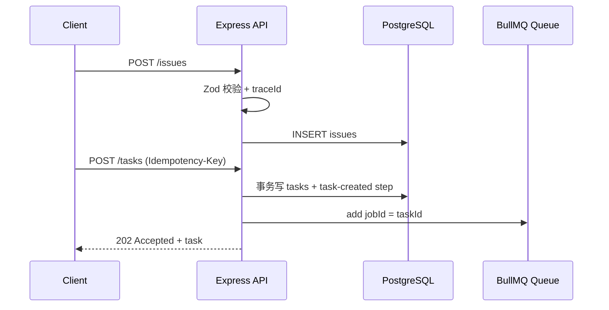

# day4Note

在day3中,我们定义好了 项目中的数据库以及最基本的四张表的结构,而day4就是实现,将前端发来的http请求,变成可校验\可追踪\可持久化的Issue -> Task,并且保存在数据库中.

在这个过程中要做到的就是规范传参,并且把每一次的记录都能够不遗漏地被保存下来:

## 请求链路

`202 Accepted` 的意思是 API 已接受任务，但任务由 Worker 异步执行，尚未保证最终成功。重复使用同一个幂等键时，API 返回已有 Task 与 `200`，不会再次入队。

## 规范传参开发

- TypeScript interface: 定义好数据类型, 但并不会阻止真实的HTTP请求传入错误数据
- Zod: 是运行时的 schema 校验库, 因为 TS的类型会在编译后消失, 所以运行的时候依旧需要校验 在运行时真正地检查数据, 错误的JSON 会获得 `400` 和traceId,就不会进入数据库
- 中间件MiddleWare: 路由处理之前或者之后都会经过的函数, 可以在这一部分去解析JSON\ 生成 traceId \ 记录Pino日志
- Pino结构化日志: 日志是 JSON对象 而不是拼接的字符串, 便于按照`traceID`\ 状态码等来进行检索
- traceID:请求的追踪编号, 方便追踪某次请求,容易debug

