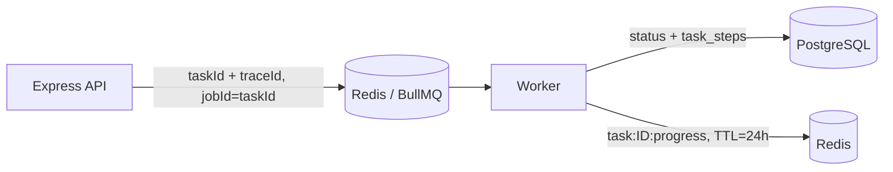

# day5Note

## 主要工作内容

API快速返回,耗时任务交给后台的Worker. 真实链路:

后端API在PostgreSQL创建task, job被放入Redis 支撑的 BullMQ队列;
Worker 取到Job, 更新PostgreSQL的 对应状态与审计步骤, 并且把短期的进度写入Redis

## 学习内容

- redis: 内存型键值数据库, 在Agent项目中大致只保存 队列和短期进度, 而不承担永久审计
- BUllMQ: Node.js的队列库, 使用Redis保存 wating active completed failed 的 Job状态
- Queue: 任务排队的通道
- Job: 一条待Agent的处理的消息任务
- Worker: 实际被分配到并且存在执行Job的进程
- TTL: time to live, 键的过期时间,避免长时间占用内存
- backoff: 失败后等待一段时间再进行重试
- at-least-one: 至少一次投递, 网络和进程故障下同一个Job可能被再次执行, 业务处理必须可重试 可去重 

## 数据职责

| 数据 | 位置 | 为什么 |
| --- | --- | --- |
| Issue、Task、步骤、错误码 | PostgreSQL | 需要长期审计、查询与恢复 |
| BullMQ job、等待/执行状态 | Redis | 需要快速入队和消费 |
| `task:{taskId}:progress` | Redis，TTL 24h | 只用于短期 UI 进度，不值得永久保存 |

PostgreSQL: 事实源
Redis: 可丢失的派生状态

## 队列

## Worker进程中做的任务:

- 写Redis进度'planning'
- 把PostgreSQL的Task更新为 planning
- 追加 worker-started 审计步骤
- 执行当前的任务, 同步success
- 追加 placeholder-execution 步骤, 写 redis 进度